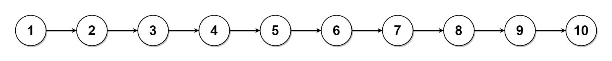

<<<<<<< HEAD
<<<<<<< HEAD
<<<<<<< HEAD
## 78.子集

给你一个整数数组 nums ，数组中的元素 互不相同 。返回该数组所有可能的子集（幂集）。

解集 不能 包含重复的子集。你可以按 任意顺序 返回解集。

```
示例 1：
输入：nums = [1,2,3]
输出：[[],[1],[2],[1,2],[3],[1,3],[2,3],[1,2,3]]
```

```
示例 2：
输入：nums = [0]
输出：[[],[0]]
```

```java
class Solution {
    public List<List<Integer>> subsets(int[] nums) {
        List<List<Integer>> results = new ArrayList<>();
        results.add(new ArrayList<Integer>());//添加空集到列表中

        for(int num:nums){
            List<List<Integer>> NewLists = new ArrayList<>();//创建一个新的列表  列表中的元素是集合
            for(List<Integer> i:results){//从已有的结果中读取每一个子列表
                List<Integer> list = new ArrayList<Integer>(i);//复制该列表
                list.add(num);//在该列表添加当前元素
                NewLists.add(list);//将加入新元素过后的加入新列表中
            }
            results.addAll(NewLists);//将NewLists中的所有元素添加到结果中
        }
        return results;
    }
}
```

```js
var subsets = function (nums) {
    const res = []
    res.push([])
    for (num of nums) {
        let newList = []
        for (item of res) {
            let temp = [...item]//数组的复制必须这样做
            temp.push(num)
            newList.push(temp)
        }
        // console.log(...newList)
        res.push(...newList)//传入的是里面的值
    }
    return res
};
```


## 90. 子集 II

给你一个整数数组 nums ，其中可能包含重复元素，请你返回该数组所有可能的子集（幂集）。

解集 不能 包含重复的子集。返回的解集中，子集可以按 任意顺序 排列。

```
示例 1：

输入：nums = [1,2,2]
输出：[[],[1],[1,2],[1,2,2],[2],[2,2]]
示例 2：
```

```
输入：nums = [0]
输出：[[],[0]]
```

```java
class Solution {
    List<Integer> t = new ArrayList<Integer>();
    List<List<Integer>> ans = new ArrayList<List<Integer>>();
    public List<List<Integer>> subsetsWithDup(int[] nums) {
        Arrays.sort(nums);
        backtracking(nums,0);
        return ans;
    }
    public void backtracking(int[] nums,int index){
        ans.add(new ArrayList<Integer>(t));//每次加入上次的结果
        // ans.add(t);//每次加入上次的结果
        for(int i=index;i<nums.length;i++){
            if(i>index&&nums[i]==nums[i-1]){//若同一层遇到相同的数字就跳过
                continue;
            }
            t.add(nums[i]);//加入当前数字
            backtracking(nums,i+1);//递归进入下一个树枝
            t.remove(t.size() - 1);//删除加入的数组，同一层后面的数字进行判断
        }
    }
}
```

## [781. 森林中的兔子](https://leetcode-cn.com/problems/rabbits-in-forest/)

森林中，每个兔子都有颜色。其中一些兔子（可能是全部）告诉你还有多少其他的兔子和自己有相同的颜色。我们将这些回答放在 answers 数组里。

返回森林中兔子的最少数量。

```
示例:
输入: answers = [1, 1, 2]
输出: 5
解释:
两只回答了 "1" 的兔子可能有相同的颜色，设为红色。
之后回答了 "2" 的兔子不会是红色，否则他们的回答会相互矛盾。
设回答了 "2" 的兔子为蓝色。
此外，森林中还应有另外 2 只蓝色兔子的回答没有包含在数组中。
因此森林中兔子的最少数量是 5: 3 只回答的和 2 只没有回答的。
输入: answers = [10, 10, 10]
输出: 11
输入: answers = []
输出: 0
```

```java
class Solution {
    public static int numRabbits(int[] answers) {
        int n = answers.length;
        if (n == 0) return 0;
        int[] counts = new int[1000]; // 回答计数数组
        int ret = 0;
        for (int answer : answers) {
            if (counts[answer] > 0) counts[answer]--; // 无效回答：该回答有兔子答过了，重复回答，抵消1个计数
            else { // 有效回答：目前该回答没有答过（或者虽然答过，但已全部抵消），计数，并累加兔子数量
                ret += (answer+1); // 累加answer+1只
                counts[answer] = answer; // 记录answer，表明还可以允许多少只兔子给出相同的answer
            }
        }
        return ret;
    }
}
```

## [80. 删除有序数组中的重复项 II](https://leetcode-cn.com/problems/remove-duplicates-from-sorted-array-ii/)

给你一个有序数组 nums ，请你 原地 删除重复出现的元素，使每个元素 最多出现两次 ，返回删除后数组的新长度。

不要使用额外的数组空间，你必须在 原地 修改输入数组 并在使用 O(1) 额外空间的条件下完成。

```
示例 1：
输入：nums = [1,1,1,2,2,3]
输出：5, nums = [1,1,2,2,3]
解释：函数应返回新长度 length = 5, 并且原数组的前五个元素被修改为 1, 1, 2, 2, 3 。 不需要考虑数组中超出新长度后面的元素。

示例 2：
输入：nums = [0,0,1,1,1,1,2,3,3]
输出：7, nums = [0,0,1,1,2,3,3]
解释：函数应返回新长度 length = 7, 并且原数组的前五个元素被修改为 0, 0, 1, 1, 2, 3, 3 。 不需要考虑数组中超出新长度后面的元素。
```

```java
//慢指针表示处理出的数组的长度，快指针表示已经检查过的数组的长度，即 nums[fast] 表示待检查的第一个元素，
//nums[slow−1] 为上一个应该被保留的元素所移动到的指定位置
//slow-1为最后一个应该被保留数字的位置
//fast是当前待检查的位置
class Solution {
    public int removeDuplicates(int[] nums) {
        int n=nums.length;
        if(n<=2) return n;//长度小于2直接输出
        int slow=2,fast=2;//快慢指针从第3个位置开始
        while(fast<n){
            if(nums[slow-2]!=nums[fast]){//此时将slow替换为num[fast]
                nums[slow]=nums[fast];//令当前位置为快指针的值  用后面的值填前面的 ，连续相同必然连续
                slow++;//慢指针--
            }
            fast++;//快指针++
        }
        return slow;  //
    }
}
```

## [264. 丑数 II](https://leetcode-cn.com/problems/ugly-number-ii/)

给你一个整数 n ，请你找出并返回第 n 个 丑数 。

丑数 就是只包含质因数 2、3 和/或 5 的正整数。

 **示例 1：**

```
输入：n = 10
输出：12
解释：[1, 2, 3, 4, 5, 6, 8, 9, 10, 12] 是由前 10 个丑数组成的序列。
```

 **示例 2：**

```
输入：n = 1
输出：1
解释：1 通常被视为丑数。
```

```java
class Solution {
    public int nthUglyNumber(int n) {
        int[] nums = new int[1690];
        int i=1;
        nums[0]=1;
        int p2=0,p3=0,p5=0;
        while(i<n){
            nums[i]=min(2*nums[p2],3*nums[p3],5*nums[p5]);//等于2，3，5乘以之前的数，三个指针比较大小
            if(nums[i]==nums[p2]*2) p2++;//该数是用p2乘的就p2++;
            if(nums[i]==nums[p3]*3) p3++;
            if(nums[i]==nums[p5]*5) p5++;
            i++;
        }
        return nums[i-1];
    }
    public int min(int x,int y,int z){
        if(x<y){
            return x<z?x:z;
        }else{
            return y<z?y:z;
        }
    }
}
```

## [179. 最大数

给定一组非负整数 nums，重新排列每个数的顺序（每个数不可拆分）使之组成一个最大的整数。

注意：输出结果可能非常大，所以你需要返回一个字符串而不是整数。

 示例 1：

```
输入：nums = [10,2]
输出："210"
```


示例 2：

```
输入：nums = [3,30,34,5,9]
输出："9534330"
```


示例 3：

```
输入：nums = [1]
输出："1"
```


示例 4：

```
输入：nums = [10]
输出："10"
```

```java
class Solution {
    public String largestNumber(int[] nums) {
        int n = nums.length;
        String numsToWord[] = new String[n];
        for(int i=0;i<n;i++){
            numsToWord[i] = String.valueOf(nums[i]);
        }
        //[233，23333]排序后变为[23333，233]
        Arrays.sort(numsToWord,(a,b)->{//lambda表达式，将方法写入参数
            return (b+a).compareTo(a+b);//compareTo确定返回值
        });//sort方法，返回值为正的则调换顺序，降序排序
        StringBuilder sb = new StringBuilder();
        for(int i=0;i<n;i++){
            sb.append(numsToWord[i]);
        }
        String res = sb.toString();
        return res.charAt(0)=='0'?"0":res;//若第一个元素是0，则后面必然小于等于0，直接返回0则可
    }
}
```

## [783. 二叉搜索树节点最小距离](https://leetcode-cn.com/problems/minimum-distance-between-bst-nodes/)

给你一个二叉搜索树的根节点 root ，返回 树中任意两不同节点值之间的最小差值 。(二叉搜索树是中序遍历升序排列)

**示例 1：**

```
输入：root = [4,2,6,1,3]
输出：1
```

**示例 2：**

```
输入：root = [1,0,48,null,null,12,49]
输出：1
```

```java
/**

 * Definition for a binary tree node.
 * public class TreeNode {
 * int val;
 * TreeNode left;
 * TreeNode right;
 * TreeNode() {}
 * TreeNode(int val) { this.val = val; }
 * TreeNode(int val, TreeNode left, TreeNode right) {
 * this.val = val;
 * this.left = left;
 * this.right = right;
 * }
 * }
   */
   class Solution {
   int pre;
   int ans;
   public int minDiffInBST(TreeNode root) {
       pre =-1;
       ans=Integer.MAX_VALUE;
       scan(root);
       return ans;
   }
   public void scan(TreeNode root){
       if(root==null) return;//中序遍历，先判断节点是否为空
       scan(root.left);
       if(pre==-1){
           pre=root.val;
       }else{
           ans=Math.min(ans,root.val-pre);//后面的值必然比前面大
           pre=root.val;
       }
       scan(root.right);
   }
   }
```

## [208. 实现 Trie (前缀树)](https://leetcode-cn.com/problems/implement-trie-prefix-tree/)

Trie（发音类似 "try"）或者说 前缀树 是一种树形数据结构，用于高效地存储和检索字符串数据集中的键。这一数据结构有相当多的应用情景，例如自动补完和拼写检查。

请你实现 Trie 类：

Trie() 初始化前缀树对象。
void insert(String word) 向前缀树中插入字符串 word 。
boolean search(String word) 如果字符串 word 在前缀树中，返回 true（即，在检索之前已经插入）；否则，返回 false 。
boolean startsWith(String prefix) 如果之前已经插入的字符串 word 的前缀之一为 prefix ，返回 true ；否则，返回 false 。

示例：

```
输入
["Trie", "insert", "search", "search", "startsWith", "insert", "search"]
[[], ["apple"], ["apple"], ["app"], ["app"], ["app"], ["app"]]
输出
[null, null, true, false, true, null, true]
解释
Trie trie = new Trie();
trie.insert("apple");
trie.search("apple");   // 返回 True
trie.search("app");     // 返回 False
trie.startsWith("app"); // 返回 True
trie.insert("app");
trie.search("app");     // 返回 True
```


```java
class Trie {
    private Trie[] children;//根节点不记录数据
    private boolean isEnd;//判断是否为一个字符的结尾
    /** Initialize your data structure here. */
    public Trie() {
        children = new Trie[26];//26个英文字母
        isEnd = false;
    }
    

    /** Inserts a word into the trie. */
    public void insert(String word) {//插入节点
        int n = word.length();
        Trie node = this;
        for(int i=0;i<n;i++){
            char ch = word.charAt(i);
            int index=ch-'a';//与a作减法，确定应该实例化哪一个节点
            if(node.children[index]==null){
                node.children[index]=new Trie();//若节点为空，则实例化该节点
            }
            node=node.children[index];//将当前节点声明为该节点
        }
        node.isEnd=true;//退出循环时
    }
    
    /** Returns if the word is in the trie. */
    public boolean search(String word) {//检查是否有该单词
        Trie node = this;
        for(int i=0;i<word.length();i++){
            char ch = word.charAt(i);
            int index = ch-'a';
            if(node.children[index] == null) return false;
            node=node.children[index];
        }
        return node.isEnd;
    }
    
    /** Returns if there is any word in the trie that starts with the given prefix. */
    public boolean startsWith(String prefix) {//检查是否有该前缀
        Trie node = this;
        for(int i=0;i<prefix.length();i++){
            char ch = prefix.charAt(i);
            int index = ch-'a';
            if(node.children[index]==null) return false;
            node=node.children[index];
        }
        return true;
    }

}

/**

 * Your Trie object will be instantiated and called as such:
 * Trie obj = new Trie();
 * obj.insert(word);
 * boolean param_2 = obj.search(word);
 * boolean param_3 = obj.startsWith(prefix);
   */
```

## [213. 打家劫舍 II](https://leetcode-cn.com/problems/house-robber-ii/)

你是一个专业的小偷，计划偷窃沿街的房屋，每间房内都藏有一定的现金。这个地方所有的房屋都 围成一圈 ，这意味着第一个房屋和最后一个房屋是紧挨着的。同时，相邻的房屋装有相互连通的防盗系统，如果两间相邻的房屋在同一晚上被小偷闯入，系统会自动报警 。

给定一个代表每个房屋存放金额的非负整数数组，计算你 在不触动警报装置的情况下 ，能够偷窃到的最高金额。

 示例 1：

```
输入：nums = [2,3,2]
输出：3
解释：你不能先偷窃 1 号房屋（金额 = 2），然后偷窃 3 号房屋（金额 = 2）, 因为他们是相邻的。
```


示例 2：

```
输入：nums = [1,2,3,1]
输出：4
解释：你可以先偷窃 1 号房屋（金额 = 1），然后偷窃 3 号房屋（金额 = 3）。
     偷窃到的最高金额 = 1 + 3 = 4 。
```


示例 3：

```
输入：nums = [0]
输出：0
```

```java
class Solution {
    public int rob(int[] nums) {
        int n=nums.length;
        if(n==1) return nums[0];//只有一个则只偷一家
        if(n==2) return nums[0]>nums[1]?nums[0]:nums[1];//两个偷较大的一个
        return Math.max(RobCount(nums,0,n-2),RobCount(nums,1,n-1));//偷0到n-2,1到n-1
    }

    public int RobCount(int nums[],int start,int end){
        int first=nums[start],second=Math.max(nums[start],nums[start+1]);//使用first 和 second来降低空间复杂度
        for(int i=start+2;i<=end;i++){}
            int temp=second;
            second=Math.max(first+nums[i],second);//当前i最大可偷等于前前位置加当前 与 前位中可偷的最大
            first=temp;
        }
        return second;
   }

}
```

## [91. 解码方法](https://leetcode-cn.com/problems/decode-ways/)

一条包含字母 A-Z 的消息通过以下映射进行了 编码 ：

```
'A' -> 1
'B' -> 2
...
'Z' -> 26
```


要 解码 已编码的消息，所有数字必须基于上述映射的方法，反向映射回字母（可能有多种方法）。例如，"11106" 可以映射为：

"AAJF" ，将消息分组为 (1 1 10 6)
"KJF" ，将消息分组为 (11 10 6)
注意，消息不能分组为  (1 11 06) ，因为 "06" 不能映射为 "F" ，这是由于 "6" 和 "06" 在映射中并不等价。

给你一个只含数字的 非空 字符串 s ，请计算并返回 解码 方法的 总数 。

题目数据保证答案肯定是一个 32 位 的整数

示例 1：

```
输入：s = "12"
输出：2
解释：它可以解码为 "AB"（1 2）或者 "L"（12）。
```


示例 2：

```
输入：s = "226"
输出：3
解释：它可以解码为 "BZ" (2 26), "VF" (22 6), 或者 "BBF" (2 2 6) 。
```


示例 3：

```
输入：s = "0"
输出：0
解释：没有字符映射到以 0 开头的数字。
含有 0 的有效映射是 'J' -> "10" 和 'T'-> "20" 。
由于没有字符，因此没有有效的方法对此进行解码，因为所有数字都需要映射。
```


示例 4：

```
输入：s = "06"
输出：0
解释："06" 不能映射到 "F" ，因为字符串含有前导 0（"6" 和 "06" 在映射中并不等价）。
```

```java
class Solution {
    public int numDecodings(String s) {
        int n = s.length();
        int[] f = new int[n + 1];//从1开始而非0
        f[0] = 1;//边界条件，空字符串也有一种解码方式，若是0，直接输出f[1]=0;
        for (int i = 1; i <= n; ++i) {
            if (s.charAt(i - 1) != '0') {
                f[i] += f[i - 1];//单字符解码方式
            }
            if (i > 1 && s.charAt(i - 2) != '0' && ((s.charAt(i - 2) - '0') * 10 + (s.charAt(i - 1) - '0') <= 26)) {
                f[i] += f[i - 2];//双字符解码方式
            }
        }
        return f[n];
    }
}
```

## [1720. 解码异或后的数组](https://leetcode-cn.com/problems/decode-xored-array/)

未知 整数数组 arr 由 n 个非负整数组成。

经编码后变为长度为 n - 1 的另一个整数数组 encoded ，其中 encoded[i] = arr[i] XOR arr[i + 1] 。例如，arr = [1,0,2,1] 经编码后得到 encoded = [1,2,3] 

给你编码后的数组 encoded 和原数组 arr 的第一个元素 first（arr[0]）。

请解码返回原数组 arr 。可以证明答案存在并且是唯一的。

示例 1：

```
输入：encoded = [1,2,3], first = 1
输出：[1,0,2,1]
解释：若 arr = [1,0,2,1] ，那么 first = 1 且 encoded = [1 XOR 0, 0 XOR 2, 2 XOR 1] = [1,2,3]
```


示例 2：

```
输入：encoded = [6,2,7,3], first = 4
输出：[4,2,0,7,4]
```

```java
class Solution {
    public int[] decode(int[] encoded, int first) {
        int n=encoded.length;
        int ori[] = new int[n+1];
        ori[0]=first;
        for(int i=0;i<n;i++){
            ori[i+1]=encoded[i]^ori[i];//a ^ b = c, a ^ b ^ b = c ^ b = a
        }
        return ori;
    }
}
```

## [1482. 制作 m 束花所需的最少天数](https://leetcode-cn.com/problems/minimum-number-of-days-to-make-m-bouquets/)

给你一个整数数组 bloomDay，以及两个整数 m 和 k 。

现需要制作 m 束花。制作花束时，需要使用花园中 相邻的 k 朵花 。

花园中有 n 朵花，第 i 朵花会在 bloomDay[i] 时盛开，恰好 可以用于 一束 花中。

请你返回从花园中摘 m 束花需要等待的最少的天数。如果不能摘到 m 束花则返回 -1 。

示例 1：

```
输入：bloomDay = [1,10,3,10,2], m = 3, k = 1
输出：3
解释：让我们一起观察这三天的花开过程，x 表示花开，而 _ 表示花还未开。
现在需要制作 3 束花，每束只需要 1 朵。
1 天后：[x, _, _, _, _]   // 只能制作 1 束花
2 天后：[x, _, _, _, x]   // 只能制作 2 束花
3 天后：[x, _, x, _, x]   // 可以制作 3 束花，答案为 3
```


示例 2：

```
输入：bloomDay = [1,10,3,10,2], m = 3, k = 2
输出：-1
解释：要制作 3 束花，每束需要 2 朵花，也就是一共需要 6 朵花。而花园中只有 5 朵花，无法满足制作要求，返回 -1 。
```


示例 3：

```
输入：bloomDay = [7,7,7,7,12,7,7], m = 2, k = 3
输出：12
解释：要制作 2 束花，每束需要 3 朵。
花园在 7 天后和 12 天后的情况如下：
7 天后：[x, x, x, x, _, x, x]
可以用前 3 朵盛开的花制作第一束花。但不能使用后 3 朵盛开的花，因为它们不相邻。
12 天后：[x, x, x, x, x, x, x]
显然，我们可以用不同的方式制作两束花。
```

```java
class Solution {
    public int minDays(int[] bloomDay, int m, int k) {
        if( m > bloomDay.length / k) return -1; // 此时无论如何都制作不出来m束花
        // 只要 m <= bloomDay.length / k, 成立，无论如何都能制作出来
        // 调用两次stream()方法求最值的效率较低，可以使用常规方法替代！
        int low = Integer.MAX_VALUE, high = 0;
        int n = bloomDay.length;
        for(int i=0;i<n;i++){
            low=Math.min(low,bloomDay[i]);
            high=Math.max(high,bloomDay[i]);
        }
        // 如果可以制作m束花，天数一定在low和high之间，因此使用二分查找
        while(low < high){
            int mid = low + (high-low)/2;
            if(make(bloomDay,m,k,mid)){
                high = mid;
            }else low = mid+1;
        }
        return low;
    }
    public boolean make(int[] bloomDay, int m, int k,int days){
        int flowers = 0; // 代表可用的花的个数
        int makeFlowers = 0; // 代表当前天数days可以制作出的花的数量
        int n = bloomDay.length;
        for(int i = 0; i < n && makeFlowers<m; i++){
            if(bloomDay[i] <= days){
                flowers++; // 只要开花所需天数小于等于days, 则说明当前花可用
                if(flowers == k){   // 当前花的数量满足可以制作一束花的数量k时，则制作出的花的数量makeFlowers++;并重置flowers
                    makeFlowers++;
                    flowers = 0;  // 重置当前可用花的数量
                }
            }else flowers = 0; // 因为需要连续的k朵花，因此只要中间有一朵花没开, flowers就重置为0   
        }
        return makeFlowers == m; // 只要 makeFlowers >= m 就说明可以满足要求
    }
}
```


## [1734. 解码异或后的排列](https://leetcode-cn.com/problems/decode-xored-permutation/)

给你一个整数数组 perm ，它是前 n 个正整数的排列，且 n 是个 奇数 。

它被加密成另一个长度为 n - 1 的整数数组 encoded ，满足 encoded[i] = perm[i] XOR perm[i + 1] 。比方说，如果 perm = [1,3,2] ，那么 encoded = [2,1] 

给你 encoded 数组，请你返回原始数组 perm 。题目保证答案存在且唯一。

示例 1：

```
输入：encoded = [3,1]
输出：[1,2,3]
解释：如果 perm = [1,2,3] ，那么 encoded = [1 XOR 2,2 XOR 3] = [3,1]
```


示例 2：

```
输入：encoded = [6,5,4,6]
输出：[2,4,1,5,3]
```

找规律，只要知道了第一个数就能解了。用案例二为例， 原数组是`[2, 4, 1, 5, 3]`，编码后数组为`[6, 5, 4, 6]`，找原数组第一个为2就行。

首位相连，一个数和自己xor为0，所以：

```java
2 ^ 4 == 6
2 ^ 1 == 6 ^ 5 ==2^4^4^1
2 ^ 5 == 6 ^ 5 ^ 4//后面同理
2 ^ 3 == 6 ^ 5 ^ 4 ^ 6
```

因为原数组长度为奇数，编码后数组一定是偶数，把上面等式两边全部xor可以得到：`4 ^ 1 ^ 5 ^ 3 == ...`，省略那块能看出偶数位个数都是偶数（上面的式子，第一位4个6，第二位3个5），可以忽略，只用将奇数位全部xor即可。等式左边是除原数组第一个数的所有数的xor，再对等式两边同时对1~n做xor，就得到第一个数。

```java
class Solution {
    public int[] decode(int[] encoded) {
        int first = 1;
        int n = encoded.length + 1;
        for (int i = 2; i <= n; i++) {
            first ^= i;//得到前n个数的异或和
        }
        for (int i = 1; i < encoded.length; i += 2) {
            first ^= encoded[i];//将和与编码后的奇数位的进行异或，就能得到编码前的第一个值
        }
        int[] ans = new int[n];
        ans[0] = first;
        for (int i = 0; i < encoded.length; i++) {
            ans[i + 1] = ans[i] ^ encoded[i];//得到编码前的数组
        }
        return ans;
    }
}
```


## [993. 二叉树的堂兄弟节点](https://leetcode-cn.com/problems/cousins-in-binary-tree/)

在二叉树中，根节点位于深度 0 处，每个深度为 k 的节点的子节点位于深度 k+1 处。

如果二叉树的两个节点深度相同，但 父节点不同 ，则它们是一对堂兄弟节点。

我们给出了具有唯一值的二叉树的根节点 root ，以及树中两个不同节点的值 x 和 y 。

只有与值 x 和 y 对应的节点是堂兄弟节点时，才返回 true 。否则，返回 false。

```java
class Solution {
    // x 的信息
    int x;
    TreeNode xParent;
    int xDepth;
    boolean xFound = false;

    // y 的信息
    int y;
    TreeNode yParent;
    int yDepth;
    boolean yFound = false;

    public boolean isCousins(TreeNode root, int x, int y) {
        this.x = x;
        this.y = y;
        dfs(root, 0, null);
        return xDepth == yDepth && xParent != yParent;
    }

    public void dfs(TreeNode node, int depth, TreeNode parent) {
        if (node == null) {
            return;
        }

        if (node.val == x) {
            xParent = parent;
            xDepth = depth;
            xFound = true;
        } else if (node.val == y) {
            yParent = parent;
            yDepth = depth;
            yFound = true;
        }

        // 如果两个节点都找到了，就可以提前退出遍历
        // 即使不提前退出，对最坏情况下的时间复杂度也不会有影响
        if (xFound && yFound) {
            return;
        }

        dfs(node.left, depth + 1, node);

        if (xFound && yFound) {
            return;
        }

        dfs(node.right, depth + 1, node);
    }
}
```

## [692. 前K个高频单词](https://leetcode-cn.com/problems/top-k-frequent-words/)

给一非空的单词列表，返回前 k 个出现次数最多的单词。

返回的答案应该按单词出现频率由高到低排序。如果不同的单词有相同出现频率，按字母顺序排序。

示例 1：

```
输入: ["i", "love", "leetcode", "i", "love", "coding"], k = 2
输出: ["i", "love"]
解析: "i" 和 "love" 为出现次数最多的两个单词，均为2次。
    注意，按字母顺序 "i" 在 "love" 之前。
```


示例 2：

```
输入: ["the", "day", "is", "sunny", "the", "the", "the", "sunny", "is", "is"], k = 4
输出: ["the", "is", "sunny", "day"]
解析: "the", "is", "sunny" 和 "day" 是出现次数最多的四个单词，
    出现次数依次为 4, 3, 2 和 1 次。
```

```java
class Solution {
    public List<String> topKFrequent(String[] words, int k) {
        Map<String, Integer> cnt = new HashMap<String, Integer>();
        for (String word : words) {
            cnt.put(word, cnt.getOrDefault(word, 0) + 1);//查找是否有该单词，有则将value加1
        }
        List<String> rec = new ArrayList<String>();
        for (Map.Entry<String, Integer> entry : cnt.entrySet()) {//得到实体即（key,val）
            rec.add(entry.getKey());//将key放入链表中
        }
        Collections.sort(rec, new Comparator<String>() {
            public int compare(String word1, String word2) {//根据要求进行排序，为正则word2在前,word1在后
                return cnt.get(word1) == cnt.get(word2) ? word1.compareTo(word2) : cnt.get(word2) - cnt.get(word1);
            }
        });
        return rec.subList(0, k);
    }
}
```

## [447. 回旋镖的数量](https://leetcode-cn.com/problems/number-of-boomerangs/)

给定平面上 n 对 互不相同 的点 points ，其中 points[i] = [xi, yi] 。回旋镖 是由点 (i, j, k) 表示的元组 ，其中 i 和 j 之间的距离和 i 和 k 之间的距离相等（需要考虑元组的顺序）

返回平面上所有回旋镖的数量。

示例 1：

```
输入：points = [[0,0],[1,0],[2,0]]
输出：2
解释：两个回旋镖为 [[1,0],[0,0],[2,0]] 和 [[1,0],[2,0],[0,0]
```

```java
class Solution {
    public int numberOfBoomerangs(int[][] points) {
        int ans=0;
        for(int[] p:points){
            Map<Integer,Integer> cnt = new HashMap<Integer,Integer>();
            for(int[] q:points){
                int dis = (p[0]-q[0])*(p[0]-q[0])+(p[1]-q[1])*(p[1]-q[1]);
                cnt.put(dis,cnt.getOrDefault(dis,0)+1);
            }//若有相同距离则数量直接+1，getOrDefault返回改键对应的值，若无值则为0
   		   for(Map.Entry<Integer,Integer> temp:cnt.entrySet()){//entry得到Map中键值对，有11对应关系
       		int m = temp.getValue();//遍历得到每个键对应的值，则表示该距离
        	ans+=m*(m-1);//使用排列
    	   }
      }
      return ans;
   }
}
```

## [524. 通过删除字母匹配到字典里最长单词](https://leetcode-cn.com/problems/longest-word-in-dictionary-through-deleting/)

给你一个字符串 s 和一个字符串数组 dictionary 作为字典，找出并返回字典中最长的字符串，该字符串可以通过删除 s 中的某些字符得到。

如果答案不止一个，返回长度最长且**字典序**最小的字符串。如果答案不存在，则返回空字符串。

示例 1：

```
输入：s = "abpcplea", dictionary = ["ale","apple","monkey","plea"]
输出："apple"
```

**示例 2：**

```
输入：s = "abpcplea", dictionary = ["a","b","c"]
输出："a"
```

```java
class Solution {
    public String findLongestWord(String s, List<String> dictionary) {
        String res="";
        for(String t : dictionary){//取出字典序中的字符串，然后双指针依次比较
            int i=0,j=0;//从开头开始
            while(i<t.length()&&j<s.length()){
                if(t.charAt(i)==s.charAt(j)){//若匹配则两个指针都往后移动
                    i++;
                    j++;
                }else{//若不匹配则只有s的指针j往后移
                    j++;
                }
            }
            if(i==t.length()){//若字典移动到了字符串的末尾，说明完全匹配，判断是否是最长的，若与之前的答案相等判断是否字典序最小
                if(t.length() > res.length() || (t.length() == res.length() && t.compareTo(res) < 0))
                res=t;
            }
        }
        return res;
    }
}
```

## [725. 分隔链表](https://leetcode-cn.com/problems/split-linked-list-in-parts/)

给你一个头结点为 head 的单链表和一个整数 k ，请你设计一个算法将链表分隔为 k 个连续的部分。

每部分的长度应该尽可能的相等：任意两部分的长度差距不能超过 1 。这可能会导致有些部分为 null 。

这 k 个部分应该按照在链表中出现的顺序排列，并且排在前面的部分的长度应该大于或等于排在后面的长度。

返回一个由上述 k 部分组成的数组。

**示例 2：**


```
输入：head = [1,2,3,4,5,6,7,8,9,10], k = 3
输出：[[1,2,3,4],[5,6,7],[8,9,10]]
解释：
输入被分成了几个连续的部分，并且每部分的长度相差不超过 1 。前面部分的长度大于等于后面部分的长度。
```

```java
/**
 * Definition for singly-linked list.
 * public class ListNode {
 *     int val;
 *     ListNode next;
 *     ListNode() {}
 *     ListNode(int val) { this.val = val; }
 *     ListNode(int val, ListNode next) { this.val = val; this.next = next; }
 * }
 
 */
class Solution {
    public ListNode[] splitListToParts(ListNode head, int k) {
        int n=0;
        ListNode temp = head;
        while(temp!=null){
            n++;
            temp = temp.next;
        }
        int q = n/k, r  =n%k;
        ListNode[] parts = new ListNode[k];
        ListNode curr = head;
        for(int i=0;i<k&&curr!=null;i++){
            parts[i] = curr;
            int partSize = q + (i < r ? 1 : 0);
            for (int j = 1; j < partSize; j++) {
                curr = curr.next;
            }
            ListNode next = curr.next;
            curr.next = null;
            curr = next;
        }
        return parts;

    }
}
```

```js
/**
 * Definition for singly-linked list.
 * function ListNode(val, next) {
 *     this.val = (val===undefined ? 0 : val)
 *     this.next = (next===undefined ? null : next)
 * }
 */
/**
 * @param {ListNode} head
 * @param {number} k
 * @return {ListNode[]}
 */
var splitListToParts = function(head, k) {
    let n =0;
    let temp = head;
    while(temp!=null){
        n++;
        temp=temp.next;
    }
    let q = Math.floor(n / k),  r=n%k;
     const parts = new Array(k).fill(null);
     let curr = head;
    for(let i=0;i<k&&curr!=null;i++ ){
        parts[i]=curr;
        let partsize = q+(i<r?1:0);
        for(let j =1;j<partsize;j++){
            curr = curr.next;
        }
            const next = curr.next;
            curr.next  =null;
            curr = next;
    }
return parts;
};
```

## [326. 3的幂](https://leetcode-cn.com/problems/power-of-three/)

给定一个整数，写一个函数来判断它是否是 3 的幂次方。如果是，返回 true ；否则，返回 false 。

整数 n 是 3 的幂次方需满足：存在整数 x 使得 n == 3x

```js
var isPowerOfThree = function(n) {
    while (n !== 0 && n % 3 === 0) {
        n = Math.floor(n / 3);
    }
    return n === 1;//我们不断地将 n 除以 3，直到 n=1。如果此过程中 n 无法被 3 整除，就说明 n 不是 3 的幂。
};
```

```js
var isPowerOfThree = function(n) {
    return n > 0 && 1162261467 % n === 0;
};//判断是不是3^19=1162261467的约数
```

```
var flatten = function(head) {
    const dfs = (node) => {
        let cur = node;
        // 记录链表的最后一个节点
        let last = null;

        while (cur) {
            let next = cur.next;
            //  如果有子节点，那么首先处理子节点
            if (cur.child) {
                const childLast = dfs(cur.child);

                next = cur.next;
                //  将 node 与 child 相连
                cur.next = cur.child;
                cur.child.prev = cur;

                //  如果 next 不为空，就将 last 与 next 相连
                if (next != null) {
                    childLast.next = next;
                    next.prev = childLast;
                }

                // 将 child 置为空
                cur.child = null;
                last = childLast;
            } else {
                last = cur;
            }
            cur = next;

        }
        return last;
    }

    dfs(head);
    return head;
};
```

## [430. 扁平化多级双向链表](https://leetcode-cn.com/problems/flatten-a-multilevel-doubly-linked-list/)

**示例 1：**

```
输入：head = [1,2,3,4,5,6,null,null,null,7,8,9,10,null,null,11,12]
输出：[1,2,3,7,8,11,12,9,10,4,5,6]
```


扁平化后的链表如下图：


```js
/**
 * // Definition for a Node.
 * function Node(val,prev,next,child) {
 *    this.val = val;
 *    this.prev = prev;
 *    this.next = next;
 *    this.child = child;
 * };
 */

/**
 * @param {Node} head
 * @return {Node}
 */
var flatten = function(head) {
    const dfs = (node) => {//递归处理
        let cur = node;
        // 记录链表的最后一个节点
        let last = null;

        while (cur) {
            let next = cur.next;
            //  如果有子节点，那么首先处理子节点
            if (cur.child) {
                const childLast = dfs(cur.child);//dfs返回最后一个节点

                next = cur.next;
                //  将 node 与 child 相连
                cur.next = cur.child;
                cur.child.prev = cur;

                //  如果 next 不为空，就将 last 与 next 相连
                if (next != null) {
                    childLast.next = next;
                    next.prev = childLast;
                }

                // 将 child 置为空
                cur.child = null;
                last = childLast;
            } else {
                last = cur;
            }
            cur = next;

        }
        return last;
    }

    dfs(head);
    return head;
};
```

## [371. 两整数之和](https://leetcode-cn.com/problems/sum-of-two-integers/)

给你两个整数 `a` 和 `b` ，**不使用** 运算符 `+` 和 `-` ，计算并返回两整数之和。

```js
/**
 * @param {number} a
 * @param {number} b
 * @return {number}
 */
var getSum = function(a, b) {
while (b != 0) {
        const carry = (a & b) << 1;  //a&b的结果向左移动一位，得到进位的位置
        a = a ^ b;
        b = carry;
    }
    return a;
}

/*
(a)3-> 0011
(b)6-> 0110
a^b= 0101
(a&b<<1)0100 (恰好是第二位由于1^1造成的进位，导致第三位要加1，那么由于这个+1会不会造成第四位的进位呢？所以还需要递归下去)
a^b= 0001
(a&b<<1)1000
a^b= 1001
(a&b<<1)0000
至此，递归结束了，因为第二项为0了，所以最终结果就是 0000 1001 转化为十进制为9
*/ 
```

## [路径总和 III](https://leetcode-cn.com/problems/path-sum-iii/)

给定一个二叉树的根节点 root ，和一个整数 targetSum ，求该二叉树里节点值之和等于 targetSum 的 路径 的数目。

路径 不需要从根节点开始，也不需要在叶子节点结束，但是路径方向必须是向下的（只能从父节点到子节点）

```js
/**
 * Definition for a binary tree node.
 * function TreeNode(val, left, right) {
 *     this.val = (val===undefined ? 0 : val)
 *     this.left = (left===undefined ? null : left)
 *     this.right = (right===undefined ? null : right)
 * }
 */
/**
 * @param {TreeNode} root
 * @param {number} targetSum
 * @return {number}
 */
var pathSum = function(root, targetSum) {
    if (root == null) {
        return 0;
    }
    
    let ret = rootSum(root, targetSum);
    ret += pathSum(root.left, targetSum);
    ret += pathSum(root.right, targetSum);
    return ret;
};

const rootSum = (root, targetSum) => {
    let ret = 0;

    if (root == null) {
        return 0;
    }
    const val = root.val;
    if (val === targetSum) {
        ret++;
    } 

    ret += rootSum(root.left, targetSum - val);
    ret += rootSum(root.right, targetSum - val);
    return ret;
}

```

## [482. 密钥格式化](https://leetcode-cn.com/problems/license-key-formatting/)

有一个密钥字符串 S ，只包含字母，数字以及 '-'（破折号）。其中， N 个 '-' 将字符串分成了 N+1 组。

给你一个数字 K，请你重新格式化字符串，使每个分组恰好包含 K 个字符。特别地，第一个分组包含的字符个数必须小于等于 K，但至少要包含 1 个字符。两个分组之间需要用 '-'（破折号）隔开，并且将所有的小写字母转换为大写字母。

示例 1：

```
输入：S = "5F3Z-2e-9-w", K = 4
输出："5F3Z-2E9W"
解释：字符串 S 被分成了两个部分，每部分 4 个字符；
     注意，两个额外的破折号需要删掉。
```

示例 2：

```
输入：S = "2-5g-3-J", K = 2
输出："2-5G-3J"
解释：字符串 S 被分成了 3 个部分，按照前面的规则描述，第一部分的字符可以少于给定的数量，其余部分皆为 2 个字符。
```

```js
/**
 * @param {string} s
 * @param {number} k
 * @return {string}
 */
var licenseKeyFormatting = function(s, k) {
    const ans=[];//定义数组变量
    let count=0;
    for(let i=s.length-1;i>=0;i--){
        if(s[i]!=='-'){
            ans.push(s[i].toUpperCase());
            count++;
            if(count%k===0){//计算当前是否可以被整除来加入-符号
                ans.push('-');
            }
        }
    }
    if(ans.length>0&&ans[ans.length-1]==='-'){
        ans.pop();//若开头也是k个，将最后加入的弹出
    }
    return ans.reverse().join('');//将数组转化为字符串   join('')表示用什么来连接
};
```

## [284. 窥探迭代器](https://leetcode-cn.com/problems/peeking-iterator/)

请你设计一个迭代器，除了支持 hasNext 和 next 操作外，还支持 peek 操作。

实现 PeekingIterator 类：

PeekingIterator(int[] nums) 使用指定整数数组 nums 初始化迭代器。
int next() 返回数组中的下一个元素，并将指针移动到下个元素处。
bool hasNext() 如果数组中存在下一个元素，返回 true ；否则，返回 false 。
int peek() 返回数组中的下一个元素，但 不 移动指针。

```js
/**
 * @param {Iterator} iterator
 */
var PeekingIterator = function(iterator) {
    this.iterator = iterator;
    this.nextElement = this.iterator.next();
};

/**
 * @return {number}
 */
PeekingIterator.prototype.peek = function() {
    return this.nextElement;
};

/**
 * @return {number}
 */
PeekingIterator.prototype.next = function() {
    const ret = this.nextElement;
    this.nextElement = this.iterator.hasNext() ? this.iterator.next() : null;
    return ret;
};

/**
 * @return {boolean}
 */
PeekingIterator.prototype.hasNext = function() {
    return this.nextElement != null;
};
```

## [第三大的数](https://leetcode-cn.com/problems/third-maximum-number/)

给你一个非空数组，返回此数组中 **第三大的数** 。如果不存在，则返回数组中最大的数。

**示例 1：**

```
输入：[3, 2, 1]
输出：1
解释：第三大的数是 1 。
```

**示例 3：**

```
输入：[2, 2, 3, 1]
输出：1
解释：注意，要求返回第三大的数，是指在所有不同数字中排第三大的数。
此例中存在两个值为 2 的数，它们都排第二。在所有不同数字中排第三大的数为 1 。
```

```js
/**
 * @param {number[]} nums
 * @return {number}
 */
var thirdMax = function(nums) {
    let len = nums.length;
    if(len===1) return nums[0];
    if(len===2) return Math.max(nums[0],nums[1]);
    nums.sort(function(a,b){
    //大于0交换位置。小于0不交换
	if(a>b) return 1;
	else if(a<b) return -1;
	else return 0;
});
    let flag=0;
    for(let i=len-2;i>=0;i--){
        if(nums[i]<nums[i+1]) flag++;
        if(flag===2) return nums[i];
    }
    return nums[len-1];
};
```

```js
var thirdMax = function(nums) {
    let a = null, b = null, c = null;
    for (const num of nums) {//遍历数组中的值
        if (a === null || num > a) {
            c = b;
            b = a;
            a = num;
        } else if (a > num && (b === null || num > b)) {
            c = b;
            b = num;
        } else if (b !== null && b > num && (c === null || num > c)) {
            c = num;
        }
    }
    return c === null ? a : c;
};
```

## [187. 重复的DNA序列](https://leetcode-cn.com/problems/repeated-dna-sequences/)

所有 DNA 都由一系列缩写为 'A'，'C'，'G' 和 'T' 的核苷酸组成，例如："ACGAATTCCG"。在研究 DNA 时，识别 DNA 中的重复序列有时会对研究非常有帮助。

编写一个函数来找出所有目标子串，目标子串的长度为 10，且在 DNA 字符串 s 中出现次数超过一次。

**示例 1：**

```js
输入：s = "AAAAACCCCCAAAAACCCCCCAAAAAGGGTTT"
输出：["AAAAACCCCC","CCCCCAAAAA"]
```

```js
/**
 * @param {string} s
 * @return {string[]}
 */
var findRepeatedDnaSequences = function(s) {
    const L=10;
    const ans = new Map();
    const res=[];
    for(i=0;i<=s.length-L;i++){
        const sub = s.slice(i,i+L);//挨着截取长度为10的字符串为map的键
        ans.set(sub,(ans.get(sub)||0)+1);//设置键值，若没有则为0，若有则返回其值再+1
        if(ans.get(sub)===2){//若map中能找到sub的次数为2，则将其加入数组中等待输出
            res.push(sub);
        }
    }
    return res;
};
```


## [38. 外观数列](https://leetcode-cn.com/problems/count-and-say/)

前五项如下：

```
1.     1
2.     11
3.     21
4.     1211
5.     111221
第一项是数字 1 
描述前一项，这个数是 1 即 “ 一 个 1 ”，记作 "11"
描述前一项，这个数是 11 即 “ 二 个 1 ” ，记作 "21"
描述前一项，这个数是 21 即 “ 一 个 2 + 一 个 1 ” ，记作 "1211"
描述前一项，这个数是 1211 即 “ 一 个 1 + 一 个 2 + 二 个 1 ” ，记作 "111221"

```

```js
var countAndSay = function(n) {
    let str = '1';
    for (let i = 2; i <= n; ++i) {
        const sb = [];
        let start = 0;
        let pos = 0;

        while (pos < str.length) {
            while (pos < str.length && str[pos] === str[start]) {
                pos++;
            }
            sb.push('' + (pos - start) + str[start]);
            start = pos;
        }
        str = sb.join('');
    }
    
    return str;
};
```


## [476. 数字的补数](https://leetcode-cn.com/problems/number-complement/)

给你一个 **正** 整数 `num` ，输出它的补数。补数是对该数的二进制表示取反。

**示例 1：**

```
输入：num = 5
输出：2
解释：5 的二进制表示为 101（没有前导零位），其补数为 010。所以你需要输出 2 。
```

```js
var findComplement = function (num) {
    let highbit = 0;
    for (let i = 1; i <= 30; i++) {
        if (num >= 1 << i) {//看数字是否大于10 100 1000来确定最高位的1在哪
            highbit = i;
        } else {
            break;
        }
    }
    const mask = highbit === 30 ? 0x7fffffff : (1 << (highbit + 1)) - 1
    //目的是设置一个mask,值为2^(i+1)-1,与num异或得到结果
    //若最高位已经是30则置为最大值防止溢出，否则(1 << (highbit + 1)) - 1
    return num ^ mask
};
```


## [453. 最小操作次数使数组元素相等](https://leetcode-cn.com/problems/minimum-moves-to-equal-array-elements/)

给你一个长度为 `n` 的整数数组，每次操作将会使 `n - 1` 个元素增加 `1` 。返回让数组所有元素相等的最小操作次数。

示例 1：

```
输入：nums = [1,2,3]
输出：3
解释：
只需要3次操作（注意每次操作会增加两个元素的值）：
[1,2,3]  =>  [2,3,3]  =>  [3,4,3]  =>  [4,4,4]
```

```js
/**
 * @param {number[]} nums
 * @return {number}
 */
var minMoves = function(nums) {//等于每次一个数-1,减多少次全部变成最小的数
    const minN = Math.min(...nums)//将nums数组转化为参数序列
    let res = 0;
    for(let i =0;i<nums.length;i++){
        res +=nums[i]-minN;
    }
    return res;

};
```


## [66. 加一](https://leetcode-cn.com/problems/plus-one/)

给定一个由 整数 组成的 非空 数组所表示的非负整数，在该数的基础上加一。

最高位数字存放在数组的首位， 数组中每个元素只存储单个数字。

你可以假设除了整数 0 之外，这个整数不会以零开头。

**示例 1：**

```
输入：digits = [1,2,3]
输出：[1,2,4]
解释：输入数组表示数字 123。
```

```js
/**
 * @param {number[]} digits
 * @return {number[]}
 */
var plusOne = function(digits) {
    const n = digits.length;
    for (let i = n - 1; i >= 0; --i) {
        if (digits[i] !== 9) {//找出第一个不为9的数
            ++digits[i];
            for (let j = i + 1; j < n; ++j) {
                digits[j] = 0;
            }
            return digits;//此处直接返回结果了
        }
    }

    // digits 中所有的元素均为 9
    const ans = new Array(n + 1).fill(0);//全部置为0，首位置为1
    ans[0] = 1;
    return ans;
};
```


## [229. 求众数 II](https://leetcode-cn.com/problems/majority-element-ii/)

给定一个大小为 *n* 的整数数组，找出其中所有出现超过 `⌊ n/3 ⌋` 次的元素。

**示例 1：**

```
输入：[3,2,3]
输出：[3]
```

```js
/**
 * @param {number[]} nums
 * @return {number[]}
 */
var majorityElement = function (nums) {
    const times = Math.floor(nums.length / 3)
    const ans = new Map()//定义Map
    const res= []
    for (num of nums) {
        ans.set(num,(ans.get(num)||0)+1)//哈希表
        if(ans.get(num)===times+1) res.push(num)//若出现次数等于time+1,加入结果中
    }
    return res
};
```

## [492. 构造矩形](https://leetcode-cn.com/problems/construct-the-rectangle/)

作为一位web开发者， 懂得怎样去规划一个页面的尺寸是很重要的。 现给定一个具体的矩形页面面积，你的任务是设计一个长度为 L 和宽度为 W 且满足以下要求的矩形的页面。要求：

1. 你设计的矩形页面必须等于给定的目标面积。

2. 宽度 W 不应大于长度 L，换言之，要求 L >= W 。

3. 长度 L 和宽度 W 之间的差距应当尽可能小。

**示例：**

```
输入: 4
输出: [2, 2]
解释: 目标面积是 4， 所有可能的构造方案有 [1,4], [2,2], [4,1]。
但是根据要求2，[1,4] 不符合要求; 根据要求3，[2,2] 比 [4,1] 更能符合要求. 所以输出长度 L 为 2， 宽度 W 为 2。
```

```js
var constructRectangle = function(area) {
    let w = Math.floor(Math.sqrt(area));
    while (area % w !== 0) {
        --w;
    }
    return [area / w, w];
};
```

## [240. 搜索二维矩阵 II](https://leetcode-cn.com/problems/search-a-2d-matrix-ii/)


编写一个高效的算法来搜索 `*m* x *n*` 矩阵 `matrix` 中的一个目标值 `target` 。该矩阵具有以下特性：

- 每行的元素从左到右升序排列。
- 每列的元素从上到下升序排列。

示例 1：


```
输入：matrix = [[1,4,7,11,15],[2,5,8,12,19],[3,6,9,16,22],[10,13,14,17,24],[18,21,23,26,30]], target = 5
输出：true
```

```js
/**
 * @param {number[][]} matrix
 * @param {number} target
 * @return {boolean}
 */
var searchMatrix = function (matrix, target) {
    let m = matrix.length;
    let n = matrix[0].length;
    let i=0, j=n-1
    while (i<m && j>=0) {//从右上角开始搜索,往左下角收缩
        if(matrix[i][j]==target) return true
        if(matrix[i][j] >target) j--;
        else i++
    }
    return false
};
```

## [496. 下一个更大元素 I](https://leetcode-cn.com/problems/next-greater-element-i/)

给你两个 没有重复元素 的数组 nums1 和 nums2 ，其中nums1 是 nums2 的子集。

请你找出 nums1 中每个元素在 nums2 中的下一个比其大的值。

nums1 中数字 x 的下一个更大元素是指 x 在 nums2 中对应位置的右边的第一个比 x 大的元素。如果不存在，对应位置输出 -1 。

示例 1:

```
输入: nums1 = [4,1,2], nums2 = [1,3,4,2].
输出: [-1,3,-1]
解释:
    对于 num1 中的数字 4 ，你无法在第二个数组中找到下一个更大的数字，因此输出 -1 。
    对于 num1 中的数字 1 ，第二个数组中数字1右边的下一个较大数字是 3 。
    对于 num1 中的数字 2 ，第二个数组中没有下一个更大的数字，因此输出 -1 。
```

自己做法（时间复杂度高）

```js
var nextGreaterElement = function (nums1, nums2) {
    const res = []
    for (num of nums1) {
        let i = nums2.findIndex(item => (item === num))//此处找到的i，位置会+1
        for (; i < nums2.length; i++) {
            if (nums2[i] > num) {
                res.push(nums2[i])
                break;
            }
        }
        if (i === nums2.length) res.push(-1)
    }
    return res
};
```

官方做法1

```js
var nextGreaterElement = function(nums1, nums2) {
    const m = nums1.length, n = nums2.length;
    const res = new Array(m).fill(0);
    for (let i = 0; i < m; ++i) {
        let j = 0;
        while (j < n && nums2[j] !== nums1[i]) {
            ++j;
        }//找到第一个相等的位置
        let k = j + 1;
        while (k < n && nums2[k] < nums2[j]) {
            ++k;
        }//再往后遍历找到第一个比该数大的数
        res[i] = k < n ? nums2[k] : -1;
    }
    return res;
};
```

官方做法2（单调栈加哈希表）


得到单调栈，找到num1与栈中元素相等值的下一个就是其再nums2中右边第一大的值

```js
var nextGreaterElement = function (nums1, nums2) {
    const map = new Map()
    const stack = []
    for (let i = nums2.length - 1; i >= 0; i--) {
        const num = nums2[i]
        while (stack.length && num > stack[stack.length - 1]) {//倒序遍历看是否当前值比栈顶元素大，若大栈顶直接pop
            stack.pop()
        }
        map.set(num, stack.length ? stack[stack.length - 1] : -1)//先将栈顶元素加入到哈希表中，就是该值在nums2中大于num的第一个值
        stack.push(num)
    }
    return new Array(nums1.length).fill(0).map((_, i) => map.get(nums1[i]))//挨个查找
};

```


## [869. 重新排序得到 2 的幂](https://leetcode-cn.com/problems/reordered-power-of-2/)

给定正整数 N ，我们按任何顺序（包括原始顺序）将数字重新排序，注意其前导数字不能为零。

如果我们可以通过上述方式得到 2 的幂，返回 true；否则，返回 false。

**示例 5：**

```
输入：46  可以转为64  为2的幂
输出：true
```

```js
/**
 * @param {number} n
 * @return {boolean}
 */
const countDigits = (n) => {
    const cnt = new Array(10).fill(0);
    while (n) {//若是2的幂，其数字数组出现的次数肯定相同，用一个10长度的数组保存每个数字出现的次数
        cnt[n % 10]++;
        n = Math.floor(n / 10);//比如46   转为数组[0000101000]
    }
    return cnt.join('');//将数组转化为字符串 ‘0000101000’
}

var reorderedPowerOf2 = function(n) {
    const powerOf2Digits = new Set();

    for (let n = 1; n <= 1e9; n <<= 1) {//一共有30个2的幂 2^0 ~ 2^29
        powerOf2Digits.add(countDigits(n));//依次保存进集合，集合中将有30个数
    }

    return powerOf2Digits.has(countDigits(n));//判断集合中是否有对应字符串即可
};
```

## [575. 分糖果](https://leetcode-cn.com/problems/distribute-candies/)

给定一个偶数长度的数组，其中不同的数字代表着不同种类的糖果，每一个数字代表一个糖果。你需要把这些糖果平均分给一个弟弟和一个妹妹。返回妹妹可以获得的最大糖果的种类数。

例 1:

```
输入: candies = [1,1,2,2,3,3]
输出: 3
解析: 一共有三种种类的糖果，每一种都有两个。
     最优分配方案：妹妹获得[1,2,3],弟弟也获得[1,2,3]。这样使妹妹获得糖果的种类数最多。
```

```js
var distributeCandies = function (candyType) {
    const set = new Set(candyType)
    // 判断种类数和n/2的大小，要么分m种，要么分n/2种
    return set.size < candyType.length/2 ? set.size : candyType.length / 2
};
```

=======
## 78.子集

给你一个整数数组 nums ，数组中的元素 互不相同 。返回该数组所有可能的子集（幂集）。

解集 不能 包含重复的子集。你可以按 任意顺序 返回解集。

```
示例 1：
输入：nums = [1,2,3]
输出：[[],[1],[2],[1,2],[3],[1,3],[2,3],[1,2,3]]
```

```
示例 2：
输入：nums = [0]
输出：[[],[0]]
```

```java
class Solution {
    public List<List<Integer>> subsets(int[] nums) {
        List<List<Integer>> results = new ArrayList<>();
        results.add(new ArrayList<Integer>());//添加空集到列表中

        for(int num:nums){
            List<List<Integer>> NewLists = new ArrayList<>();//创建一个新的列表  列表中的元素是集合
            for(List<Integer> i:results){//从已有的结果中读取每一个子列表
                List<Integer> list = new ArrayList<Integer>(i);//复制该列表
                list.add(num);//在该列表添加当前元素
                NewLists.add(list);//将加入新元素过后的加入新列表中
            }
            results.addAll(NewLists);//将NewLists中的所有元素添加到结果中
        }
        return results;
    }
}
```

```js
var subsets = function (nums) {
    const res = []
    res.push([])
    for (num of nums) {
        let newList = []
        for (item of res) {
            let temp = [...item]//数组的复制必须这样做
            temp.push(num)
            newList.push(temp)
        }
        // console.log(...newList)
        res.push(...newList)//传入的是里面的值
    }
    return res
};
```


## 90. 子集 II

给你一个整数数组 nums ，其中可能包含重复元素，请你返回该数组所有可能的子集（幂集）。

解集 不能 包含重复的子集。返回的解集中，子集可以按 任意顺序 排列。

```
示例 1：

输入：nums = [1,2,2]
输出：[[],[1],[1,2],[1,2,2],[2],[2,2]]
示例 2：
```

```
输入：nums = [0]
输出：[[],[0]]
```

```java
class Solution {
    List<Integer> t = new ArrayList<Integer>();
    List<List<Integer>> ans = new ArrayList<List<Integer>>();
    public List<List<Integer>> subsetsWithDup(int[] nums) {
        Arrays.sort(nums);
        backtracking(nums,0);
        return ans;
    }
    public void backtracking(int[] nums,int index){
        ans.add(new ArrayList<Integer>(t));//每次加入上次的结果
        // ans.add(t);//每次加入上次的结果
        for(int i=index;i<nums.length;i++){
            if(i>index&&nums[i]==nums[i-1]){//若同一层遇到相同的数字就跳过
                continue;
            }
            t.add(nums[i]);//加入当前数字
            backtracking(nums,i+1);//递归进入下一个树枝
            t.remove(t.size() - 1);//删除加入的数组，同一层后面的数字进行判断
        }
    }
}
```

## [781. 森林中的兔子](https://leetcode-cn.com/problems/rabbits-in-forest/)

森林中，每个兔子都有颜色。其中一些兔子（可能是全部）告诉你还有多少其他的兔子和自己有相同的颜色。我们将这些回答放在 answers 数组里。

返回森林中兔子的最少数量。

```
示例:
输入: answers = [1, 1, 2]
输出: 5
解释:
两只回答了 "1" 的兔子可能有相同的颜色，设为红色。
之后回答了 "2" 的兔子不会是红色，否则他们的回答会相互矛盾。
设回答了 "2" 的兔子为蓝色。
此外，森林中还应有另外 2 只蓝色兔子的回答没有包含在数组中。
因此森林中兔子的最少数量是 5: 3 只回答的和 2 只没有回答的。
输入: answers = [10, 10, 10]
输出: 11
输入: answers = []
输出: 0
```

```java
class Solution {
    public static int numRabbits(int[] answers) {
        int n = answers.length;
        if (n == 0) return 0;
        int[] counts = new int[1000]; // 回答计数数组
        int ret = 0;
        for (int answer : answers) {
            if (counts[answer] > 0) counts[answer]--; // 无效回答：该回答有兔子答过了，重复回答，抵消1个计数
            else { // 有效回答：目前该回答没有答过（或者虽然答过，但已全部抵消），计数，并累加兔子数量
                ret += (answer+1); // 累加answer+1只
                counts[answer] = answer; // 记录answer，表明还可以允许多少只兔子给出相同的answer
            }
        }
        return ret;
    }
}
```

## [80. 删除有序数组中的重复项 II](https://leetcode-cn.com/problems/remove-duplicates-from-sorted-array-ii/)

给你一个有序数组 nums ，请你 原地 删除重复出现的元素，使每个元素 最多出现两次 ，返回删除后数组的新长度。

不要使用额外的数组空间，你必须在 原地 修改输入数组 并在使用 O(1) 额外空间的条件下完成。

```
示例 1：
输入：nums = [1,1,1,2,2,3]
输出：5, nums = [1,1,2,2,3]
解释：函数应返回新长度 length = 5, 并且原数组的前五个元素被修改为 1, 1, 2, 2, 3 。 不需要考虑数组中超出新长度后面的元素。

示例 2：
输入：nums = [0,0,1,1,1,1,2,3,3]
输出：7, nums = [0,0,1,1,2,3,3]
解释：函数应返回新长度 length = 7, 并且原数组的前五个元素被修改为 0, 0, 1, 1, 2, 3, 3 。 不需要考虑数组中超出新长度后面的元素。
```

```java
//慢指针表示处理出的数组的长度，快指针表示已经检查过的数组的长度，即 nums[fast] 表示待检查的第一个元素，
//nums[slow−1] 为上一个应该被保留的元素所移动到的指定位置
//slow-1为最后一个应该被保留数字的位置
//fast是当前待检查的位置
class Solution {
    public int removeDuplicates(int[] nums) {
        int n=nums.length;
        if(n<=2) return n;//长度小于2直接输出
        int slow=2,fast=2;//快慢指针从第3个位置开始
        while(fast<n){
            if(nums[slow-2]!=nums[fast]){//此时将slow替换为num[fast]
                nums[slow]=nums[fast];//令当前位置为快指针的值  用后面的值填前面的 ，连续相同必然连续
                slow++;//慢指针--
            }
            fast++;//快指针++
        }
        return slow;  //
    }
}
```

## [264. 丑数 II](https://leetcode-cn.com/problems/ugly-number-ii/)

给你一个整数 n ，请你找出并返回第 n 个 丑数 。

丑数 就是只包含质因数 2、3 和/或 5 的正整数。

 **示例 1：**

```
输入：n = 10
输出：12
解释：[1, 2, 3, 4, 5, 6, 8, 9, 10, 12] 是由前 10 个丑数组成的序列。
```

 **示例 2：**

```
输入：n = 1
输出：1
解释：1 通常被视为丑数。
```

```java
class Solution {
    public int nthUglyNumber(int n) {
        int[] nums = new int[1690];
        int i=1;
        nums[0]=1;
        int p2=0,p3=0,p5=0;
        while(i<n){
            nums[i]=min(2*nums[p2],3*nums[p3],5*nums[p5]);//等于2，3，5乘以之前的数，三个指针比较大小
            if(nums[i]==nums[p2]*2) p2++;//该数是用p2乘的就p2++;
            if(nums[i]==nums[p3]*3) p3++;
            if(nums[i]==nums[p5]*5) p5++;
            i++;
        }
        return nums[i-1];
    }
    public int min(int x,int y,int z){
        if(x<y){
            return x<z?x:z;
        }else{
            return y<z?y:z;
        }
    }
}
```

## [179. 最大数

给定一组非负整数 nums，重新排列每个数的顺序（每个数不可拆分）使之组成一个最大的整数。

注意：输出结果可能非常大，所以你需要返回一个字符串而不是整数。

 示例 1：

```
输入：nums = [10,2]
输出："210"
```


示例 2：

```
输入：nums = [3,30,34,5,9]
输出："9534330"
```


示例 3：

```
输入：nums = [1]
输出："1"
```


示例 4：

```
输入：nums = [10]
输出："10"
```

```java
class Solution {
    public String largestNumber(int[] nums) {
        int n = nums.length;
        String numsToWord[] = new String[n];
        for(int i=0;i<n;i++){
            numsToWord[i] = String.valueOf(nums[i]);
        }
        //[233，23333]排序后变为[23333，233]
        Arrays.sort(numsToWord,(a,b)->{//lambda表达式，将方法写入参数
            return (b+a).compareTo(a+b);//compareTo确定返回值
        });//sort方法，返回值为正的则调换顺序，降序排序
        StringBuilder sb = new StringBuilder();
        for(int i=0;i<n;i++){
            sb.append(numsToWord[i]);
        }
        String res = sb.toString();
        return res.charAt(0)=='0'?"0":res;//若第一个元素是0，则后面必然小于等于0，直接返回0则可
    }
}
```

## [783. 二叉搜索树节点最小距离](https://leetcode-cn.com/problems/minimum-distance-between-bst-nodes/)

给你一个二叉搜索树的根节点 root ，返回 树中任意两不同节点值之间的最小差值 。(二叉搜索树是中序遍历升序排列)

**示例 1：**

```
输入：root = [4,2,6,1,3]
输出：1
```

**示例 2：**

```
输入：root = [1,0,48,null,null,12,49]
输出：1
```

```java
/**

 * Definition for a binary tree node.
 * public class TreeNode {
 * int val;
 * TreeNode left;
 * TreeNode right;
 * TreeNode() {}
 * TreeNode(int val) { this.val = val; }
 * TreeNode(int val, TreeNode left, TreeNode right) {
 * this.val = val;
 * this.left = left;
 * this.right = right;
 * }
 * }
   */
   class Solution {
   int pre;
   int ans;
   public int minDiffInBST(TreeNode root) {
       pre =-1;
       ans=Integer.MAX_VALUE;
       scan(root);
       return ans;
   }
   public void scan(TreeNode root){
       if(root==null) return;//中序遍历，先判断节点是否为空
       scan(root.left);
       if(pre==-1){
           pre=root.val;
       }else{
           ans=Math.min(ans,root.val-pre);//后面的值必然比前面大
           pre=root.val;
       }
       scan(root.right);
   }
   }
```

## [208. 实现 Trie (前缀树)](https://leetcode-cn.com/problems/implement-trie-prefix-tree/)

Trie（发音类似 "try"）或者说 前缀树 是一种树形数据结构，用于高效地存储和检索字符串数据集中的键。这一数据结构有相当多的应用情景，例如自动补完和拼写检查。

请你实现 Trie 类：

Trie() 初始化前缀树对象。
void insert(String word) 向前缀树中插入字符串 word 。
boolean search(String word) 如果字符串 word 在前缀树中，返回 true（即，在检索之前已经插入）；否则，返回 false 。
boolean startsWith(String prefix) 如果之前已经插入的字符串 word 的前缀之一为 prefix ，返回 true ；否则，返回 false 。

示例：

```
输入
["Trie", "insert", "search", "search", "startsWith", "insert", "search"]
[[], ["apple"], ["apple"], ["app"], ["app"], ["app"], ["app"]]
输出
[null, null, true, false, true, null, true]
解释
Trie trie = new Trie();
trie.insert("apple");
trie.search("apple");   // 返回 True
trie.search("app");     // 返回 False
trie.startsWith("app"); // 返回 True
trie.insert("app");
trie.search("app");     // 返回 True
```


```java
class Trie {
    private Trie[] children;//根节点不记录数据
    private boolean isEnd;//判断是否为一个字符的结尾
    /** Initialize your data structure here. */
    public Trie() {
        children = new Trie[26];//26个英文字母
        isEnd = false;
    }
    

    /** Inserts a word into the trie. */
    public void insert(String word) {//插入节点
        int n = word.length();
        Trie node = this;
        for(int i=0;i<n;i++){
            char ch = word.charAt(i);
            int index=ch-'a';//与a作减法，确定应该实例化哪一个节点
            if(node.children[index]==null){
                node.children[index]=new Trie();//若节点为空，则实例化该节点
            }
            node=node.children[index];//将当前节点声明为该节点
        }
        node.isEnd=true;//退出循环时
    }
    
    /** Returns if the word is in the trie. */
    public boolean search(String word) {//检查是否有该单词
        Trie node = this;
        for(int i=0;i<word.length();i++){
            char ch = word.charAt(i);
            int index = ch-'a';
            if(node.children[index] == null) return false;
            node=node.children[index];
        }
        return node.isEnd;
    }
    
    /** Returns if there is any word in the trie that starts with the given prefix. */
    public boolean startsWith(String prefix) {//检查是否有该前缀
        Trie node = this;
        for(int i=0;i<prefix.length();i++){
            char ch = prefix.charAt(i);
            int index = ch-'a';
            if(node.children[index]==null) return false;
            node=node.children[index];
        }
        return true;
    }

}

/**

 * Your Trie object will be instantiated and called as such:
 * Trie obj = new Trie();
 * obj.insert(word);
 * boolean param_2 = obj.search(word);
 * boolean param_3 = obj.startsWith(prefix);
   */
```

## [213. 打家劫舍 II](https://leetcode-cn.com/problems/house-robber-ii/)

你是一个专业的小偷，计划偷窃沿街的房屋，每间房内都藏有一定的现金。这个地方所有的房屋都 围成一圈 ，这意味着第一个房屋和最后一个房屋是紧挨着的。同时，相邻的房屋装有相互连通的防盗系统，如果两间相邻的房屋在同一晚上被小偷闯入，系统会自动报警 。

给定一个代表每个房屋存放金额的非负整数数组，计算你 在不触动警报装置的情况下 ，能够偷窃到的最高金额。

 示例 1：

```
输入：nums = [2,3,2]
输出：3
解释：你不能先偷窃 1 号房屋（金额 = 2），然后偷窃 3 号房屋（金额 = 2）, 因为他们是相邻的。
```


示例 2：

```
输入：nums = [1,2,3,1]
输出：4
解释：你可以先偷窃 1 号房屋（金额 = 1），然后偷窃 3 号房屋（金额 = 3）。
     偷窃到的最高金额 = 1 + 3 = 4 。
```


示例 3：

```
输入：nums = [0]
输出：0
```

```java
class Solution {
    public int rob(int[] nums) {
        int n=nums.length;
        if(n==1) return nums[0];//只有一个则只偷一家
        if(n==2) return nums[0]>nums[1]?nums[0]:nums[1];//两个偷较大的一个
        return Math.max(RobCount(nums,0,n-2),RobCount(nums,1,n-1));//偷0到n-2,1到n-1
    }

    public int RobCount(int nums[],int start,int end){
        int first=nums[start],second=Math.max(nums[start],nums[start+1]);//使用first 和 second来降低空间复杂度
        for(int i=start+2;i<=end;i++){}
            int temp=second;
            second=Math.max(first+nums[i],second);//当前i最大可偷等于前前位置加当前 与 前位中可偷的最大
            first=temp;
        }
        return second;
   }

}
```

## [91. 解码方法](https://leetcode-cn.com/problems/decode-ways/)

一条包含字母 A-Z 的消息通过以下映射进行了 编码 ：

```
'A' -> 1
'B' -> 2
...
'Z' -> 26
```


要 解码 已编码的消息，所有数字必须基于上述映射的方法，反向映射回字母（可能有多种方法）。例如，"11106" 可以映射为：

"AAJF" ，将消息分组为 (1 1 10 6)
"KJF" ，将消息分组为 (11 10 6)
注意，消息不能分组为  (1 11 06) ，因为 "06" 不能映射为 "F" ，这是由于 "6" 和 "06" 在映射中并不等价。

给你一个只含数字的 非空 字符串 s ，请计算并返回 解码 方法的 总数 。

题目数据保证答案肯定是一个 32 位 的整数

示例 1：

```
输入：s = "12"
输出：2
解释：它可以解码为 "AB"（1 2）或者 "L"（12）。
```


示例 2：

```
输入：s = "226"
输出：3
解释：它可以解码为 "BZ" (2 26), "VF" (22 6), 或者 "BBF" (2 2 6) 。
```


示例 3：

```
输入：s = "0"
输出：0
解释：没有字符映射到以 0 开头的数字。
含有 0 的有效映射是 'J' -> "10" 和 'T'-> "20" 。
由于没有字符，因此没有有效的方法对此进行解码，因为所有数字都需要映射。
```


示例 4：

```
输入：s = "06"
输出：0
解释："06" 不能映射到 "F" ，因为字符串含有前导 0（"6" 和 "06" 在映射中并不等价）。
```

```java
class Solution {
    public int numDecodings(String s) {
        int n = s.length();
        int[] f = new int[n + 1];//从1开始而非0
        f[0] = 1;//边界条件，空字符串也有一种解码方式，若是0，直接输出f[1]=0;
        for (int i = 1; i <= n; ++i) {
            if (s.charAt(i - 1) != '0') {
                f[i] += f[i - 1];//单字符解码方式
            }
            if (i > 1 && s.charAt(i - 2) != '0' && ((s.charAt(i - 2) - '0') * 10 + (s.charAt(i - 1) - '0') <= 26)) {
                f[i] += f[i - 2];//双字符解码方式
            }
        }
        return f[n];
    }
}
```

## [1720. 解码异或后的数组](https://leetcode-cn.com/problems/decode-xored-array/)

未知 整数数组 arr 由 n 个非负整数组成。

经编码后变为长度为 n - 1 的另一个整数数组 encoded ，其中 encoded[i] = arr[i] XOR arr[i + 1] 。例如，arr = [1,0,2,1] 经编码后得到 encoded = [1,2,3] 

给你编码后的数组 encoded 和原数组 arr 的第一个元素 first（arr[0]）。

请解码返回原数组 arr 。可以证明答案存在并且是唯一的。

示例 1：

```
输入：encoded = [1,2,3], first = 1
输出：[1,0,2,1]
解释：若 arr = [1,0,2,1] ，那么 first = 1 且 encoded = [1 XOR 0, 0 XOR 2, 2 XOR 1] = [1,2,3]
```


示例 2：

```
输入：encoded = [6,2,7,3], first = 4
输出：[4,2,0,7,4]
```

```java
class Solution {
    public int[] decode(int[] encoded, int first) {
        int n=encoded.length;
        int ori[] = new int[n+1];
        ori[0]=first;
        for(int i=0;i<n;i++){
            ori[i+1]=encoded[i]^ori[i];//a ^ b = c, a ^ b ^ b = c ^ b = a
        }
        return ori;
    }
}
```

## [1482. 制作 m 束花所需的最少天数](https://leetcode-cn.com/problems/minimum-number-of-days-to-make-m-bouquets/)

给你一个整数数组 bloomDay，以及两个整数 m 和 k 。

现需要制作 m 束花。制作花束时，需要使用花园中 相邻的 k 朵花 。

花园中有 n 朵花，第 i 朵花会在 bloomDay[i] 时盛开，恰好 可以用于 一束 花中。

请你返回从花园中摘 m 束花需要等待的最少的天数。如果不能摘到 m 束花则返回 -1 。

示例 1：

```
输入：bloomDay = [1,10,3,10,2], m = 3, k = 1
输出：3
解释：让我们一起观察这三天的花开过程，x 表示花开，而 _ 表示花还未开。
现在需要制作 3 束花，每束只需要 1 朵。
1 天后：[x, _, _, _, _]   // 只能制作 1 束花
2 天后：[x, _, _, _, x]   // 只能制作 2 束花
3 天后：[x, _, x, _, x]   // 可以制作 3 束花，答案为 3
```


示例 2：

```
输入：bloomDay = [1,10,3,10,2], m = 3, k = 2
输出：-1
解释：要制作 3 束花，每束需要 2 朵花，也就是一共需要 6 朵花。而花园中只有 5 朵花，无法满足制作要求，返回 -1 。
```


示例 3：

```
输入：bloomDay = [7,7,7,7,12,7,7], m = 2, k = 3
输出：12
解释：要制作 2 束花，每束需要 3 朵。
花园在 7 天后和 12 天后的情况如下：
7 天后：[x, x, x, x, _, x, x]
可以用前 3 朵盛开的花制作第一束花。但不能使用后 3 朵盛开的花，因为它们不相邻。
12 天后：[x, x, x, x, x, x, x]
显然，我们可以用不同的方式制作两束花。
```

```java
class Solution {
    public int minDays(int[] bloomDay, int m, int k) {
        if( m > bloomDay.length / k) return -1; // 此时无论如何都制作不出来m束花
        // 只要 m <= bloomDay.length / k, 成立，无论如何都能制作出来
        // 调用两次stream()方法求最值的效率较低，可以使用常规方法替代！
        int low = Integer.MAX_VALUE, high = 0;
        int n = bloomDay.length;
        for(int i=0;i<n;i++){
            low=Math.min(low,bloomDay[i]);
            high=Math.max(high,bloomDay[i]);
        }
        // 如果可以制作m束花，天数一定在low和high之间，因此使用二分查找
        while(low < high){
            int mid = low + (high-low)/2;
            if(make(bloomDay,m,k,mid)){
                high = mid;
            }else low = mid+1;
        }
        return low;
    }
    public boolean make(int[] bloomDay, int m, int k,int days){
        int flowers = 0; // 代表可用的花的个数
        int makeFlowers = 0; // 代表当前天数days可以制作出的花的数量
        int n = bloomDay.length;
        for(int i = 0; i < n && makeFlowers<m; i++){
            if(bloomDay[i] <= days){
                flowers++; // 只要开花所需天数小于等于days, 则说明当前花可用
                if(flowers == k){   // 当前花的数量满足可以制作一束花的数量k时，则制作出的花的数量makeFlowers++;并重置flowers
                    makeFlowers++;
                    flowers = 0;  // 重置当前可用花的数量
                }
            }else flowers = 0; // 因为需要连续的k朵花，因此只要中间有一朵花没开, flowers就重置为0   
        }
        return makeFlowers == m; // 只要 makeFlowers >= m 就说明可以满足要求
    }
}
```


## [1734. 解码异或后的排列](https://leetcode-cn.com/problems/decode-xored-permutation/)

给你一个整数数组 perm ，它是前 n 个正整数的排列，且 n 是个 奇数 。

它被加密成另一个长度为 n - 1 的整数数组 encoded ，满足 encoded[i] = perm[i] XOR perm[i + 1] 。比方说，如果 perm = [1,3,2] ，那么 encoded = [2,1] 

给你 encoded 数组，请你返回原始数组 perm 。题目保证答案存在且唯一。

示例 1：

```
输入：encoded = [3,1]
输出：[1,2,3]
解释：如果 perm = [1,2,3] ，那么 encoded = [1 XOR 2,2 XOR 3] = [3,1]
```


示例 2：

```
输入：encoded = [6,5,4,6]
输出：[2,4,1,5,3]
```

找规律，只要知道了第一个数就能解了。用案例二为例， 原数组是`[2, 4, 1, 5, 3]`，编码后数组为`[6, 5, 4, 6]`，找原数组第一个为2就行。

首位相连，一个数和自己xor为0，所以：

```java
2 ^ 4 == 6
2 ^ 1 == 6 ^ 5 ==2^4^4^1
2 ^ 5 == 6 ^ 5 ^ 4//后面同理
2 ^ 3 == 6 ^ 5 ^ 4 ^ 6
```

因为原数组长度为奇数，编码后数组一定是偶数，把上面等式两边全部xor可以得到：`4 ^ 1 ^ 5 ^ 3 == ...`，省略那块能看出偶数位个数都是偶数（上面的式子，第一位4个6，第二位3个5），可以忽略，只用将奇数位全部xor即可。等式左边是除原数组第一个数的所有数的xor，再对等式两边同时对1~n做xor，就得到第一个数。

```java
class Solution {
    public int[] decode(int[] encoded) {
        int first = 1;
        int n = encoded.length + 1;
        for (int i = 2; i <= n; i++) {
            first ^= i;//得到前n个数的异或和
        }
        for (int i = 1; i < encoded.length; i += 2) {
            first ^= encoded[i];//将和与编码后的奇数位的进行异或，就能得到编码前的第一个值
        }
        int[] ans = new int[n];
        ans[0] = first;
        for (int i = 0; i < encoded.length; i++) {
            ans[i + 1] = ans[i] ^ encoded[i];//得到编码前的数组
        }
        return ans;
    }
}
```


## [993. 二叉树的堂兄弟节点](https://leetcode-cn.com/problems/cousins-in-binary-tree/)

在二叉树中，根节点位于深度 0 处，每个深度为 k 的节点的子节点位于深度 k+1 处。

如果二叉树的两个节点深度相同，但 父节点不同 ，则它们是一对堂兄弟节点。

我们给出了具有唯一值的二叉树的根节点 root ，以及树中两个不同节点的值 x 和 y 。

只有与值 x 和 y 对应的节点是堂兄弟节点时，才返回 true 。否则，返回 false。

```java
class Solution {
    // x 的信息
    int x;
    TreeNode xParent;
    int xDepth;
    boolean xFound = false;

    // y 的信息
    int y;
    TreeNode yParent;
    int yDepth;
    boolean yFound = false;

    public boolean isCousins(TreeNode root, int x, int y) {
        this.x = x;
        this.y = y;
        dfs(root, 0, null);
        return xDepth == yDepth && xParent != yParent;
    }

    public void dfs(TreeNode node, int depth, TreeNode parent) {
        if (node == null) {
            return;
        }

        if (node.val == x) {
            xParent = parent;
            xDepth = depth;
            xFound = true;
        } else if (node.val == y) {
            yParent = parent;
            yDepth = depth;
            yFound = true;
        }

        // 如果两个节点都找到了，就可以提前退出遍历
        // 即使不提前退出，对最坏情况下的时间复杂度也不会有影响
        if (xFound && yFound) {
            return;
        }

        dfs(node.left, depth + 1, node);

        if (xFound && yFound) {
            return;
        }

        dfs(node.right, depth + 1, node);
    }
}
```

## [692. 前K个高频单词](https://leetcode-cn.com/problems/top-k-frequent-words/)

给一非空的单词列表，返回前 k 个出现次数最多的单词。

返回的答案应该按单词出现频率由高到低排序。如果不同的单词有相同出现频率，按字母顺序排序。

示例 1：

```
输入: ["i", "love", "leetcode", "i", "love", "coding"], k = 2
输出: ["i", "love"]
解析: "i" 和 "love" 为出现次数最多的两个单词，均为2次。
    注意，按字母顺序 "i" 在 "love" 之前。
```


示例 2：

```
输入: ["the", "day", "is", "sunny", "the", "the", "the", "sunny", "is", "is"], k = 4
输出: ["the", "is", "sunny", "day"]
解析: "the", "is", "sunny" 和 "day" 是出现次数最多的四个单词，
    出现次数依次为 4, 3, 2 和 1 次。
```

```java
class Solution {
    public List<String> topKFrequent(String[] words, int k) {
        Map<String, Integer> cnt = new HashMap<String, Integer>();
        for (String word : words) {
            cnt.put(word, cnt.getOrDefault(word, 0) + 1);//查找是否有该单词，有则将value加1
        }
        List<String> rec = new ArrayList<String>();
        for (Map.Entry<String, Integer> entry : cnt.entrySet()) {//得到实体即（key,val）
            rec.add(entry.getKey());//将key放入链表中
        }
        Collections.sort(rec, new Comparator<String>() {
            public int compare(String word1, String word2) {//根据要求进行排序，为正则word2在前,word1在后
                return cnt.get(word1) == cnt.get(word2) ? word1.compareTo(word2) : cnt.get(word2) - cnt.get(word1);
            }
        });
        return rec.subList(0, k);
    }
}
```

## [447. 回旋镖的数量](https://leetcode-cn.com/problems/number-of-boomerangs/)

给定平面上 n 对 互不相同 的点 points ，其中 points[i] = [xi, yi] 。回旋镖 是由点 (i, j, k) 表示的元组 ，其中 i 和 j 之间的距离和 i 和 k 之间的距离相等（需要考虑元组的顺序）

返回平面上所有回旋镖的数量。

示例 1：

```
输入：points = [[0,0],[1,0],[2,0]]
输出：2
解释：两个回旋镖为 [[1,0],[0,0],[2,0]] 和 [[1,0],[2,0],[0,0]
```

```java
class Solution {
    public int numberOfBoomerangs(int[][] points) {
        int ans=0;
        for(int[] p:points){
            Map<Integer,Integer> cnt = new HashMap<Integer,Integer>();
            for(int[] q:points){
                int dis = (p[0]-q[0])*(p[0]-q[0])+(p[1]-q[1])*(p[1]-q[1]);
                cnt.put(dis,cnt.getOrDefault(dis,0)+1);
            }//若有相同距离则数量直接+1，getOrDefault返回改键对应的值，若无值则为0
   		   for(Map.Entry<Integer,Integer> temp:cnt.entrySet()){//entry得到Map中键值对，有11对应关系
       		int m = temp.getValue();//遍历得到每个键对应的值，则表示该距离
        	ans+=m*(m-1);//使用排列
    	   }
      }
      return ans;
   }
}
```

## [524. 通过删除字母匹配到字典里最长单词](https://leetcode-cn.com/problems/longest-word-in-dictionary-through-deleting/)

给你一个字符串 s 和一个字符串数组 dictionary 作为字典，找出并返回字典中最长的字符串，该字符串可以通过删除 s 中的某些字符得到。

如果答案不止一个，返回长度最长且**字典序**最小的字符串。如果答案不存在，则返回空字符串。

示例 1：

```
输入：s = "abpcplea", dictionary = ["ale","apple","monkey","plea"]
输出："apple"
```

**示例 2：**

```
输入：s = "abpcplea", dictionary = ["a","b","c"]
输出："a"
```

```java
class Solution {
    public String findLongestWord(String s, List<String> dictionary) {
        String res="";
        for(String t : dictionary){//取出字典序中的字符串，然后双指针依次比较
            int i=0,j=0;//从开头开始
            while(i<t.length()&&j<s.length()){
                if(t.charAt(i)==s.charAt(j)){//若匹配则两个指针都往后移动
                    i++;
                    j++;
                }else{//若不匹配则只有s的指针j往后移
                    j++;
                }
            }
            if(i==t.length()){//若字典移动到了字符串的末尾，说明完全匹配，判断是否是最长的，若与之前的答案相等判断是否字典序最小
                if(t.length() > res.length() || (t.length() == res.length() && t.compareTo(res) < 0))
                res=t;
            }
        }
        return res;
    }
}
```

## [725. 分隔链表](https://leetcode-cn.com/problems/split-linked-list-in-parts/)

给你一个头结点为 head 的单链表和一个整数 k ，请你设计一个算法将链表分隔为 k 个连续的部分。

每部分的长度应该尽可能的相等：任意两部分的长度差距不能超过 1 。这可能会导致有些部分为 null 。

这 k 个部分应该按照在链表中出现的顺序排列，并且排在前面的部分的长度应该大于或等于排在后面的长度。

返回一个由上述 k 部分组成的数组。

**示例 2：**


```
输入：head = [1,2,3,4,5,6,7,8,9,10], k = 3
输出：[[1,2,3,4],[5,6,7],[8,9,10]]
解释：
输入被分成了几个连续的部分，并且每部分的长度相差不超过 1 。前面部分的长度大于等于后面部分的长度。
```

```java
/**
 * Definition for singly-linked list.
 * public class ListNode {
 *     int val;
 *     ListNode next;
 *     ListNode() {}
 *     ListNode(int val) { this.val = val; }
 *     ListNode(int val, ListNode next) { this.val = val; this.next = next; }
 * }
 
 */
class Solution {
    public ListNode[] splitListToParts(ListNode head, int k) {
        int n=0;
        ListNode temp = head;
        while(temp!=null){
            n++;
            temp = temp.next;
        }
        int q = n/k, r  =n%k;
        ListNode[] parts = new ListNode[k];
        ListNode curr = head;
        for(int i=0;i<k&&curr!=null;i++){
            parts[i] = curr;
            int partSize = q + (i < r ? 1 : 0);
            for (int j = 1; j < partSize; j++) {
                curr = curr.next;
            }
            ListNode next = curr.next;
            curr.next = null;
            curr = next;
        }
        return parts;

    }
}
```

```js
/**
 * Definition for singly-linked list.
 * function ListNode(val, next) {
 *     this.val = (val===undefined ? 0 : val)
 *     this.next = (next===undefined ? null : next)
 * }
 */
/**
 * @param {ListNode} head
 * @param {number} k
 * @return {ListNode[]}
 */
var splitListToParts = function(head, k) {
    let n =0;
    let temp = head;
    while(temp!=null){
        n++;
        temp=temp.next;
    }
    let q = Math.floor(n / k),  r=n%k;
     const parts = new Array(k).fill(null);
     let curr = head;
    for(let i=0;i<k&&curr!=null;i++ ){
        parts[i]=curr;
        let partsize = q+(i<r?1:0);
        for(let j =1;j<partsize;j++){
            curr = curr.next;
        }
            const next = curr.next;
            curr.next  =null;
            curr = next;
    }
return parts;
};
```

## [326. 3的幂](https://leetcode-cn.com/problems/power-of-three/)

给定一个整数，写一个函数来判断它是否是 3 的幂次方。如果是，返回 true ；否则，返回 false 。

整数 n 是 3 的幂次方需满足：存在整数 x 使得 n == 3x

```js
var isPowerOfThree = function(n) {
    while (n !== 0 && n % 3 === 0) {
        n = Math.floor(n / 3);
    }
    return n === 1;//我们不断地将 n 除以 3，直到 n=1。如果此过程中 n 无法被 3 整除，就说明 n 不是 3 的幂。
};
```

```js
var isPowerOfThree = function(n) {
    return n > 0 && 1162261467 % n === 0;
};//判断是不是3^19=1162261467的约数
```

```
var flatten = function(head) {
    const dfs = (node) => {
        let cur = node;
        // 记录链表的最后一个节点
        let last = null;

        while (cur) {
            let next = cur.next;
            //  如果有子节点，那么首先处理子节点
            if (cur.child) {
                const childLast = dfs(cur.child);

                next = cur.next;
                //  将 node 与 child 相连
                cur.next = cur.child;
                cur.child.prev = cur;

                //  如果 next 不为空，就将 last 与 next 相连
                if (next != null) {
                    childLast.next = next;
                    next.prev = childLast;
                }

                // 将 child 置为空
                cur.child = null;
                last = childLast;
            } else {
                last = cur;
            }
            cur = next;

        }
        return last;
    }

    dfs(head);
    return head;
};
```

## [430. 扁平化多级双向链表](https://leetcode-cn.com/problems/flatten-a-multilevel-doubly-linked-list/)

**示例 1：**

```
输入：head = [1,2,3,4,5,6,null,null,null,7,8,9,10,null,null,11,12]
输出：[1,2,3,7,8,11,12,9,10,4,5,6]
```


扁平化后的链表如下图：


```js
/**
 * // Definition for a Node.
 * function Node(val,prev,next,child) {
 *    this.val = val;
 *    this.prev = prev;
 *    this.next = next;
 *    this.child = child;
 * };
 */

/**
 * @param {Node} head
 * @return {Node}
 */
var flatten = function(head) {
    const dfs = (node) => {//递归处理
        let cur = node;
        // 记录链表的最后一个节点
        let last = null;

        while (cur) {
            let next = cur.next;
            //  如果有子节点，那么首先处理子节点
            if (cur.child) {
                const childLast = dfs(cur.child);//dfs返回最后一个节点

                next = cur.next;
                //  将 node 与 child 相连
                cur.next = cur.child;
                cur.child.prev = cur;

                //  如果 next 不为空，就将 last 与 next 相连
                if (next != null) {
                    childLast.next = next;
                    next.prev = childLast;
                }

                // 将 child 置为空
                cur.child = null;
                last = childLast;
            } else {
                last = cur;
            }
            cur = next;

        }
        return last;
    }

    dfs(head);
    return head;
};
```

## [371. 两整数之和](https://leetcode-cn.com/problems/sum-of-two-integers/)

给你两个整数 `a` 和 `b` ，**不使用** 运算符 `+` 和 `-` ，计算并返回两整数之和。

```js
/**
 * @param {number} a
 * @param {number} b
 * @return {number}
 */
var getSum = function(a, b) {
while (b != 0) {
        const carry = (a & b) << 1;  //a&b的结果向左移动一位，得到进位的位置
        a = a ^ b;
        b = carry;
    }
    return a;
}

/*
(a)3-> 0011
(b)6-> 0110
a^b= 0101
(a&b<<1)0100 (恰好是第二位由于1^1造成的进位，导致第三位要加1，那么由于这个+1会不会造成第四位的进位呢？所以还需要递归下去)
a^b= 0001
(a&b<<1)1000
a^b= 1001
(a&b<<1)0000
至此，递归结束了，因为第二项为0了，所以最终结果就是 0000 1001 转化为十进制为9
*/ 
```

## [路径总和 III](https://leetcode-cn.com/problems/path-sum-iii/)

给定一个二叉树的根节点 root ，和一个整数 targetSum ，求该二叉树里节点值之和等于 targetSum 的 路径 的数目。

路径 不需要从根节点开始，也不需要在叶子节点结束，但是路径方向必须是向下的（只能从父节点到子节点）

```js
/**
 * Definition for a binary tree node.
 * function TreeNode(val, left, right) {
 *     this.val = (val===undefined ? 0 : val)
 *     this.left = (left===undefined ? null : left)
 *     this.right = (right===undefined ? null : right)
 * }
 */
/**
 * @param {TreeNode} root
 * @param {number} targetSum
 * @return {number}
 */
var pathSum = function(root, targetSum) {
    if (root == null) {
        return 0;
    }
    
    let ret = rootSum(root, targetSum);
    ret += pathSum(root.left, targetSum);
    ret += pathSum(root.right, targetSum);
    return ret;
};

const rootSum = (root, targetSum) => {
    let ret = 0;

    if (root == null) {
        return 0;
    }
    const val = root.val;
    if (val === targetSum) {
        ret++;
    } 

    ret += rootSum(root.left, targetSum - val);
    ret += rootSum(root.right, targetSum - val);
    return ret;
}

```

## [482. 密钥格式化](https://leetcode-cn.com/problems/license-key-formatting/)

有一个密钥字符串 S ，只包含字母，数字以及 '-'（破折号）。其中， N 个 '-' 将字符串分成了 N+1 组。

给你一个数字 K，请你重新格式化字符串，使每个分组恰好包含 K 个字符。特别地，第一个分组包含的字符个数必须小于等于 K，但至少要包含 1 个字符。两个分组之间需要用 '-'（破折号）隔开，并且将所有的小写字母转换为大写字母。

示例 1：

```
输入：S = "5F3Z-2e-9-w", K = 4
输出："5F3Z-2E9W"
解释：字符串 S 被分成了两个部分，每部分 4 个字符；
     注意，两个额外的破折号需要删掉。
```

示例 2：

```
输入：S = "2-5g-3-J", K = 2
输出："2-5G-3J"
解释：字符串 S 被分成了 3 个部分，按照前面的规则描述，第一部分的字符可以少于给定的数量，其余部分皆为 2 个字符。
```

```js
/**
 * @param {string} s
 * @param {number} k
 * @return {string}
 */
var licenseKeyFormatting = function(s, k) {
    const ans=[];//定义数组变量
    let count=0;
    for(let i=s.length-1;i>=0;i--){
        if(s[i]!=='-'){
            ans.push(s[i].toUpperCase());
            count++;
            if(count%k===0){//计算当前是否可以被整除来加入-符号
                ans.push('-');
            }
        }
    }
    if(ans.length>0&&ans[ans.length-1]==='-'){
        ans.pop();//若开头也是k个，将最后加入的弹出
    }
    return ans.reverse().join('');//将数组转化为字符串   join('')表示用什么来连接
};
```

## [284. 窥探迭代器](https://leetcode-cn.com/problems/peeking-iterator/)

请你设计一个迭代器，除了支持 hasNext 和 next 操作外，还支持 peek 操作。

实现 PeekingIterator 类：

PeekingIterator(int[] nums) 使用指定整数数组 nums 初始化迭代器。
int next() 返回数组中的下一个元素，并将指针移动到下个元素处。
bool hasNext() 如果数组中存在下一个元素，返回 true ；否则，返回 false 。
int peek() 返回数组中的下一个元素，但 不 移动指针。

```js
/**
 * @param {Iterator} iterator
 */
var PeekingIterator = function(iterator) {
    this.iterator = iterator;
    this.nextElement = this.iterator.next();
};

/**
 * @return {number}
 */
PeekingIterator.prototype.peek = function() {
    return this.nextElement;
};

/**
 * @return {number}
 */
PeekingIterator.prototype.next = function() {
    const ret = this.nextElement;
    this.nextElement = this.iterator.hasNext() ? this.iterator.next() : null;
    return ret;
};

/**
 * @return {boolean}
 */
PeekingIterator.prototype.hasNext = function() {
    return this.nextElement != null;
};
```

## [第三大的数](https://leetcode-cn.com/problems/third-maximum-number/)

给你一个非空数组，返回此数组中 **第三大的数** 。如果不存在，则返回数组中最大的数。

**示例 1：**

```
输入：[3, 2, 1]
输出：1
解释：第三大的数是 1 。
```

**示例 3：**

```
输入：[2, 2, 3, 1]
输出：1
解释：注意，要求返回第三大的数，是指在所有不同数字中排第三大的数。
此例中存在两个值为 2 的数，它们都排第二。在所有不同数字中排第三大的数为 1 。
```

```js
/**
 * @param {number[]} nums
 * @return {number}
 */
var thirdMax = function(nums) {
    let len = nums.length;
    if(len===1) return nums[0];
    if(len===2) return Math.max(nums[0],nums[1]);
    nums.sort(function(a,b){
    //大于0交换位置。小于0不交换
	if(a>b) return 1;
	else if(a<b) return -1;
	else return 0;
});
    let flag=0;
    for(let i=len-2;i>=0;i--){
        if(nums[i]<nums[i+1]) flag++;
        if(flag===2) return nums[i];
    }
    return nums[len-1];
};
```

```js
var thirdMax = function(nums) {
    let a = null, b = null, c = null;
    for (const num of nums) {//遍历数组中的值
        if (a === null || num > a) {
            c = b;
            b = a;
            a = num;
        } else if (a > num && (b === null || num > b)) {
            c = b;
            b = num;
        } else if (b !== null && b > num && (c === null || num > c)) {
            c = num;
        }
    }
    return c === null ? a : c;
};
```

## [187. 重复的DNA序列](https://leetcode-cn.com/problems/repeated-dna-sequences/)

所有 DNA 都由一系列缩写为 'A'，'C'，'G' 和 'T' 的核苷酸组成，例如："ACGAATTCCG"。在研究 DNA 时，识别 DNA 中的重复序列有时会对研究非常有帮助。

编写一个函数来找出所有目标子串，目标子串的长度为 10，且在 DNA 字符串 s 中出现次数超过一次。

**示例 1：**

```js
输入：s = "AAAAACCCCCAAAAACCCCCCAAAAAGGGTTT"
输出：["AAAAACCCCC","CCCCCAAAAA"]
```

```js
/**
 * @param {string} s
 * @return {string[]}
 */
var findRepeatedDnaSequences = function(s) {
    const L=10;
    const ans = new Map();
    const res=[];
    for(i=0;i<=s.length-L;i++){
        const sub = s.slice(i,i+L);//挨着截取长度为10的字符串为map的键
        ans.set(sub,(ans.get(sub)||0)+1);//设置键值，若没有则为0，若有则返回其值再+1
        if(ans.get(sub)===2){//若map中能找到sub的次数为2，则将其加入数组中等待输出
            res.push(sub);
        }
    }
    return res;
};
```


## [38. 外观数列](https://leetcode-cn.com/problems/count-and-say/)

前五项如下：

```
1.     1
2.     11
3.     21
4.     1211
5.     111221
第一项是数字 1 
描述前一项，这个数是 1 即 “ 一 个 1 ”，记作 "11"
描述前一项，这个数是 11 即 “ 二 个 1 ” ，记作 "21"
描述前一项，这个数是 21 即 “ 一 个 2 + 一 个 1 ” ，记作 "1211"
描述前一项，这个数是 1211 即 “ 一 个 1 + 一 个 2 + 二 个 1 ” ，记作 "111221"

```

```js
var countAndSay = function(n) {
    let str = '1';
    for (let i = 2; i <= n; ++i) {
        const sb = [];
        let start = 0;
        let pos = 0;

        while (pos < str.length) {
            while (pos < str.length && str[pos] === str[start]) {
                pos++;
            }
            sb.push('' + (pos - start) + str[start]);
            start = pos;
        }
        str = sb.join('');
    }
    
    return str;
};
```


## [476. 数字的补数](https://leetcode-cn.com/problems/number-complement/)

给你一个 **正** 整数 `num` ，输出它的补数。补数是对该数的二进制表示取反。

**示例 1：**

```
输入：num = 5
输出：2
解释：5 的二进制表示为 101（没有前导零位），其补数为 010。所以你需要输出 2 。
```

```js
var findComplement = function (num) {
    let highbit = 0;
    for (let i = 1; i <= 30; i++) {
        if (num >= 1 << i) {//看数字是否大于10 100 1000来确定最高位的1在哪
            highbit = i;
        } else {
            break;
        }
    }
    const mask = highbit === 30 ? 0x7fffffff : (1 << (highbit + 1)) - 1
    //目的是设置一个mask,值为2^(i+1)-1,与num异或得到结果
    //若最高位已经是30则置为最大值防止溢出，否则(1 << (highbit + 1)) - 1
    return num ^ mask
};
```


## [453. 最小操作次数使数组元素相等](https://leetcode-cn.com/problems/minimum-moves-to-equal-array-elements/)

给你一个长度为 `n` 的整数数组，每次操作将会使 `n - 1` 个元素增加 `1` 。返回让数组所有元素相等的最小操作次数。

示例 1：

```
输入：nums = [1,2,3]
输出：3
解释：
只需要3次操作（注意每次操作会增加两个元素的值）：
[1,2,3]  =>  [2,3,3]  =>  [3,4,3]  =>  [4,4,4]
```

```js
/**
 * @param {number[]} nums
 * @return {number}
 */
var minMoves = function(nums) {//等于每次一个数-1,减多少次全部变成最小的数
    const minN = Math.min(...nums)//将nums数组转化为参数序列
    let res = 0;
    for(let i =0;i<nums.length;i++){
        res +=nums[i]-minN;
    }
    return res;

};
```


## [66. 加一](https://leetcode-cn.com/problems/plus-one/)

给定一个由 整数 组成的 非空 数组所表示的非负整数，在该数的基础上加一。

最高位数字存放在数组的首位， 数组中每个元素只存储单个数字。

你可以假设除了整数 0 之外，这个整数不会以零开头。

**示例 1：**

```
输入：digits = [1,2,3]
输出：[1,2,4]
解释：输入数组表示数字 123。
```

```js
/**
 * @param {number[]} digits
 * @return {number[]}
 */
var plusOne = function(digits) {
    const n = digits.length;
    for (let i = n - 1; i >= 0; --i) {
        if (digits[i] !== 9) {//找出第一个不为9的数
            ++digits[i];
            for (let j = i + 1; j < n; ++j) {
                digits[j] = 0;
            }
            return digits;//此处直接返回结果了
        }
    }

    // digits 中所有的元素均为 9
    const ans = new Array(n + 1).fill(0);//全部置为0，首位置为1
    ans[0] = 1;
    return ans;
};
```


## [229. 求众数 II](https://leetcode-cn.com/problems/majority-element-ii/)

给定一个大小为 *n* 的整数数组，找出其中所有出现超过 `⌊ n/3 ⌋` 次的元素。

**示例 1：**

```
输入：[3,2,3]
输出：[3]
```

```js
/**
 * @param {number[]} nums
 * @return {number[]}
 */
var majorityElement = function (nums) {
    const times = Math.floor(nums.length / 3)
    const ans = new Map()//定义Map
    const res= []
    for (num of nums) {
        ans.set(num,(ans.get(num)||0)+1)//哈希表
        if(ans.get(num)===times+1) res.push(num)//若出现次数等于time+1,加入结果中
    }
    return res
};
```

## [492. 构造矩形](https://leetcode-cn.com/problems/construct-the-rectangle/)

作为一位web开发者， 懂得怎样去规划一个页面的尺寸是很重要的。 现给定一个具体的矩形页面面积，你的任务是设计一个长度为 L 和宽度为 W 且满足以下要求的矩形的页面。要求：

1. 你设计的矩形页面必须等于给定的目标面积。

2. 宽度 W 不应大于长度 L，换言之，要求 L >= W 。

3. 长度 L 和宽度 W 之间的差距应当尽可能小。

**示例：**

```
输入: 4
输出: [2, 2]
解释: 目标面积是 4， 所有可能的构造方案有 [1,4], [2,2], [4,1]。
但是根据要求2，[1,4] 不符合要求; 根据要求3，[2,2] 比 [4,1] 更能符合要求. 所以输出长度 L 为 2， 宽度 W 为 2。
```

```js
var constructRectangle = function(area) {
    let w = Math.floor(Math.sqrt(area));
    while (area % w !== 0) {
        --w;
    }
    return [area / w, w];
};
```

## [240. 搜索二维矩阵 II](https://leetcode-cn.com/problems/search-a-2d-matrix-ii/)


编写一个高效的算法来搜索 `*m* x *n*` 矩阵 `matrix` 中的一个目标值 `target` 。该矩阵具有以下特性：

- 每行的元素从左到右升序排列。
- 每列的元素从上到下升序排列。

示例 1：


```
输入：matrix = [[1,4,7,11,15],[2,5,8,12,19],[3,6,9,16,22],[10,13,14,17,24],[18,21,23,26,30]], target = 5
输出：true
```

```js
/**
 * @param {number[][]} matrix
 * @param {number} target
 * @return {boolean}
 */
var searchMatrix = function (matrix, target) {
    let m = matrix.length;
    let n = matrix[0].length;
    let i=0, j=n-1
    while (i<m && j>=0) {//从右上角开始搜索,往左下角收缩
        if(matrix[i][j]==target) return true
        if(matrix[i][j] >target) j--;
        else i++
    }
    return false
};
```

## [496. 下一个更大元素 I](https://leetcode-cn.com/problems/next-greater-element-i/)

给你两个 没有重复元素 的数组 nums1 和 nums2 ，其中nums1 是 nums2 的子集。

请你找出 nums1 中每个元素在 nums2 中的下一个比其大的值。

nums1 中数字 x 的下一个更大元素是指 x 在 nums2 中对应位置的右边的第一个比 x 大的元素。如果不存在，对应位置输出 -1 。

示例 1:

```
输入: nums1 = [4,1,2], nums2 = [1,3,4,2].
输出: [-1,3,-1]
解释:
    对于 num1 中的数字 4 ，你无法在第二个数组中找到下一个更大的数字，因此输出 -1 。
    对于 num1 中的数字 1 ，第二个数组中数字1右边的下一个较大数字是 3 。
    对于 num1 中的数字 2 ，第二个数组中没有下一个更大的数字，因此输出 -1 。
```

自己做法（时间复杂度高）

```js
var nextGreaterElement = function (nums1, nums2) {
    const res = []
    for (num of nums1) {
        let i = nums2.findIndex(item => (item === num))//此处找到的i，位置会+1
        for (; i < nums2.length; i++) {
            if (nums2[i] > num) {
                res.push(nums2[i])
                break;
            }
        }
        if (i === nums2.length) res.push(-1)
    }
    return res
};
```

官方做法1

```js
var nextGreaterElement = function(nums1, nums2) {
    const m = nums1.length, n = nums2.length;
    const res = new Array(m).fill(0);
    for (let i = 0; i < m; ++i) {
        let j = 0;
        while (j < n && nums2[j] !== nums1[i]) {
            ++j;
        }//找到第一个相等的位置
        let k = j + 1;
        while (k < n && nums2[k] < nums2[j]) {
            ++k;
        }//再往后遍历找到第一个比该数大的数
        res[i] = k < n ? nums2[k] : -1;
    }
    return res;
};
```

官方做法2（单调栈加哈希表）


得到单调栈，找到num1与栈中元素相等值的下一个就是其再nums2中右边第一大的值

```js
var nextGreaterElement = function (nums1, nums2) {
    const map = new Map()
    const stack = []
    for (let i = nums2.length - 1; i >= 0; i--) {
        const num = nums2[i]
        while (stack.length && num > stack[stack.length - 1]) {//倒序遍历看是否当前值比栈顶元素大，若大栈顶直接pop
            stack.pop()
        }
        map.set(num, stack.length ? stack[stack.length - 1] : -1)//先将栈顶元素加入到哈希表中，就是该值在nums2中大于num的第一个值
        stack.push(num)
    }
    return new Array(nums1.length).fill(0).map((_, i) => map.get(nums1[i]))//挨个查找
};

```


## [869. 重新排序得到 2 的幂](https://leetcode-cn.com/problems/reordered-power-of-2/)

给定正整数 N ，我们按任何顺序（包括原始顺序）将数字重新排序，注意其前导数字不能为零。

如果我们可以通过上述方式得到 2 的幂，返回 true；否则，返回 false。

**示例 5：**

```
输入：46  可以转为64  为2的幂
输出：true
```

```js
/**
 * @param {number} n
 * @return {boolean}
 */
const countDigits = (n) => {
    const cnt = new Array(10).fill(0);
    while (n) {//若是2的幂，其数字数组出现的次数肯定相同，用一个10长度的数组保存每个数字出现的次数
        cnt[n % 10]++;
        n = Math.floor(n / 10);//比如46   转为数组[0000101000]
    }
    return cnt.join('');//将数组转化为字符串 ‘0000101000’
}

var reorderedPowerOf2 = function(n) {
    const powerOf2Digits = new Set();

    for (let n = 1; n <= 1e9; n <<= 1) {//一共有30个2的幂 2^0 ~ 2^29
        powerOf2Digits.add(countDigits(n));//依次保存进集合，集合中将有30个数
    }

    return powerOf2Digits.has(countDigits(n));//判断集合中是否有对应字符串即可
};
```

## [575. 分糖果](https://leetcode-cn.com/problems/distribute-candies/)

给定一个偶数长度的数组，其中不同的数字代表着不同种类的糖果，每一个数字代表一个糖果。你需要把这些糖果平均分给一个弟弟和一个妹妹。返回妹妹可以获得的最大糖果的种类数。

例 1:

```
输入: candies = [1,1,2,2,3,3]
输出: 3
解析: 一共有三种种类的糖果，每一种都有两个。
     最优分配方案：妹妹获得[1,2,3],弟弟也获得[1,2,3]。这样使妹妹获得糖果的种类数最多。
```

```js
var distributeCandies = function (candyType) {
    const set = new Set(candyType)
    // 判断种类数和n/2的大小，要么分m种，要么分n/2种
    return set.size < candyType.length/2 ? set.size : candyType.length / 2
};
```

>>>>>>> 80016a86f0a17524ea5664f33d447f44cd769a36
=======
## 78.子集

给你一个整数数组 nums ，数组中的元素 互不相同 。返回该数组所有可能的子集（幂集）。

解集 不能 包含重复的子集。你可以按 任意顺序 返回解集。

```
示例 1：
输入：nums = [1,2,3]
输出：[[],[1],[2],[1,2],[3],[1,3],[2,3],[1,2,3]]
```

```
示例 2：
输入：nums = [0]
输出：[[],[0]]
```

```java
class Solution {
    public List<List<Integer>> subsets(int[] nums) {
        List<List<Integer>> results = new ArrayList<>();
        results.add(new ArrayList<Integer>());//添加空集到列表中

        for(int num:nums){
            List<List<Integer>> NewLists = new ArrayList<>();//创建一个新的列表  列表中的元素是集合
            for(List<Integer> i:results){//从已有的结果中读取每一个子列表
                List<Integer> list = new ArrayList<Integer>(i);//复制该列表
                list.add(num);//在该列表添加当前元素
                NewLists.add(list);//将加入新元素过后的加入新列表中
            }
            results.addAll(NewLists);//将NewLists中的所有元素添加到结果中
        }
        return results;
    }
}
```

```js
var subsets = function (nums) {
    const res = []
    res.push([])
    for (num of nums) {
        let newList = []
        for (item of res) {
            let temp = [...item]//数组的复制必须这样做
            temp.push(num)
            newList.push(temp)
        }
        // console.log(...newList)
        res.push(...newList)//传入的是里面的值
    }
    return res
};
```


## 90. 子集 II

给你一个整数数组 nums ，其中可能包含重复元素，请你返回该数组所有可能的子集（幂集）。

解集 不能 包含重复的子集。返回的解集中，子集可以按 任意顺序 排列。

```
示例 1：

输入：nums = [1,2,2]
输出：[[],[1],[1,2],[1,2,2],[2],[2,2]]
示例 2：
```

```
输入：nums = [0]
输出：[[],[0]]
```

```java
class Solution {
    List<Integer> t = new ArrayList<Integer>();
    List<List<Integer>> ans = new ArrayList<List<Integer>>();
    public List<List<Integer>> subsetsWithDup(int[] nums) {
        Arrays.sort(nums);
        backtracking(nums,0);
        return ans;
    }
    public void backtracking(int[] nums,int index){
        ans.add(new ArrayList<Integer>(t));//每次加入上次的结果
        // ans.add(t);//每次加入上次的结果
        for(int i=index;i<nums.length;i++){
            if(i>index&&nums[i]==nums[i-1]){//若同一层遇到相同的数字就跳过
                continue;
            }
            t.add(nums[i]);//加入当前数字
            backtracking(nums,i+1);//递归进入下一个树枝
            t.remove(t.size() - 1);//删除加入的数组，同一层后面的数字进行判断
        }
    }
}
```

## [781. 森林中的兔子](https://leetcode-cn.com/problems/rabbits-in-forest/)

森林中，每个兔子都有颜色。其中一些兔子（可能是全部）告诉你还有多少其他的兔子和自己有相同的颜色。我们将这些回答放在 answers 数组里。

返回森林中兔子的最少数量。

```
示例:
输入: answers = [1, 1, 2]
输出: 5
解释:
两只回答了 "1" 的兔子可能有相同的颜色，设为红色。
之后回答了 "2" 的兔子不会是红色，否则他们的回答会相互矛盾。
设回答了 "2" 的兔子为蓝色。
此外，森林中还应有另外 2 只蓝色兔子的回答没有包含在数组中。
因此森林中兔子的最少数量是 5: 3 只回答的和 2 只没有回答的。
输入: answers = [10, 10, 10]
输出: 11
输入: answers = []
输出: 0
```

```java
class Solution {
    public static int numRabbits(int[] answers) {
        int n = answers.length;
        if (n == 0) return 0;
        int[] counts = new int[1000]; // 回答计数数组
        int ret = 0;
        for (int answer : answers) {
            if (counts[answer] > 0) counts[answer]--; // 无效回答：该回答有兔子答过了，重复回答，抵消1个计数
            else { // 有效回答：目前该回答没有答过（或者虽然答过，但已全部抵消），计数，并累加兔子数量
                ret += (answer+1); // 累加answer+1只
                counts[answer] = answer; // 记录answer，表明还可以允许多少只兔子给出相同的answer
            }
        }
        return ret;
    }
}
```

## [80. 删除有序数组中的重复项 II](https://leetcode-cn.com/problems/remove-duplicates-from-sorted-array-ii/)

给你一个有序数组 nums ，请你 原地 删除重复出现的元素，使每个元素 最多出现两次 ，返回删除后数组的新长度。

不要使用额外的数组空间，你必须在 原地 修改输入数组 并在使用 O(1) 额外空间的条件下完成。

```
示例 1：
输入：nums = [1,1,1,2,2,3]
输出：5, nums = [1,1,2,2,3]
解释：函数应返回新长度 length = 5, 并且原数组的前五个元素被修改为 1, 1, 2, 2, 3 。 不需要考虑数组中超出新长度后面的元素。

示例 2：
输入：nums = [0,0,1,1,1,1,2,3,3]
输出：7, nums = [0,0,1,1,2,3,3]
解释：函数应返回新长度 length = 7, 并且原数组的前五个元素被修改为 0, 0, 1, 1, 2, 3, 3 。 不需要考虑数组中超出新长度后面的元素。
```

```java
//慢指针表示处理出的数组的长度，快指针表示已经检查过的数组的长度，即 nums[fast] 表示待检查的第一个元素，
//nums[slow−1] 为上一个应该被保留的元素所移动到的指定位置
//slow-1为最后一个应该被保留数字的位置
//fast是当前待检查的位置
class Solution {
    public int removeDuplicates(int[] nums) {
        int n=nums.length;
        if(n<=2) return n;//长度小于2直接输出
        int slow=2,fast=2;//快慢指针从第3个位置开始
        while(fast<n){
            if(nums[slow-2]!=nums[fast]){//此时将slow替换为num[fast]
                nums[slow]=nums[fast];//令当前位置为快指针的值  用后面的值填前面的 ，连续相同必然连续
                slow++;//慢指针--
            }
            fast++;//快指针++
        }
        return slow;  //
    }
}
```

## [264. 丑数 II](https://leetcode-cn.com/problems/ugly-number-ii/)

给你一个整数 n ，请你找出并返回第 n 个 丑数 。

丑数 就是只包含质因数 2、3 和/或 5 的正整数。

 **示例 1：**

```
输入：n = 10
输出：12
解释：[1, 2, 3, 4, 5, 6, 8, 9, 10, 12] 是由前 10 个丑数组成的序列。
```

 **示例 2：**

```
输入：n = 1
输出：1
解释：1 通常被视为丑数。
```

```java
class Solution {
    public int nthUglyNumber(int n) {
        int[] nums = new int[1690];
        int i=1;
        nums[0]=1;
        int p2=0,p3=0,p5=0;
        while(i<n){
            nums[i]=min(2*nums[p2],3*nums[p3],5*nums[p5]);//等于2，3，5乘以之前的数，三个指针比较大小
            if(nums[i]==nums[p2]*2) p2++;//该数是用p2乘的就p2++;
            if(nums[i]==nums[p3]*3) p3++;
            if(nums[i]==nums[p5]*5) p5++;
            i++;
        }
        return nums[i-1];
    }
    public int min(int x,int y,int z){
        if(x<y){
            return x<z?x:z;
        }else{
            return y<z?y:z;
        }
    }
}
```

## [179. 最大数

给定一组非负整数 nums，重新排列每个数的顺序（每个数不可拆分）使之组成一个最大的整数。

注意：输出结果可能非常大，所以你需要返回一个字符串而不是整数。

 示例 1：

```
输入：nums = [10,2]
输出："210"
```


示例 2：

```
输入：nums = [3,30,34,5,9]
输出："9534330"
```


示例 3：

```
输入：nums = [1]
输出："1"
```


示例 4：

```
输入：nums = [10]
输出："10"
```

```java
class Solution {
    public String largestNumber(int[] nums) {
        int n = nums.length;
        String numsToWord[] = new String[n];
        for(int i=0;i<n;i++){
            numsToWord[i] = String.valueOf(nums[i]);
        }
        //[233，23333]排序后变为[23333，233]
        Arrays.sort(numsToWord,(a,b)->{//lambda表达式，将方法写入参数
            return (b+a).compareTo(a+b);//compareTo确定返回值
        });//sort方法，返回值为正的则调换顺序，降序排序
        StringBuilder sb = new StringBuilder();
        for(int i=0;i<n;i++){
            sb.append(numsToWord[i]);
        }
        String res = sb.toString();
        return res.charAt(0)=='0'?"0":res;//若第一个元素是0，则后面必然小于等于0，直接返回0则可
    }
}
```

## [783. 二叉搜索树节点最小距离](https://leetcode-cn.com/problems/minimum-distance-between-bst-nodes/)

给你一个二叉搜索树的根节点 root ，返回 树中任意两不同节点值之间的最小差值 。(二叉搜索树是中序遍历升序排列)

**示例 1：**

```
输入：root = [4,2,6,1,3]
输出：1
```

**示例 2：**

```
输入：root = [1,0,48,null,null,12,49]
输出：1
```

```java
/**

 * Definition for a binary tree node.
 * public class TreeNode {
 * int val;
 * TreeNode left;
 * TreeNode right;
 * TreeNode() {}
 * TreeNode(int val) { this.val = val; }
 * TreeNode(int val, TreeNode left, TreeNode right) {
 * this.val = val;
 * this.left = left;
 * this.right = right;
 * }
 * }
   */
   class Solution {
   int pre;
   int ans;
   public int minDiffInBST(TreeNode root) {
       pre =-1;
       ans=Integer.MAX_VALUE;
       scan(root);
       return ans;
   }
   public void scan(TreeNode root){
       if(root==null) return;//中序遍历，先判断节点是否为空
       scan(root.left);
       if(pre==-1){
           pre=root.val;
       }else{
           ans=Math.min(ans,root.val-pre);//后面的值必然比前面大
           pre=root.val;
       }
       scan(root.right);
   }
   }
```

## [208. 实现 Trie (前缀树)](https://leetcode-cn.com/problems/implement-trie-prefix-tree/)

Trie（发音类似 "try"）或者说 前缀树 是一种树形数据结构，用于高效地存储和检索字符串数据集中的键。这一数据结构有相当多的应用情景，例如自动补完和拼写检查。

请你实现 Trie 类：

Trie() 初始化前缀树对象。
void insert(String word) 向前缀树中插入字符串 word 。
boolean search(String word) 如果字符串 word 在前缀树中，返回 true（即，在检索之前已经插入）；否则，返回 false 。
boolean startsWith(String prefix) 如果之前已经插入的字符串 word 的前缀之一为 prefix ，返回 true ；否则，返回 false 。

示例：

```
输入
["Trie", "insert", "search", "search", "startsWith", "insert", "search"]
[[], ["apple"], ["apple"], ["app"], ["app"], ["app"], ["app"]]
输出
[null, null, true, false, true, null, true]
解释
Trie trie = new Trie();
trie.insert("apple");
trie.search("apple");   // 返回 True
trie.search("app");     // 返回 False
trie.startsWith("app"); // 返回 True
trie.insert("app");
trie.search("app");     // 返回 True
```


```java
class Trie {
    private Trie[] children;//根节点不记录数据
    private boolean isEnd;//判断是否为一个字符的结尾
    /** Initialize your data structure here. */
    public Trie() {
        children = new Trie[26];//26个英文字母
        isEnd = false;
    }
    

    /** Inserts a word into the trie. */
    public void insert(String word) {//插入节点
        int n = word.length();
        Trie node = this;
        for(int i=0;i<n;i++){
            char ch = word.charAt(i);
            int index=ch-'a';//与a作减法，确定应该实例化哪一个节点
            if(node.children[index]==null){
                node.children[index]=new Trie();//若节点为空，则实例化该节点
            }
            node=node.children[index];//将当前节点声明为该节点
        }
        node.isEnd=true;//退出循环时
    }
    
    /** Returns if the word is in the trie. */
    public boolean search(String word) {//检查是否有该单词
        Trie node = this;
        for(int i=0;i<word.length();i++){
            char ch = word.charAt(i);
            int index = ch-'a';
            if(node.children[index] == null) return false;
            node=node.children[index];
        }
        return node.isEnd;
    }
    
    /** Returns if there is any word in the trie that starts with the given prefix. */
    public boolean startsWith(String prefix) {//检查是否有该前缀
        Trie node = this;
        for(int i=0;i<prefix.length();i++){
            char ch = prefix.charAt(i);
            int index = ch-'a';
            if(node.children[index]==null) return false;
            node=node.children[index];
        }
        return true;
    }

}

/**

 * Your Trie object will be instantiated and called as such:
 * Trie obj = new Trie();
 * obj.insert(word);
 * boolean param_2 = obj.search(word);
 * boolean param_3 = obj.startsWith(prefix);
   */
```

## [213. 打家劫舍 II](https://leetcode-cn.com/problems/house-robber-ii/)

你是一个专业的小偷，计划偷窃沿街的房屋，每间房内都藏有一定的现金。这个地方所有的房屋都 围成一圈 ，这意味着第一个房屋和最后一个房屋是紧挨着的。同时，相邻的房屋装有相互连通的防盗系统，如果两间相邻的房屋在同一晚上被小偷闯入，系统会自动报警 。

给定一个代表每个房屋存放金额的非负整数数组，计算你 在不触动警报装置的情况下 ，能够偷窃到的最高金额。

 示例 1：

```
输入：nums = [2,3,2]
输出：3
解释：你不能先偷窃 1 号房屋（金额 = 2），然后偷窃 3 号房屋（金额 = 2）, 因为他们是相邻的。
```


示例 2：

```
输入：nums = [1,2,3,1]
输出：4
解释：你可以先偷窃 1 号房屋（金额 = 1），然后偷窃 3 号房屋（金额 = 3）。
     偷窃到的最高金额 = 1 + 3 = 4 。
```


示例 3：

```
输入：nums = [0]
输出：0
```

```java
class Solution {
    public int rob(int[] nums) {
        int n=nums.length;
        if(n==1) return nums[0];//只有一个则只偷一家
        if(n==2) return nums[0]>nums[1]?nums[0]:nums[1];//两个偷较大的一个
        return Math.max(RobCount(nums,0,n-2),RobCount(nums,1,n-1));//偷0到n-2,1到n-1
    }

    public int RobCount(int nums[],int start,int end){
        int first=nums[start],second=Math.max(nums[start],nums[start+1]);//使用first 和 second来降低空间复杂度
        for(int i=start+2;i<=end;i++){}
            int temp=second;
            second=Math.max(first+nums[i],second);//当前i最大可偷等于前前位置加当前 与 前位中可偷的最大
            first=temp;
        }
        return second;
   }

}
```

## [91. 解码方法](https://leetcode-cn.com/problems/decode-ways/)

一条包含字母 A-Z 的消息通过以下映射进行了 编码 ：

```
'A' -> 1
'B' -> 2
...
'Z' -> 26
```


要 解码 已编码的消息，所有数字必须基于上述映射的方法，反向映射回字母（可能有多种方法）。例如，"11106" 可以映射为：

"AAJF" ，将消息分组为 (1 1 10 6)
"KJF" ，将消息分组为 (11 10 6)
注意，消息不能分组为  (1 11 06) ，因为 "06" 不能映射为 "F" ，这是由于 "6" 和 "06" 在映射中并不等价。

给你一个只含数字的 非空 字符串 s ，请计算并返回 解码 方法的 总数 。

题目数据保证答案肯定是一个 32 位 的整数

示例 1：

```
输入：s = "12"
输出：2
解释：它可以解码为 "AB"（1 2）或者 "L"（12）。
```


示例 2：

```
输入：s = "226"
输出：3
解释：它可以解码为 "BZ" (2 26), "VF" (22 6), 或者 "BBF" (2 2 6) 。
```


示例 3：

```
输入：s = "0"
输出：0
解释：没有字符映射到以 0 开头的数字。
含有 0 的有效映射是 'J' -> "10" 和 'T'-> "20" 。
由于没有字符，因此没有有效的方法对此进行解码，因为所有数字都需要映射。
```


示例 4：

```
输入：s = "06"
输出：0
解释："06" 不能映射到 "F" ，因为字符串含有前导 0（"6" 和 "06" 在映射中并不等价）。
```

```java
class Solution {
    public int numDecodings(String s) {
        int n = s.length();
        int[] f = new int[n + 1];//从1开始而非0
        f[0] = 1;//边界条件，空字符串也有一种解码方式，若是0，直接输出f[1]=0;
        for (int i = 1; i <= n; ++i) {
            if (s.charAt(i - 1) != '0') {
                f[i] += f[i - 1];//单字符解码方式
            }
            if (i > 1 && s.charAt(i - 2) != '0' && ((s.charAt(i - 2) - '0') * 10 + (s.charAt(i - 1) - '0') <= 26)) {
                f[i] += f[i - 2];//双字符解码方式
            }
        }
        return f[n];
    }
}
```

## [1720. 解码异或后的数组](https://leetcode-cn.com/problems/decode-xored-array/)

未知 整数数组 arr 由 n 个非负整数组成。

经编码后变为长度为 n - 1 的另一个整数数组 encoded ，其中 encoded[i] = arr[i] XOR arr[i + 1] 。例如，arr = [1,0,2,1] 经编码后得到 encoded = [1,2,3] 

给你编码后的数组 encoded 和原数组 arr 的第一个元素 first（arr[0]）。

请解码返回原数组 arr 。可以证明答案存在并且是唯一的。

示例 1：

```
输入：encoded = [1,2,3], first = 1
输出：[1,0,2,1]
解释：若 arr = [1,0,2,1] ，那么 first = 1 且 encoded = [1 XOR 0, 0 XOR 2, 2 XOR 1] = [1,2,3]
```


示例 2：

```
输入：encoded = [6,2,7,3], first = 4
输出：[4,2,0,7,4]
```

```java
class Solution {
    public int[] decode(int[] encoded, int first) {
        int n=encoded.length;
        int ori[] = new int[n+1];
        ori[0]=first;
        for(int i=0;i<n;i++){
            ori[i+1]=encoded[i]^ori[i];//a ^ b = c, a ^ b ^ b = c ^ b = a
        }
        return ori;
    }
}
```

## [1482. 制作 m 束花所需的最少天数](https://leetcode-cn.com/problems/minimum-number-of-days-to-make-m-bouquets/)

给你一个整数数组 bloomDay，以及两个整数 m 和 k 。

现需要制作 m 束花。制作花束时，需要使用花园中 相邻的 k 朵花 。

花园中有 n 朵花，第 i 朵花会在 bloomDay[i] 时盛开，恰好 可以用于 一束 花中。

请你返回从花园中摘 m 束花需要等待的最少的天数。如果不能摘到 m 束花则返回 -1 。

示例 1：

```
输入：bloomDay = [1,10,3,10,2], m = 3, k = 1
输出：3
解释：让我们一起观察这三天的花开过程，x 表示花开，而 _ 表示花还未开。
现在需要制作 3 束花，每束只需要 1 朵。
1 天后：[x, _, _, _, _]   // 只能制作 1 束花
2 天后：[x, _, _, _, x]   // 只能制作 2 束花
3 天后：[x, _, x, _, x]   // 可以制作 3 束花，答案为 3
```


示例 2：

```
输入：bloomDay = [1,10,3,10,2], m = 3, k = 2
输出：-1
解释：要制作 3 束花，每束需要 2 朵花，也就是一共需要 6 朵花。而花园中只有 5 朵花，无法满足制作要求，返回 -1 。
```


示例 3：

```
输入：bloomDay = [7,7,7,7,12,7,7], m = 2, k = 3
输出：12
解释：要制作 2 束花，每束需要 3 朵。
花园在 7 天后和 12 天后的情况如下：
7 天后：[x, x, x, x, _, x, x]
可以用前 3 朵盛开的花制作第一束花。但不能使用后 3 朵盛开的花，因为它们不相邻。
12 天后：[x, x, x, x, x, x, x]
显然，我们可以用不同的方式制作两束花。
```

```java
class Solution {
    public int minDays(int[] bloomDay, int m, int k) {
        if( m > bloomDay.length / k) return -1; // 此时无论如何都制作不出来m束花
        // 只要 m <= bloomDay.length / k, 成立，无论如何都能制作出来
        // 调用两次stream()方法求最值的效率较低，可以使用常规方法替代！
        int low = Integer.MAX_VALUE, high = 0;
        int n = bloomDay.length;
        for(int i=0;i<n;i++){
            low=Math.min(low,bloomDay[i]);
            high=Math.max(high,bloomDay[i]);
        }
        // 如果可以制作m束花，天数一定在low和high之间，因此使用二分查找
        while(low < high){
            int mid = low + (high-low)/2;
            if(make(bloomDay,m,k,mid)){
                high = mid;
            }else low = mid+1;
        }
        return low;
    }
    public boolean make(int[] bloomDay, int m, int k,int days){
        int flowers = 0; // 代表可用的花的个数
        int makeFlowers = 0; // 代表当前天数days可以制作出的花的数量
        int n = bloomDay.length;
        for(int i = 0; i < n && makeFlowers<m; i++){
            if(bloomDay[i] <= days){
                flowers++; // 只要开花所需天数小于等于days, 则说明当前花可用
                if(flowers == k){   // 当前花的数量满足可以制作一束花的数量k时，则制作出的花的数量makeFlowers++;并重置flowers
                    makeFlowers++;
                    flowers = 0;  // 重置当前可用花的数量
                }
            }else flowers = 0; // 因为需要连续的k朵花，因此只要中间有一朵花没开, flowers就重置为0   
        }
        return makeFlowers == m; // 只要 makeFlowers >= m 就说明可以满足要求
    }
}
```


## [1734. 解码异或后的排列](https://leetcode-cn.com/problems/decode-xored-permutation/)

给你一个整数数组 perm ，它是前 n 个正整数的排列，且 n 是个 奇数 。

它被加密成另一个长度为 n - 1 的整数数组 encoded ，满足 encoded[i] = perm[i] XOR perm[i + 1] 。比方说，如果 perm = [1,3,2] ，那么 encoded = [2,1] 

给你 encoded 数组，请你返回原始数组 perm 。题目保证答案存在且唯一。

示例 1：

```
输入：encoded = [3,1]
输出：[1,2,3]
解释：如果 perm = [1,2,3] ，那么 encoded = [1 XOR 2,2 XOR 3] = [3,1]
```


示例 2：

```
输入：encoded = [6,5,4,6]
输出：[2,4,1,5,3]
```

找规律，只要知道了第一个数就能解了。用案例二为例， 原数组是`[2, 4, 1, 5, 3]`，编码后数组为`[6, 5, 4, 6]`，找原数组第一个为2就行。

首位相连，一个数和自己xor为0，所以：

```java
2 ^ 4 == 6
2 ^ 1 == 6 ^ 5 ==2^4^4^1
2 ^ 5 == 6 ^ 5 ^ 4//后面同理
2 ^ 3 == 6 ^ 5 ^ 4 ^ 6
```

因为原数组长度为奇数，编码后数组一定是偶数，把上面等式两边全部xor可以得到：`4 ^ 1 ^ 5 ^ 3 == ...`，省略那块能看出偶数位个数都是偶数（上面的式子，第一位4个6，第二位3个5），可以忽略，只用将奇数位全部xor即可。等式左边是除原数组第一个数的所有数的xor，再对等式两边同时对1~n做xor，就得到第一个数。

```java
class Solution {
    public int[] decode(int[] encoded) {
        int first = 1;
        int n = encoded.length + 1;
        for (int i = 2; i <= n; i++) {
            first ^= i;//得到前n个数的异或和
        }
        for (int i = 1; i < encoded.length; i += 2) {
            first ^= encoded[i];//将和与编码后的奇数位的进行异或，就能得到编码前的第一个值
        }
        int[] ans = new int[n];
        ans[0] = first;
        for (int i = 0; i < encoded.length; i++) {
            ans[i + 1] = ans[i] ^ encoded[i];//得到编码前的数组
        }
        return ans;
    }
}
```


## [993. 二叉树的堂兄弟节点](https://leetcode-cn.com/problems/cousins-in-binary-tree/)

在二叉树中，根节点位于深度 0 处，每个深度为 k 的节点的子节点位于深度 k+1 处。

如果二叉树的两个节点深度相同，但 父节点不同 ，则它们是一对堂兄弟节点。

我们给出了具有唯一值的二叉树的根节点 root ，以及树中两个不同节点的值 x 和 y 。

只有与值 x 和 y 对应的节点是堂兄弟节点时，才返回 true 。否则，返回 false。

```java
class Solution {
    // x 的信息
    int x;
    TreeNode xParent;
    int xDepth;
    boolean xFound = false;

    // y 的信息
    int y;
    TreeNode yParent;
    int yDepth;
    boolean yFound = false;

    public boolean isCousins(TreeNode root, int x, int y) {
        this.x = x;
        this.y = y;
        dfs(root, 0, null);
        return xDepth == yDepth && xParent != yParent;
    }

    public void dfs(TreeNode node, int depth, TreeNode parent) {
        if (node == null) {
            return;
        }

        if (node.val == x) {
            xParent = parent;
            xDepth = depth;
            xFound = true;
        } else if (node.val == y) {
            yParent = parent;
            yDepth = depth;
            yFound = true;
        }

        // 如果两个节点都找到了，就可以提前退出遍历
        // 即使不提前退出，对最坏情况下的时间复杂度也不会有影响
        if (xFound && yFound) {
            return;
        }

        dfs(node.left, depth + 1, node);

        if (xFound && yFound) {
            return;
        }

        dfs(node.right, depth + 1, node);
    }
}
```

## [692. 前K个高频单词](https://leetcode-cn.com/problems/top-k-frequent-words/)

给一非空的单词列表，返回前 k 个出现次数最多的单词。

返回的答案应该按单词出现频率由高到低排序。如果不同的单词有相同出现频率，按字母顺序排序。

示例 1：

```
输入: ["i", "love", "leetcode", "i", "love", "coding"], k = 2
输出: ["i", "love"]
解析: "i" 和 "love" 为出现次数最多的两个单词，均为2次。
    注意，按字母顺序 "i" 在 "love" 之前。
```


示例 2：

```
输入: ["the", "day", "is", "sunny", "the", "the", "the", "sunny", "is", "is"], k = 4
输出: ["the", "is", "sunny", "day"]
解析: "the", "is", "sunny" 和 "day" 是出现次数最多的四个单词，
    出现次数依次为 4, 3, 2 和 1 次。
```

```java
class Solution {
    public List<String> topKFrequent(String[] words, int k) {
        Map<String, Integer> cnt = new HashMap<String, Integer>();
        for (String word : words) {
            cnt.put(word, cnt.getOrDefault(word, 0) + 1);//查找是否有该单词，有则将value加1
        }
        List<String> rec = new ArrayList<String>();
        for (Map.Entry<String, Integer> entry : cnt.entrySet()) {//得到实体即（key,val）
            rec.add(entry.getKey());//将key放入链表中
        }
        Collections.sort(rec, new Comparator<String>() {
            public int compare(String word1, String word2) {//根据要求进行排序，为正则word2在前,word1在后
                return cnt.get(word1) == cnt.get(word2) ? word1.compareTo(word2) : cnt.get(word2) - cnt.get(word1);
            }
        });
        return rec.subList(0, k);
    }
}
```

## [447. 回旋镖的数量](https://leetcode-cn.com/problems/number-of-boomerangs/)

给定平面上 n 对 互不相同 的点 points ，其中 points[i] = [xi, yi] 。回旋镖 是由点 (i, j, k) 表示的元组 ，其中 i 和 j 之间的距离和 i 和 k 之间的距离相等（需要考虑元组的顺序）

返回平面上所有回旋镖的数量。

示例 1：

```
输入：points = [[0,0],[1,0],[2,0]]
输出：2
解释：两个回旋镖为 [[1,0],[0,0],[2,0]] 和 [[1,0],[2,0],[0,0]
```

```java
class Solution {
    public int numberOfBoomerangs(int[][] points) {
        int ans=0;
        for(int[] p:points){
            Map<Integer,Integer> cnt = new HashMap<Integer,Integer>();
            for(int[] q:points){
                int dis = (p[0]-q[0])*(p[0]-q[0])+(p[1]-q[1])*(p[1]-q[1]);
                cnt.put(dis,cnt.getOrDefault(dis,0)+1);
            }//若有相同距离则数量直接+1，getOrDefault返回改键对应的值，若无值则为0
   		   for(Map.Entry<Integer,Integer> temp:cnt.entrySet()){//entry得到Map中键值对，有11对应关系
       		int m = temp.getValue();//遍历得到每个键对应的值，则表示该距离
        	ans+=m*(m-1);//使用排列
    	   }
      }
      return ans;
   }
}
```

## [524. 通过删除字母匹配到字典里最长单词](https://leetcode-cn.com/problems/longest-word-in-dictionary-through-deleting/)

给你一个字符串 s 和一个字符串数组 dictionary 作为字典，找出并返回字典中最长的字符串，该字符串可以通过删除 s 中的某些字符得到。

如果答案不止一个，返回长度最长且**字典序**最小的字符串。如果答案不存在，则返回空字符串。

示例 1：

```
输入：s = "abpcplea", dictionary = ["ale","apple","monkey","plea"]
输出："apple"
```

**示例 2：**

```
输入：s = "abpcplea", dictionary = ["a","b","c"]
输出："a"
```

```java
class Solution {
    public String findLongestWord(String s, List<String> dictionary) {
        String res="";
        for(String t : dictionary){//取出字典序中的字符串，然后双指针依次比较
            int i=0,j=0;//从开头开始
            while(i<t.length()&&j<s.length()){
                if(t.charAt(i)==s.charAt(j)){//若匹配则两个指针都往后移动
                    i++;
                    j++;
                }else{//若不匹配则只有s的指针j往后移
                    j++;
                }
            }
            if(i==t.length()){//若字典移动到了字符串的末尾，说明完全匹配，判断是否是最长的，若与之前的答案相等判断是否字典序最小
                if(t.length() > res.length() || (t.length() == res.length() && t.compareTo(res) < 0))
                res=t;
            }
        }
        return res;
    }
}
```

## [725. 分隔链表](https://leetcode-cn.com/problems/split-linked-list-in-parts/)

给你一个头结点为 head 的单链表和一个整数 k ，请你设计一个算法将链表分隔为 k 个连续的部分。

每部分的长度应该尽可能的相等：任意两部分的长度差距不能超过 1 。这可能会导致有些部分为 null 。

这 k 个部分应该按照在链表中出现的顺序排列，并且排在前面的部分的长度应该大于或等于排在后面的长度。

返回一个由上述 k 部分组成的数组。

**示例 2：**


```
输入：head = [1,2,3,4,5,6,7,8,9,10], k = 3
输出：[[1,2,3,4],[5,6,7],[8,9,10]]
解释：
输入被分成了几个连续的部分，并且每部分的长度相差不超过 1 。前面部分的长度大于等于后面部分的长度。
```

```java
/**
 * Definition for singly-linked list.
 * public class ListNode {
 *     int val;
 *     ListNode next;
 *     ListNode() {}
 *     ListNode(int val) { this.val = val; }
 *     ListNode(int val, ListNode next) { this.val = val; this.next = next; }
 * }
 
 */
class Solution {
    public ListNode[] splitListToParts(ListNode head, int k) {
        int n=0;
        ListNode temp = head;
        while(temp!=null){
            n++;
            temp = temp.next;
        }
        int q = n/k, r  =n%k;
        ListNode[] parts = new ListNode[k];
        ListNode curr = head;
        for(int i=0;i<k&&curr!=null;i++){
            parts[i] = curr;
            int partSize = q + (i < r ? 1 : 0);
            for (int j = 1; j < partSize; j++) {
                curr = curr.next;
            }
            ListNode next = curr.next;
            curr.next = null;
            curr = next;
        }
        return parts;

    }
}
```

```js
/**
 * Definition for singly-linked list.
 * function ListNode(val, next) {
 *     this.val = (val===undefined ? 0 : val)
 *     this.next = (next===undefined ? null : next)
 * }
 */
/**
 * @param {ListNode} head
 * @param {number} k
 * @return {ListNode[]}
 */
var splitListToParts = function(head, k) {
    let n =0;
    let temp = head;
    while(temp!=null){
        n++;
        temp=temp.next;
    }
    let q = Math.floor(n / k),  r=n%k;
     const parts = new Array(k).fill(null);
     let curr = head;
    for(let i=0;i<k&&curr!=null;i++ ){
        parts[i]=curr;
        let partsize = q+(i<r?1:0);
        for(let j =1;j<partsize;j++){
            curr = curr.next;
        }
            const next = curr.next;
            curr.next  =null;
            curr = next;
    }
return parts;
};
```

## [326. 3的幂](https://leetcode-cn.com/problems/power-of-three/)

给定一个整数，写一个函数来判断它是否是 3 的幂次方。如果是，返回 true ；否则，返回 false 。

整数 n 是 3 的幂次方需满足：存在整数 x 使得 n == 3x

```js
var isPowerOfThree = function(n) {
    while (n !== 0 && n % 3 === 0) {
        n = Math.floor(n / 3);
    }
    return n === 1;//我们不断地将 n 除以 3，直到 n=1。如果此过程中 n 无法被 3 整除，就说明 n 不是 3 的幂。
};
```

```js
var isPowerOfThree = function(n) {
    return n > 0 && 1162261467 % n === 0;
};//判断是不是3^19=1162261467的约数
```

```
var flatten = function(head) {
    const dfs = (node) => {
        let cur = node;
        // 记录链表的最后一个节点
        let last = null;

        while (cur) {
            let next = cur.next;
            //  如果有子节点，那么首先处理子节点
            if (cur.child) {
                const childLast = dfs(cur.child);

                next = cur.next;
                //  将 node 与 child 相连
                cur.next = cur.child;
                cur.child.prev = cur;

                //  如果 next 不为空，就将 last 与 next 相连
                if (next != null) {
                    childLast.next = next;
                    next.prev = childLast;
                }

                // 将 child 置为空
                cur.child = null;
                last = childLast;
            } else {
                last = cur;
            }
            cur = next;

        }
        return last;
    }

    dfs(head);
    return head;
};
```

## [430. 扁平化多级双向链表](https://leetcode-cn.com/problems/flatten-a-multilevel-doubly-linked-list/)

**示例 1：**

```
输入：head = [1,2,3,4,5,6,null,null,null,7,8,9,10,null,null,11,12]
输出：[1,2,3,7,8,11,12,9,10,4,5,6]
```


扁平化后的链表如下图：


```js
/**
 * // Definition for a Node.
 * function Node(val,prev,next,child) {
 *    this.val = val;
 *    this.prev = prev;
 *    this.next = next;
 *    this.child = child;
 * };
 */

/**
 * @param {Node} head
 * @return {Node}
 */
var flatten = function(head) {
    const dfs = (node) => {//递归处理
        let cur = node;
        // 记录链表的最后一个节点
        let last = null;

        while (cur) {
            let next = cur.next;
            //  如果有子节点，那么首先处理子节点
            if (cur.child) {
                const childLast = dfs(cur.child);//dfs返回最后一个节点

                next = cur.next;
                //  将 node 与 child 相连
                cur.next = cur.child;
                cur.child.prev = cur;

                //  如果 next 不为空，就将 last 与 next 相连
                if (next != null) {
                    childLast.next = next;
                    next.prev = childLast;
                }

                // 将 child 置为空
                cur.child = null;
                last = childLast;
            } else {
                last = cur;
            }
            cur = next;

        }
        return last;
    }

    dfs(head);
    return head;
};
```

## [371. 两整数之和](https://leetcode-cn.com/problems/sum-of-two-integers/)

给你两个整数 `a` 和 `b` ，**不使用** 运算符 `+` 和 `-` ，计算并返回两整数之和。

```js
/**
 * @param {number} a
 * @param {number} b
 * @return {number}
 */
var getSum = function(a, b) {
while (b != 0) {
        const carry = (a & b) << 1;  //a&b的结果向左移动一位，得到进位的位置
        a = a ^ b;
        b = carry;
    }
    return a;
}

/*
(a)3-> 0011
(b)6-> 0110
a^b= 0101
(a&b<<1)0100 (恰好是第二位由于1^1造成的进位，导致第三位要加1，那么由于这个+1会不会造成第四位的进位呢？所以还需要递归下去)
a^b= 0001
(a&b<<1)1000
a^b= 1001
(a&b<<1)0000
至此，递归结束了，因为第二项为0了，所以最终结果就是 0000 1001 转化为十进制为9
*/ 
```

## [路径总和 III](https://leetcode-cn.com/problems/path-sum-iii/)

给定一个二叉树的根节点 root ，和一个整数 targetSum ，求该二叉树里节点值之和等于 targetSum 的 路径 的数目。

路径 不需要从根节点开始，也不需要在叶子节点结束，但是路径方向必须是向下的（只能从父节点到子节点）

```js
/**
 * Definition for a binary tree node.
 * function TreeNode(val, left, right) {
 *     this.val = (val===undefined ? 0 : val)
 *     this.left = (left===undefined ? null : left)
 *     this.right = (right===undefined ? null : right)
 * }
 */
/**
 * @param {TreeNode} root
 * @param {number} targetSum
 * @return {number}
 */
var pathSum = function(root, targetSum) {
    if (root == null) {
        return 0;
    }
    
    let ret = rootSum(root, targetSum);
    ret += pathSum(root.left, targetSum);
    ret += pathSum(root.right, targetSum);
    return ret;
};

const rootSum = (root, targetSum) => {
    let ret = 0;

    if (root == null) {
        return 0;
    }
    const val = root.val;
    if (val === targetSum) {
        ret++;
    } 

    ret += rootSum(root.left, targetSum - val);
    ret += rootSum(root.right, targetSum - val);
    return ret;
}

```

## [482. 密钥格式化](https://leetcode-cn.com/problems/license-key-formatting/)

有一个密钥字符串 S ，只包含字母，数字以及 '-'（破折号）。其中， N 个 '-' 将字符串分成了 N+1 组。

给你一个数字 K，请你重新格式化字符串，使每个分组恰好包含 K 个字符。特别地，第一个分组包含的字符个数必须小于等于 K，但至少要包含 1 个字符。两个分组之间需要用 '-'（破折号）隔开，并且将所有的小写字母转换为大写字母。

示例 1：

```
输入：S = "5F3Z-2e-9-w", K = 4
输出："5F3Z-2E9W"
解释：字符串 S 被分成了两个部分，每部分 4 个字符；
     注意，两个额外的破折号需要删掉。
```

示例 2：

```
输入：S = "2-5g-3-J", K = 2
输出："2-5G-3J"
解释：字符串 S 被分成了 3 个部分，按照前面的规则描述，第一部分的字符可以少于给定的数量，其余部分皆为 2 个字符。
```

```js
/**
 * @param {string} s
 * @param {number} k
 * @return {string}
 */
var licenseKeyFormatting = function(s, k) {
    const ans=[];//定义数组变量
    let count=0;
    for(let i=s.length-1;i>=0;i--){
        if(s[i]!=='-'){
            ans.push(s[i].toUpperCase());
            count++;
            if(count%k===0){//计算当前是否可以被整除来加入-符号
                ans.push('-');
            }
        }
    }
    if(ans.length>0&&ans[ans.length-1]==='-'){
        ans.pop();//若开头也是k个，将最后加入的弹出
    }
    return ans.reverse().join('');//将数组转化为字符串   join('')表示用什么来连接
};
```

## [284. 窥探迭代器](https://leetcode-cn.com/problems/peeking-iterator/)

请你设计一个迭代器，除了支持 hasNext 和 next 操作外，还支持 peek 操作。

实现 PeekingIterator 类：

PeekingIterator(int[] nums) 使用指定整数数组 nums 初始化迭代器。
int next() 返回数组中的下一个元素，并将指针移动到下个元素处。
bool hasNext() 如果数组中存在下一个元素，返回 true ；否则，返回 false 。
int peek() 返回数组中的下一个元素，但 不 移动指针。

```js
/**
 * @param {Iterator} iterator
 */
var PeekingIterator = function(iterator) {
    this.iterator = iterator;
    this.nextElement = this.iterator.next();
};

/**
 * @return {number}
 */
PeekingIterator.prototype.peek = function() {
    return this.nextElement;
};

/**
 * @return {number}
 */
PeekingIterator.prototype.next = function() {
    const ret = this.nextElement;
    this.nextElement = this.iterator.hasNext() ? this.iterator.next() : null;
    return ret;
};

/**
 * @return {boolean}
 */
PeekingIterator.prototype.hasNext = function() {
    return this.nextElement != null;
};
```

## [第三大的数](https://leetcode-cn.com/problems/third-maximum-number/)

给你一个非空数组，返回此数组中 **第三大的数** 。如果不存在，则返回数组中最大的数。

**示例 1：**

```
输入：[3, 2, 1]
输出：1
解释：第三大的数是 1 。
```

**示例 3：**

```
输入：[2, 2, 3, 1]
输出：1
解释：注意，要求返回第三大的数，是指在所有不同数字中排第三大的数。
此例中存在两个值为 2 的数，它们都排第二。在所有不同数字中排第三大的数为 1 。
```

```js
/**
 * @param {number[]} nums
 * @return {number}
 */
var thirdMax = function(nums) {
    let len = nums.length;
    if(len===1) return nums[0];
    if(len===2) return Math.max(nums[0],nums[1]);
    nums.sort(function(a,b){
    //大于0交换位置。小于0不交换
	if(a>b) return 1;
	else if(a<b) return -1;
	else return 0;
});
    let flag=0;
    for(let i=len-2;i>=0;i--){
        if(nums[i]<nums[i+1]) flag++;
        if(flag===2) return nums[i];
    }
    return nums[len-1];
};
```

```js
var thirdMax = function(nums) {
    let a = null, b = null, c = null;
    for (const num of nums) {//遍历数组中的值
        if (a === null || num > a) {
            c = b;
            b = a;
            a = num;
        } else if (a > num && (b === null || num > b)) {
            c = b;
            b = num;
        } else if (b !== null && b > num && (c === null || num > c)) {
            c = num;
        }
    }
    return c === null ? a : c;
};
```

## [187. 重复的DNA序列](https://leetcode-cn.com/problems/repeated-dna-sequences/)

所有 DNA 都由一系列缩写为 'A'，'C'，'G' 和 'T' 的核苷酸组成，例如："ACGAATTCCG"。在研究 DNA 时，识别 DNA 中的重复序列有时会对研究非常有帮助。

编写一个函数来找出所有目标子串，目标子串的长度为 10，且在 DNA 字符串 s 中出现次数超过一次。

**示例 1：**

```js
输入：s = "AAAAACCCCCAAAAACCCCCCAAAAAGGGTTT"
输出：["AAAAACCCCC","CCCCCAAAAA"]
```

```js
/**
 * @param {string} s
 * @return {string[]}
 */
var findRepeatedDnaSequences = function(s) {
    const L=10;
    const ans = new Map();
    const res=[];
    for(i=0;i<=s.length-L;i++){
        const sub = s.slice(i,i+L);//挨着截取长度为10的字符串为map的键
        ans.set(sub,(ans.get(sub)||0)+1);//设置键值，若没有则为0，若有则返回其值再+1
        if(ans.get(sub)===2){//若map中能找到sub的次数为2，则将其加入数组中等待输出
            res.push(sub);
        }
    }
    return res;
};
```


## [38. 外观数列](https://leetcode-cn.com/problems/count-and-say/)

前五项如下：

```
1.     1
2.     11
3.     21
4.     1211
5.     111221
第一项是数字 1 
描述前一项，这个数是 1 即 “ 一 个 1 ”，记作 "11"
描述前一项，这个数是 11 即 “ 二 个 1 ” ，记作 "21"
描述前一项，这个数是 21 即 “ 一 个 2 + 一 个 1 ” ，记作 "1211"
描述前一项，这个数是 1211 即 “ 一 个 1 + 一 个 2 + 二 个 1 ” ，记作 "111221"

```

```js
var countAndSay = function(n) {
    let str = '1';
    for (let i = 2; i <= n; ++i) {
        const sb = [];
        let start = 0;
        let pos = 0;

        while (pos < str.length) {
            while (pos < str.length && str[pos] === str[start]) {
                pos++;
            }
            sb.push('' + (pos - start) + str[start]);
            start = pos;
        }
        str = sb.join('');
    }
    
    return str;
};
```


## [476. 数字的补数](https://leetcode-cn.com/problems/number-complement/)

给你一个 **正** 整数 `num` ，输出它的补数。补数是对该数的二进制表示取反。

**示例 1：**

```
输入：num = 5
输出：2
解释：5 的二进制表示为 101（没有前导零位），其补数为 010。所以你需要输出 2 。
```

```js
var findComplement = function (num) {
    let highbit = 0;
    for (let i = 1; i <= 30; i++) {
        if (num >= 1 << i) {//看数字是否大于10 100 1000来确定最高位的1在哪
            highbit = i;
        } else {
            break;
        }
    }
    const mask = highbit === 30 ? 0x7fffffff : (1 << (highbit + 1)) - 1
    //目的是设置一个mask,值为2^(i+1)-1,与num异或得到结果
    //若最高位已经是30则置为最大值防止溢出，否则(1 << (highbit + 1)) - 1
    return num ^ mask
};
```


## [453. 最小操作次数使数组元素相等](https://leetcode-cn.com/problems/minimum-moves-to-equal-array-elements/)

给你一个长度为 `n` 的整数数组，每次操作将会使 `n - 1` 个元素增加 `1` 。返回让数组所有元素相等的最小操作次数。

示例 1：

```
输入：nums = [1,2,3]
输出：3
解释：
只需要3次操作（注意每次操作会增加两个元素的值）：
[1,2,3]  =>  [2,3,3]  =>  [3,4,3]  =>  [4,4,4]
```

```js
/**
 * @param {number[]} nums
 * @return {number}
 */
var minMoves = function(nums) {//等于每次一个数-1,减多少次全部变成最小的数
    const minN = Math.min(...nums)//将nums数组转化为参数序列
    let res = 0;
    for(let i =0;i<nums.length;i++){
        res +=nums[i]-minN;
    }
    return res;

};
```


## [66. 加一](https://leetcode-cn.com/problems/plus-one/)

给定一个由 整数 组成的 非空 数组所表示的非负整数，在该数的基础上加一。

最高位数字存放在数组的首位， 数组中每个元素只存储单个数字。

你可以假设除了整数 0 之外，这个整数不会以零开头。

**示例 1：**

```
输入：digits = [1,2,3]
输出：[1,2,4]
解释：输入数组表示数字 123。
```

```js
/**
 * @param {number[]} digits
 * @return {number[]}
 */
var plusOne = function(digits) {
    const n = digits.length;
    for (let i = n - 1; i >= 0; --i) {
        if (digits[i] !== 9) {//找出第一个不为9的数
            ++digits[i];
            for (let j = i + 1; j < n; ++j) {
                digits[j] = 0;
            }
            return digits;//此处直接返回结果了
        }
    }

    // digits 中所有的元素均为 9
    const ans = new Array(n + 1).fill(0);//全部置为0，首位置为1
    ans[0] = 1;
    return ans;
};
```


## [229. 求众数 II](https://leetcode-cn.com/problems/majority-element-ii/)

给定一个大小为 *n* 的整数数组，找出其中所有出现超过 `⌊ n/3 ⌋` 次的元素。

**示例 1：**

```
输入：[3,2,3]
输出：[3]
```

```js
/**
 * @param {number[]} nums
 * @return {number[]}
 */
var majorityElement = function (nums) {
    const times = Math.floor(nums.length / 3)
    const ans = new Map()//定义Map
    const res= []
    for (num of nums) {
        ans.set(num,(ans.get(num)||0)+1)//哈希表
        if(ans.get(num)===times+1) res.push(num)//若出现次数等于time+1,加入结果中
    }
    return res
};
```

## [492. 构造矩形](https://leetcode-cn.com/problems/construct-the-rectangle/)

作为一位web开发者， 懂得怎样去规划一个页面的尺寸是很重要的。 现给定一个具体的矩形页面面积，你的任务是设计一个长度为 L 和宽度为 W 且满足以下要求的矩形的页面。要求：

1. 你设计的矩形页面必须等于给定的目标面积。

2. 宽度 W 不应大于长度 L，换言之，要求 L >= W 。

3. 长度 L 和宽度 W 之间的差距应当尽可能小。

**示例：**

```
输入: 4
输出: [2, 2]
解释: 目标面积是 4， 所有可能的构造方案有 [1,4], [2,2], [4,1]。
但是根据要求2，[1,4] 不符合要求; 根据要求3，[2,2] 比 [4,1] 更能符合要求. 所以输出长度 L 为 2， 宽度 W 为 2。
```

```js
var constructRectangle = function(area) {
    let w = Math.floor(Math.sqrt(area));
    while (area % w !== 0) {
        --w;
    }
    return [area / w, w];
};
```

## [240. 搜索二维矩阵 II](https://leetcode-cn.com/problems/search-a-2d-matrix-ii/)


编写一个高效的算法来搜索 `*m* x *n*` 矩阵 `matrix` 中的一个目标值 `target` 。该矩阵具有以下特性：

- 每行的元素从左到右升序排列。
- 每列的元素从上到下升序排列。

示例 1：


```
输入：matrix = [[1,4,7,11,15],[2,5,8,12,19],[3,6,9,16,22],[10,13,14,17,24],[18,21,23,26,30]], target = 5
输出：true
```

```js
/**
 * @param {number[][]} matrix
 * @param {number} target
 * @return {boolean}
 */
var searchMatrix = function (matrix, target) {
    let m = matrix.length;
    let n = matrix[0].length;
    let i=0, j=n-1
    while (i<m && j>=0) {//从右上角开始搜索,往左下角收缩
        if(matrix[i][j]==target) return true
        if(matrix[i][j] >target) j--;
        else i++
    }
    return false
};
```

## [496. 下一个更大元素 I](https://leetcode-cn.com/problems/next-greater-element-i/)

给你两个 没有重复元素 的数组 nums1 和 nums2 ，其中nums1 是 nums2 的子集。

请你找出 nums1 中每个元素在 nums2 中的下一个比其大的值。

nums1 中数字 x 的下一个更大元素是指 x 在 nums2 中对应位置的右边的第一个比 x 大的元素。如果不存在，对应位置输出 -1 。

示例 1:

```
输入: nums1 = [4,1,2], nums2 = [1,3,4,2].
输出: [-1,3,-1]
解释:
    对于 num1 中的数字 4 ，你无法在第二个数组中找到下一个更大的数字，因此输出 -1 。
    对于 num1 中的数字 1 ，第二个数组中数字1右边的下一个较大数字是 3 。
    对于 num1 中的数字 2 ，第二个数组中没有下一个更大的数字，因此输出 -1 。
```

自己做法（时间复杂度高）

```js
var nextGreaterElement = function (nums1, nums2) {
    const res = []
    for (num of nums1) {
        let i = nums2.findIndex(item => (item === num))//此处找到的i，位置会+1
        for (; i < nums2.length; i++) {
            if (nums2[i] > num) {
                res.push(nums2[i])
                break;
            }
        }
        if (i === nums2.length) res.push(-1)
    }
    return res
};
```

官方做法1

```js
var nextGreaterElement = function(nums1, nums2) {
    const m = nums1.length, n = nums2.length;
    const res = new Array(m).fill(0);
    for (let i = 0; i < m; ++i) {
        let j = 0;
        while (j < n && nums2[j] !== nums1[i]) {
            ++j;
        }//找到第一个相等的位置
        let k = j + 1;
        while (k < n && nums2[k] < nums2[j]) {
            ++k;
        }//再往后遍历找到第一个比该数大的数
        res[i] = k < n ? nums2[k] : -1;
    }
    return res;
};
```

官方做法2（单调栈加哈希表）


得到单调栈，找到num1与栈中元素相等值的下一个就是其再nums2中右边第一大的值

```js
var nextGreaterElement = function (nums1, nums2) {
    const map = new Map()
    const stack = []
    for (let i = nums2.length - 1; i >= 0; i--) {
        const num = nums2[i]
        while (stack.length && num > stack[stack.length - 1]) {//倒序遍历看是否当前值比栈顶元素大，若大栈顶直接pop
            stack.pop()
        }
        map.set(num, stack.length ? stack[stack.length - 1] : -1)//先将栈顶元素加入到哈希表中，就是该值在nums2中大于num的第一个值
        stack.push(num)
    }
    return new Array(nums1.length).fill(0).map((_, i) => map.get(nums1[i]))//挨个查找
};

```


## [869. 重新排序得到 2 的幂](https://leetcode-cn.com/problems/reordered-power-of-2/)

给定正整数 N ，我们按任何顺序（包括原始顺序）将数字重新排序，注意其前导数字不能为零。

如果我们可以通过上述方式得到 2 的幂，返回 true；否则，返回 false。

**示例 5：**

```
输入：46  可以转为64  为2的幂
输出：true
```

```js
/**
 * @param {number} n
 * @return {boolean}
 */
const countDigits = (n) => {
    const cnt = new Array(10).fill(0);
    while (n) {//若是2的幂，其数字数组出现的次数肯定相同，用一个10长度的数组保存每个数字出现的次数
        cnt[n % 10]++;
        n = Math.floor(n / 10);//比如46   转为数组[0000101000]
    }
    return cnt.join('');//将数组转化为字符串 ‘0000101000’
}

var reorderedPowerOf2 = function(n) {
    const powerOf2Digits = new Set();

    for (let n = 1; n <= 1e9; n <<= 1) {//一共有30个2的幂 2^0 ~ 2^29
        powerOf2Digits.add(countDigits(n));//依次保存进集合，集合中将有30个数
    }

    return powerOf2Digits.has(countDigits(n));//判断集合中是否有对应字符串即可
};
```

## [575. 分糖果](https://leetcode-cn.com/problems/distribute-candies/)

给定一个偶数长度的数组，其中不同的数字代表着不同种类的糖果，每一个数字代表一个糖果。你需要把这些糖果平均分给一个弟弟和一个妹妹。返回妹妹可以获得的最大糖果的种类数。

例 1:

```
输入: candies = [1,1,2,2,3,3]
输出: 3
解析: 一共有三种种类的糖果，每一种都有两个。
     最优分配方案：妹妹获得[1,2,3],弟弟也获得[1,2,3]。这样使妹妹获得糖果的种类数最多。
```

```js
var distributeCandies = function (candyType) {
    const set = new Set(candyType)
    // 判断种类数和n/2的大小，要么分m种，要么分n/2种
    return set.size < candyType.length/2 ? set.size : candyType.length / 2
};
```

>>>>>>> 80016a86f0a17524ea5664f33d447f44cd769a36
=======
## 78.子集

给你一个整数数组 nums ，数组中的元素 互不相同 。返回该数组所有可能的子集（幂集）。

解集 不能 包含重复的子集。你可以按 任意顺序 返回解集。

```
示例 1：
输入：nums = [1,2,3]
输出：[[],[1],[2],[1,2],[3],[1,3],[2,3],[1,2,3]]
```

```
示例 2：
输入：nums = [0]
输出：[[],[0]]
```

```java
class Solution {
    public List<List<Integer>> subsets(int[] nums) {
        List<List<Integer>> results = new ArrayList<>();
        results.add(new ArrayList<Integer>());//添加空集到列表中

        for(int num:nums){
            List<List<Integer>> NewLists = new ArrayList<>();//创建一个新的列表  列表中的元素是集合
            for(List<Integer> i:results){//从已有的结果中读取每一个子列表
                List<Integer> list = new ArrayList<Integer>(i);//复制该列表
                list.add(num);//在该列表添加当前元素
                NewLists.add(list);//将加入新元素过后的加入新列表中
            }
            results.addAll(NewLists);//将NewLists中的所有元素添加到结果中
        }
        return results;
    }
}
```

```js
var subsets = function (nums) {
    const res = []
    res.push([])
    for (num of nums) {
        let newList = []
        for (item of res) {
            let temp = [...item]//数组的复制必须这样做
            temp.push(num)
            newList.push(temp)
        }
        // console.log(...newList)
        res.push(...newList)//传入的是里面的值
    }
    return res
};
```


## 90. 子集 II

给你一个整数数组 nums ，其中可能包含重复元素，请你返回该数组所有可能的子集（幂集）。

解集 不能 包含重复的子集。返回的解集中，子集可以按 任意顺序 排列。

```
示例 1：

输入：nums = [1,2,2]
输出：[[],[1],[1,2],[1,2,2],[2],[2,2]]
示例 2：
```

```
输入：nums = [0]
输出：[[],[0]]
```

```java
class Solution {
    List<Integer> t = new ArrayList<Integer>();
    List<List<Integer>> ans = new ArrayList<List<Integer>>();
    public List<List<Integer>> subsetsWithDup(int[] nums) {
        Arrays.sort(nums);
        backtracking(nums,0);
        return ans;
    }
    public void backtracking(int[] nums,int index){
        ans.add(new ArrayList<Integer>(t));//每次加入上次的结果
        // ans.add(t);//每次加入上次的结果
        for(int i=index;i<nums.length;i++){
            if(i>index&&nums[i]==nums[i-1]){//若同一层遇到相同的数字就跳过
                continue;
            }
            t.add(nums[i]);//加入当前数字
            backtracking(nums,i+1);//递归进入下一个树枝
            t.remove(t.size() - 1);//删除加入的数组，同一层后面的数字进行判断
        }
    }
}
```

## [781. 森林中的兔子](https://leetcode-cn.com/problems/rabbits-in-forest/)

森林中，每个兔子都有颜色。其中一些兔子（可能是全部）告诉你还有多少其他的兔子和自己有相同的颜色。我们将这些回答放在 answers 数组里。

返回森林中兔子的最少数量。

```
示例:
输入: answers = [1, 1, 2]
输出: 5
解释:
两只回答了 "1" 的兔子可能有相同的颜色，设为红色。
之后回答了 "2" 的兔子不会是红色，否则他们的回答会相互矛盾。
设回答了 "2" 的兔子为蓝色。
此外，森林中还应有另外 2 只蓝色兔子的回答没有包含在数组中。
因此森林中兔子的最少数量是 5: 3 只回答的和 2 只没有回答的。
输入: answers = [10, 10, 10]
输出: 11
输入: answers = []
输出: 0
```

```java
class Solution {
    public static int numRabbits(int[] answers) {
        int n = answers.length;
        if (n == 0) return 0;
        int[] counts = new int[1000]; // 回答计数数组
        int ret = 0;
        for (int answer : answers) {
            if (counts[answer] > 0) counts[answer]--; // 无效回答：该回答有兔子答过了，重复回答，抵消1个计数
            else { // 有效回答：目前该回答没有答过（或者虽然答过，但已全部抵消），计数，并累加兔子数量
                ret += (answer+1); // 累加answer+1只
                counts[answer] = answer; // 记录answer，表明还可以允许多少只兔子给出相同的answer
            }
        }
        return ret;
    }
}
```

## [80. 删除有序数组中的重复项 II](https://leetcode-cn.com/problems/remove-duplicates-from-sorted-array-ii/)

给你一个有序数组 nums ，请你 原地 删除重复出现的元素，使每个元素 最多出现两次 ，返回删除后数组的新长度。

不要使用额外的数组空间，你必须在 原地 修改输入数组 并在使用 O(1) 额外空间的条件下完成。

```
示例 1：
输入：nums = [1,1,1,2,2,3]
输出：5, nums = [1,1,2,2,3]
解释：函数应返回新长度 length = 5, 并且原数组的前五个元素被修改为 1, 1, 2, 2, 3 。 不需要考虑数组中超出新长度后面的元素。

示例 2：
输入：nums = [0,0,1,1,1,1,2,3,3]
输出：7, nums = [0,0,1,1,2,3,3]
解释：函数应返回新长度 length = 7, 并且原数组的前五个元素被修改为 0, 0, 1, 1, 2, 3, 3 。 不需要考虑数组中超出新长度后面的元素。
```

```java
//慢指针表示处理出的数组的长度，快指针表示已经检查过的数组的长度，即 nums[fast] 表示待检查的第一个元素，
//nums[slow−1] 为上一个应该被保留的元素所移动到的指定位置
//slow-1为最后一个应该被保留数字的位置
//fast是当前待检查的位置
class Solution {
    public int removeDuplicates(int[] nums) {
        int n=nums.length;
        if(n<=2) return n;//长度小于2直接输出
        int slow=2,fast=2;//快慢指针从第3个位置开始
        while(fast<n){
            if(nums[slow-2]!=nums[fast]){//此时将slow替换为num[fast]
                nums[slow]=nums[fast];//令当前位置为快指针的值  用后面的值填前面的 ，连续相同必然连续
                slow++;//慢指针--
            }
            fast++;//快指针++
        }
        return slow;  //
    }
}
```

## [264. 丑数 II](https://leetcode-cn.com/problems/ugly-number-ii/)

给你一个整数 n ，请你找出并返回第 n 个 丑数 。

丑数 就是只包含质因数 2、3 和/或 5 的正整数。

 **示例 1：**

```
输入：n = 10
输出：12
解释：[1, 2, 3, 4, 5, 6, 8, 9, 10, 12] 是由前 10 个丑数组成的序列。
```

 **示例 2：**

```
输入：n = 1
输出：1
解释：1 通常被视为丑数。
```

```java
class Solution {
    public int nthUglyNumber(int n) {
        int[] nums = new int[1690];
        int i=1;
        nums[0]=1;
        int p2=0,p3=0,p5=0;
        while(i<n){
            nums[i]=min(2*nums[p2],3*nums[p3],5*nums[p5]);//等于2，3，5乘以之前的数，三个指针比较大小
            if(nums[i]==nums[p2]*2) p2++;//该数是用p2乘的就p2++;
            if(nums[i]==nums[p3]*3) p3++;
            if(nums[i]==nums[p5]*5) p5++;
            i++;
        }
        return nums[i-1];
    }
    public int min(int x,int y,int z){
        if(x<y){
            return x<z?x:z;
        }else{
            return y<z?y:z;
        }
    }
}
```

## [179. 最大数

给定一组非负整数 nums，重新排列每个数的顺序（每个数不可拆分）使之组成一个最大的整数。

注意：输出结果可能非常大，所以你需要返回一个字符串而不是整数。

 示例 1：

```
输入：nums = [10,2]
输出："210"
```


示例 2：

```
输入：nums = [3,30,34,5,9]
输出："9534330"
```


示例 3：

```
输入：nums = [1]
输出："1"
```


示例 4：

```
输入：nums = [10]
输出："10"
```

```java
class Solution {
    public String largestNumber(int[] nums) {
        int n = nums.length;
        String numsToWord[] = new String[n];
        for(int i=0;i<n;i++){
            numsToWord[i] = String.valueOf(nums[i]);
        }
        //[233，23333]排序后变为[23333，233]
        Arrays.sort(numsToWord,(a,b)->{//lambda表达式，将方法写入参数
            return (b+a).compareTo(a+b);//compareTo确定返回值
        });//sort方法，返回值为正的则调换顺序，降序排序
        StringBuilder sb = new StringBuilder();
        for(int i=0;i<n;i++){
            sb.append(numsToWord[i]);
        }
        String res = sb.toString();
        return res.charAt(0)=='0'?"0":res;//若第一个元素是0，则后面必然小于等于0，直接返回0则可
    }
}
```

## [783. 二叉搜索树节点最小距离](https://leetcode-cn.com/problems/minimum-distance-between-bst-nodes/)

给你一个二叉搜索树的根节点 root ，返回 树中任意两不同节点值之间的最小差值 。(二叉搜索树是中序遍历升序排列)

**示例 1：**

```
输入：root = [4,2,6,1,3]
输出：1
```

**示例 2：**

```
输入：root = [1,0,48,null,null,12,49]
输出：1
```

```java
/**

 * Definition for a binary tree node.
 * public class TreeNode {
 * int val;
 * TreeNode left;
 * TreeNode right;
 * TreeNode() {}
 * TreeNode(int val) { this.val = val; }
 * TreeNode(int val, TreeNode left, TreeNode right) {
 * this.val = val;
 * this.left = left;
 * this.right = right;
 * }
 * }
   */
   class Solution {
   int pre;
   int ans;
   public int minDiffInBST(TreeNode root) {
       pre =-1;
       ans=Integer.MAX_VALUE;
       scan(root);
       return ans;
   }
   public void scan(TreeNode root){
       if(root==null) return;//中序遍历，先判断节点是否为空
       scan(root.left);
       if(pre==-1){
           pre=root.val;
       }else{
           ans=Math.min(ans,root.val-pre);//后面的值必然比前面大
           pre=root.val;
       }
       scan(root.right);
   }
   }
```

## [208. 实现 Trie (前缀树)](https://leetcode-cn.com/problems/implement-trie-prefix-tree/)

Trie（发音类似 "try"）或者说 前缀树 是一种树形数据结构，用于高效地存储和检索字符串数据集中的键。这一数据结构有相当多的应用情景，例如自动补完和拼写检查。

请你实现 Trie 类：

Trie() 初始化前缀树对象。
void insert(String word) 向前缀树中插入字符串 word 。
boolean search(String word) 如果字符串 word 在前缀树中，返回 true（即，在检索之前已经插入）；否则，返回 false 。
boolean startsWith(String prefix) 如果之前已经插入的字符串 word 的前缀之一为 prefix ，返回 true ；否则，返回 false 。

示例：

```
输入
["Trie", "insert", "search", "search", "startsWith", "insert", "search"]
[[], ["apple"], ["apple"], ["app"], ["app"], ["app"], ["app"]]
输出
[null, null, true, false, true, null, true]
解释
Trie trie = new Trie();
trie.insert("apple");
trie.search("apple");   // 返回 True
trie.search("app");     // 返回 False
trie.startsWith("app"); // 返回 True
trie.insert("app");
trie.search("app");     // 返回 True
```


```java
class Trie {
    private Trie[] children;//根节点不记录数据
    private boolean isEnd;//判断是否为一个字符的结尾
    /** Initialize your data structure here. */
    public Trie() {
        children = new Trie[26];//26个英文字母
        isEnd = false;
    }
    

    /** Inserts a word into the trie. */
    public void insert(String word) {//插入节点
        int n = word.length();
        Trie node = this;
        for(int i=0;i<n;i++){
            char ch = word.charAt(i);
            int index=ch-'a';//与a作减法，确定应该实例化哪一个节点
            if(node.children[index]==null){
                node.children[index]=new Trie();//若节点为空，则实例化该节点
            }
            node=node.children[index];//将当前节点声明为该节点
        }
        node.isEnd=true;//退出循环时
    }
    
    /** Returns if the word is in the trie. */
    public boolean search(String word) {//检查是否有该单词
        Trie node = this;
        for(int i=0;i<word.length();i++){
            char ch = word.charAt(i);
            int index = ch-'a';
            if(node.children[index] == null) return false;
            node=node.children[index];
        }
        return node.isEnd;
    }
    
    /** Returns if there is any word in the trie that starts with the given prefix. */
    public boolean startsWith(String prefix) {//检查是否有该前缀
        Trie node = this;
        for(int i=0;i<prefix.length();i++){
            char ch = prefix.charAt(i);
            int index = ch-'a';
            if(node.children[index]==null) return false;
            node=node.children[index];
        }
        return true;
    }

}

/**

 * Your Trie object will be instantiated and called as such:
 * Trie obj = new Trie();
 * obj.insert(word);
 * boolean param_2 = obj.search(word);
 * boolean param_3 = obj.startsWith(prefix);
   */
```

## [213. 打家劫舍 II](https://leetcode-cn.com/problems/house-robber-ii/)

你是一个专业的小偷，计划偷窃沿街的房屋，每间房内都藏有一定的现金。这个地方所有的房屋都 围成一圈 ，这意味着第一个房屋和最后一个房屋是紧挨着的。同时，相邻的房屋装有相互连通的防盗系统，如果两间相邻的房屋在同一晚上被小偷闯入，系统会自动报警 。

给定一个代表每个房屋存放金额的非负整数数组，计算你 在不触动警报装置的情况下 ，能够偷窃到的最高金额。

 示例 1：

```
输入：nums = [2,3,2]
输出：3
解释：你不能先偷窃 1 号房屋（金额 = 2），然后偷窃 3 号房屋（金额 = 2）, 因为他们是相邻的。
```


示例 2：

```
输入：nums = [1,2,3,1]
输出：4
解释：你可以先偷窃 1 号房屋（金额 = 1），然后偷窃 3 号房屋（金额 = 3）。
     偷窃到的最高金额 = 1 + 3 = 4 。
```


示例 3：

```
输入：nums = [0]
输出：0
```

```java
class Solution {
    public int rob(int[] nums) {
        int n=nums.length;
        if(n==1) return nums[0];//只有一个则只偷一家
        if(n==2) return nums[0]>nums[1]?nums[0]:nums[1];//两个偷较大的一个
        return Math.max(RobCount(nums,0,n-2),RobCount(nums,1,n-1));//偷0到n-2,1到n-1
    }

    public int RobCount(int nums[],int start,int end){
        int first=nums[start],second=Math.max(nums[start],nums[start+1]);//使用first 和 second来降低空间复杂度
        for(int i=start+2;i<=end;i++){}
            int temp=second;
            second=Math.max(first+nums[i],second);//当前i最大可偷等于前前位置加当前 与 前位中可偷的最大
            first=temp;
        }
        return second;
   }

}
```

## [91. 解码方法](https://leetcode-cn.com/problems/decode-ways/)

一条包含字母 A-Z 的消息通过以下映射进行了 编码 ：

```
'A' -> 1
'B' -> 2
...
'Z' -> 26
```


要 解码 已编码的消息，所有数字必须基于上述映射的方法，反向映射回字母（可能有多种方法）。例如，"11106" 可以映射为：

"AAJF" ，将消息分组为 (1 1 10 6)
"KJF" ，将消息分组为 (11 10 6)
注意，消息不能分组为  (1 11 06) ，因为 "06" 不能映射为 "F" ，这是由于 "6" 和 "06" 在映射中并不等价。

给你一个只含数字的 非空 字符串 s ，请计算并返回 解码 方法的 总数 。

题目数据保证答案肯定是一个 32 位 的整数

示例 1：

```
输入：s = "12"
输出：2
解释：它可以解码为 "AB"（1 2）或者 "L"（12）。
```


示例 2：

```
输入：s = "226"
输出：3
解释：它可以解码为 "BZ" (2 26), "VF" (22 6), 或者 "BBF" (2 2 6) 。
```


示例 3：

```
输入：s = "0"
输出：0
解释：没有字符映射到以 0 开头的数字。
含有 0 的有效映射是 'J' -> "10" 和 'T'-> "20" 。
由于没有字符，因此没有有效的方法对此进行解码，因为所有数字都需要映射。
```


示例 4：

```
输入：s = "06"
输出：0
解释："06" 不能映射到 "F" ，因为字符串含有前导 0（"6" 和 "06" 在映射中并不等价）。
```

```java
class Solution {
    public int numDecodings(String s) {
        int n = s.length();
        int[] f = new int[n + 1];//从1开始而非0
        f[0] = 1;//边界条件，空字符串也有一种解码方式，若是0，直接输出f[1]=0;
        for (int i = 1; i <= n; ++i) {
            if (s.charAt(i - 1) != '0') {
                f[i] += f[i - 1];//单字符解码方式
            }
            if (i > 1 && s.charAt(i - 2) != '0' && ((s.charAt(i - 2) - '0') * 10 + (s.charAt(i - 1) - '0') <= 26)) {
                f[i] += f[i - 2];//双字符解码方式
            }
        }
        return f[n];
    }
}
```

## [1720. 解码异或后的数组](https://leetcode-cn.com/problems/decode-xored-array/)

未知 整数数组 arr 由 n 个非负整数组成。

经编码后变为长度为 n - 1 的另一个整数数组 encoded ，其中 encoded[i] = arr[i] XOR arr[i + 1] 。例如，arr = [1,0,2,1] 经编码后得到 encoded = [1,2,3] 

给你编码后的数组 encoded 和原数组 arr 的第一个元素 first（arr[0]）。

请解码返回原数组 arr 。可以证明答案存在并且是唯一的。

示例 1：

```
输入：encoded = [1,2,3], first = 1
输出：[1,0,2,1]
解释：若 arr = [1,0,2,1] ，那么 first = 1 且 encoded = [1 XOR 0, 0 XOR 2, 2 XOR 1] = [1,2,3]
```


示例 2：

```
输入：encoded = [6,2,7,3], first = 4
输出：[4,2,0,7,4]
```

```java
class Solution {
    public int[] decode(int[] encoded, int first) {
        int n=encoded.length;
        int ori[] = new int[n+1];
        ori[0]=first;
        for(int i=0;i<n;i++){
            ori[i+1]=encoded[i]^ori[i];//a ^ b = c, a ^ b ^ b = c ^ b = a
        }
        return ori;
    }
}
```

## [1482. 制作 m 束花所需的最少天数](https://leetcode-cn.com/problems/minimum-number-of-days-to-make-m-bouquets/)

给你一个整数数组 bloomDay，以及两个整数 m 和 k 。

现需要制作 m 束花。制作花束时，需要使用花园中 相邻的 k 朵花 。

花园中有 n 朵花，第 i 朵花会在 bloomDay[i] 时盛开，恰好 可以用于 一束 花中。

请你返回从花园中摘 m 束花需要等待的最少的天数。如果不能摘到 m 束花则返回 -1 。

示例 1：

```
输入：bloomDay = [1,10,3,10,2], m = 3, k = 1
输出：3
解释：让我们一起观察这三天的花开过程，x 表示花开，而 _ 表示花还未开。
现在需要制作 3 束花，每束只需要 1 朵。
1 天后：[x, _, _, _, _]   // 只能制作 1 束花
2 天后：[x, _, _, _, x]   // 只能制作 2 束花
3 天后：[x, _, x, _, x]   // 可以制作 3 束花，答案为 3
```


示例 2：

```
输入：bloomDay = [1,10,3,10,2], m = 3, k = 2
输出：-1
解释：要制作 3 束花，每束需要 2 朵花，也就是一共需要 6 朵花。而花园中只有 5 朵花，无法满足制作要求，返回 -1 。
```


示例 3：

```
输入：bloomDay = [7,7,7,7,12,7,7], m = 2, k = 3
输出：12
解释：要制作 2 束花，每束需要 3 朵。
花园在 7 天后和 12 天后的情况如下：
7 天后：[x, x, x, x, _, x, x]
可以用前 3 朵盛开的花制作第一束花。但不能使用后 3 朵盛开的花，因为它们不相邻。
12 天后：[x, x, x, x, x, x, x]
显然，我们可以用不同的方式制作两束花。
```

```java
class Solution {
    public int minDays(int[] bloomDay, int m, int k) {
        if( m > bloomDay.length / k) return -1; // 此时无论如何都制作不出来m束花
        // 只要 m <= bloomDay.length / k, 成立，无论如何都能制作出来
        // 调用两次stream()方法求最值的效率较低，可以使用常规方法替代！
        int low = Integer.MAX_VALUE, high = 0;
        int n = bloomDay.length;
        for(int i=0;i<n;i++){
            low=Math.min(low,bloomDay[i]);
            high=Math.max(high,bloomDay[i]);
        }
        // 如果可以制作m束花，天数一定在low和high之间，因此使用二分查找
        while(low < high){
            int mid = low + (high-low)/2;
            if(make(bloomDay,m,k,mid)){
                high = mid;
            }else low = mid+1;
        }
        return low;
    }
    public boolean make(int[] bloomDay, int m, int k,int days){
        int flowers = 0; // 代表可用的花的个数
        int makeFlowers = 0; // 代表当前天数days可以制作出的花的数量
        int n = bloomDay.length;
        for(int i = 0; i < n && makeFlowers<m; i++){
            if(bloomDay[i] <= days){
                flowers++; // 只要开花所需天数小于等于days, 则说明当前花可用
                if(flowers == k){   // 当前花的数量满足可以制作一束花的数量k时，则制作出的花的数量makeFlowers++;并重置flowers
                    makeFlowers++;
                    flowers = 0;  // 重置当前可用花的数量
                }
            }else flowers = 0; // 因为需要连续的k朵花，因此只要中间有一朵花没开, flowers就重置为0   
        }
        return makeFlowers == m; // 只要 makeFlowers >= m 就说明可以满足要求
    }
}
```


## [1734. 解码异或后的排列](https://leetcode-cn.com/problems/decode-xored-permutation/)

给你一个整数数组 perm ，它是前 n 个正整数的排列，且 n 是个 奇数 。

它被加密成另一个长度为 n - 1 的整数数组 encoded ，满足 encoded[i] = perm[i] XOR perm[i + 1] 。比方说，如果 perm = [1,3,2] ，那么 encoded = [2,1] 

给你 encoded 数组，请你返回原始数组 perm 。题目保证答案存在且唯一。

示例 1：

```
输入：encoded = [3,1]
输出：[1,2,3]
解释：如果 perm = [1,2,3] ，那么 encoded = [1 XOR 2,2 XOR 3] = [3,1]
```


示例 2：

```
输入：encoded = [6,5,4,6]
输出：[2,4,1,5,3]
```

找规律，只要知道了第一个数就能解了。用案例二为例， 原数组是`[2, 4, 1, 5, 3]`，编码后数组为`[6, 5, 4, 6]`，找原数组第一个为2就行。

首位相连，一个数和自己xor为0，所以：

```java
2 ^ 4 == 6
2 ^ 1 == 6 ^ 5 ==2^4^4^1
2 ^ 5 == 6 ^ 5 ^ 4//后面同理
2 ^ 3 == 6 ^ 5 ^ 4 ^ 6
```

因为原数组长度为奇数，编码后数组一定是偶数，把上面等式两边全部xor可以得到：`4 ^ 1 ^ 5 ^ 3 == ...`，省略那块能看出偶数位个数都是偶数（上面的式子，第一位4个6，第二位3个5），可以忽略，只用将奇数位全部xor即可。等式左边是除原数组第一个数的所有数的xor，再对等式两边同时对1~n做xor，就得到第一个数。

```java
class Solution {
    public int[] decode(int[] encoded) {
        int first = 1;
        int n = encoded.length + 1;
        for (int i = 2; i <= n; i++) {
            first ^= i;//得到前n个数的异或和
        }
        for (int i = 1; i < encoded.length; i += 2) {
            first ^= encoded[i];//将和与编码后的奇数位的进行异或，就能得到编码前的第一个值
        }
        int[] ans = new int[n];
        ans[0] = first;
        for (int i = 0; i < encoded.length; i++) {
            ans[i + 1] = ans[i] ^ encoded[i];//得到编码前的数组
        }
        return ans;
    }
}
```


## [993. 二叉树的堂兄弟节点](https://leetcode-cn.com/problems/cousins-in-binary-tree/)

在二叉树中，根节点位于深度 0 处，每个深度为 k 的节点的子节点位于深度 k+1 处。

如果二叉树的两个节点深度相同，但 父节点不同 ，则它们是一对堂兄弟节点。

我们给出了具有唯一值的二叉树的根节点 root ，以及树中两个不同节点的值 x 和 y 。

只有与值 x 和 y 对应的节点是堂兄弟节点时，才返回 true 。否则，返回 false。

```java
class Solution {
    // x 的信息
    int x;
    TreeNode xParent;
    int xDepth;
    boolean xFound = false;

    // y 的信息
    int y;
    TreeNode yParent;
    int yDepth;
    boolean yFound = false;

    public boolean isCousins(TreeNode root, int x, int y) {
        this.x = x;
        this.y = y;
        dfs(root, 0, null);
        return xDepth == yDepth && xParent != yParent;
    }

    public void dfs(TreeNode node, int depth, TreeNode parent) {
        if (node == null) {
            return;
        }

        if (node.val == x) {
            xParent = parent;
            xDepth = depth;
            xFound = true;
        } else if (node.val == y) {
            yParent = parent;
            yDepth = depth;
            yFound = true;
        }

        // 如果两个节点都找到了，就可以提前退出遍历
        // 即使不提前退出，对最坏情况下的时间复杂度也不会有影响
        if (xFound && yFound) {
            return;
        }

        dfs(node.left, depth + 1, node);

        if (xFound && yFound) {
            return;
        }

        dfs(node.right, depth + 1, node);
    }
}
```

## [692. 前K个高频单词](https://leetcode-cn.com/problems/top-k-frequent-words/)

给一非空的单词列表，返回前 k 个出现次数最多的单词。

返回的答案应该按单词出现频率由高到低排序。如果不同的单词有相同出现频率，按字母顺序排序。

示例 1：

```
输入: ["i", "love", "leetcode", "i", "love", "coding"], k = 2
输出: ["i", "love"]
解析: "i" 和 "love" 为出现次数最多的两个单词，均为2次。
    注意，按字母顺序 "i" 在 "love" 之前。
```


示例 2：

```
输入: ["the", "day", "is", "sunny", "the", "the", "the", "sunny", "is", "is"], k = 4
输出: ["the", "is", "sunny", "day"]
解析: "the", "is", "sunny" 和 "day" 是出现次数最多的四个单词，
    出现次数依次为 4, 3, 2 和 1 次。
```

```java
class Solution {
    public List<String> topKFrequent(String[] words, int k) {
        Map<String, Integer> cnt = new HashMap<String, Integer>();
        for (String word : words) {
            cnt.put(word, cnt.getOrDefault(word, 0) + 1);//查找是否有该单词，有则将value加1
        }
        List<String> rec = new ArrayList<String>();
        for (Map.Entry<String, Integer> entry : cnt.entrySet()) {//得到实体即（key,val）
            rec.add(entry.getKey());//将key放入链表中
        }
        Collections.sort(rec, new Comparator<String>() {
            public int compare(String word1, String word2) {//根据要求进行排序，为正则word2在前,word1在后
                return cnt.get(word1) == cnt.get(word2) ? word1.compareTo(word2) : cnt.get(word2) - cnt.get(word1);
            }
        });
        return rec.subList(0, k);
    }
}
```

## [447. 回旋镖的数量](https://leetcode-cn.com/problems/number-of-boomerangs/)

给定平面上 n 对 互不相同 的点 points ，其中 points[i] = [xi, yi] 。回旋镖 是由点 (i, j, k) 表示的元组 ，其中 i 和 j 之间的距离和 i 和 k 之间的距离相等（需要考虑元组的顺序）

返回平面上所有回旋镖的数量。

示例 1：

```
输入：points = [[0,0],[1,0],[2,0]]
输出：2
解释：两个回旋镖为 [[1,0],[0,0],[2,0]] 和 [[1,0],[2,0],[0,0]
```

```java
class Solution {
    public int numberOfBoomerangs(int[][] points) {
        int ans=0;
        for(int[] p:points){
            Map<Integer,Integer> cnt = new HashMap<Integer,Integer>();
            for(int[] q:points){
                int dis = (p[0]-q[0])*(p[0]-q[0])+(p[1]-q[1])*(p[1]-q[1]);
                cnt.put(dis,cnt.getOrDefault(dis,0)+1);
            }//若有相同距离则数量直接+1，getOrDefault返回改键对应的值，若无值则为0
   		   for(Map.Entry<Integer,Integer> temp:cnt.entrySet()){//entry得到Map中键值对，有11对应关系
       		int m = temp.getValue();//遍历得到每个键对应的值，则表示该距离
        	ans+=m*(m-1);//使用排列
    	   }
      }
      return ans;
   }
}
```

## [524. 通过删除字母匹配到字典里最长单词](https://leetcode-cn.com/problems/longest-word-in-dictionary-through-deleting/)

给你一个字符串 s 和一个字符串数组 dictionary 作为字典，找出并返回字典中最长的字符串，该字符串可以通过删除 s 中的某些字符得到。

如果答案不止一个，返回长度最长且**字典序**最小的字符串。如果答案不存在，则返回空字符串。

示例 1：

```
输入：s = "abpcplea", dictionary = ["ale","apple","monkey","plea"]
输出："apple"
```

**示例 2：**

```
输入：s = "abpcplea", dictionary = ["a","b","c"]
输出："a"
```

```java
class Solution {
    public String findLongestWord(String s, List<String> dictionary) {
        String res="";
        for(String t : dictionary){//取出字典序中的字符串，然后双指针依次比较
            int i=0,j=0;//从开头开始
            while(i<t.length()&&j<s.length()){
                if(t.charAt(i)==s.charAt(j)){//若匹配则两个指针都往后移动
                    i++;
                    j++;
                }else{//若不匹配则只有s的指针j往后移
                    j++;
                }
            }
            if(i==t.length()){//若字典移动到了字符串的末尾，说明完全匹配，判断是否是最长的，若与之前的答案相等判断是否字典序最小
                if(t.length() > res.length() || (t.length() == res.length() && t.compareTo(res) < 0))
                res=t;
            }
        }
        return res;
    }
}
```

## [725. 分隔链表](https://leetcode-cn.com/problems/split-linked-list-in-parts/)

给你一个头结点为 head 的单链表和一个整数 k ，请你设计一个算法将链表分隔为 k 个连续的部分。

每部分的长度应该尽可能的相等：任意两部分的长度差距不能超过 1 。这可能会导致有些部分为 null 。

这 k 个部分应该按照在链表中出现的顺序排列，并且排在前面的部分的长度应该大于或等于排在后面的长度。

返回一个由上述 k 部分组成的数组。

**示例 2：**


```
输入：head = [1,2,3,4,5,6,7,8,9,10], k = 3
输出：[[1,2,3,4],[5,6,7],[8,9,10]]
解释：
输入被分成了几个连续的部分，并且每部分的长度相差不超过 1 。前面部分的长度大于等于后面部分的长度。
```

```java
/**
 * Definition for singly-linked list.
 * public class ListNode {
 *     int val;
 *     ListNode next;
 *     ListNode() {}
 *     ListNode(int val) { this.val = val; }
 *     ListNode(int val, ListNode next) { this.val = val; this.next = next; }
 * }
 
 */
class Solution {
    public ListNode[] splitListToParts(ListNode head, int k) {
        int n=0;
        ListNode temp = head;
        while(temp!=null){
            n++;
            temp = temp.next;
        }
        int q = n/k, r  =n%k;
        ListNode[] parts = new ListNode[k];
        ListNode curr = head;
        for(int i=0;i<k&&curr!=null;i++){
            parts[i] = curr;
            int partSize = q + (i < r ? 1 : 0);
            for (int j = 1; j < partSize; j++) {
                curr = curr.next;
            }
            ListNode next = curr.next;
            curr.next = null;
            curr = next;
        }
        return parts;

    }
}
```

```js
/**
 * Definition for singly-linked list.
 * function ListNode(val, next) {
 *     this.val = (val===undefined ? 0 : val)
 *     this.next = (next===undefined ? null : next)
 * }
 */
/**
 * @param {ListNode} head
 * @param {number} k
 * @return {ListNode[]}
 */
var splitListToParts = function(head, k) {
    let n =0;
    let temp = head;
    while(temp!=null){
        n++;
        temp=temp.next;
    }
    let q = Math.floor(n / k),  r=n%k;
     const parts = new Array(k).fill(null);
     let curr = head;
    for(let i=0;i<k&&curr!=null;i++ ){
        parts[i]=curr;
        let partsize = q+(i<r?1:0);
        for(let j =1;j<partsize;j++){
            curr = curr.next;
        }
            const next = curr.next;
            curr.next  =null;
            curr = next;
    }
return parts;
};
```

## [326. 3的幂](https://leetcode-cn.com/problems/power-of-three/)

给定一个整数，写一个函数来判断它是否是 3 的幂次方。如果是，返回 true ；否则，返回 false 。

整数 n 是 3 的幂次方需满足：存在整数 x 使得 n == 3x

```js
var isPowerOfThree = function(n) {
    while (n !== 0 && n % 3 === 0) {
        n = Math.floor(n / 3);
    }
    return n === 1;//我们不断地将 n 除以 3，直到 n=1。如果此过程中 n 无法被 3 整除，就说明 n 不是 3 的幂。
};
```

```js
var isPowerOfThree = function(n) {
    return n > 0 && 1162261467 % n === 0;
};//判断是不是3^19=1162261467的约数
```

```
var flatten = function(head) {
    const dfs = (node) => {
        let cur = node;
        // 记录链表的最后一个节点
        let last = null;

        while (cur) {
            let next = cur.next;
            //  如果有子节点，那么首先处理子节点
            if (cur.child) {
                const childLast = dfs(cur.child);

                next = cur.next;
                //  将 node 与 child 相连
                cur.next = cur.child;
                cur.child.prev = cur;

                //  如果 next 不为空，就将 last 与 next 相连
                if (next != null) {
                    childLast.next = next;
                    next.prev = childLast;
                }

                // 将 child 置为空
                cur.child = null;
                last = childLast;
            } else {
                last = cur;
            }
            cur = next;

        }
        return last;
    }

    dfs(head);
    return head;
};
```

## [430. 扁平化多级双向链表](https://leetcode-cn.com/problems/flatten-a-multilevel-doubly-linked-list/)

**示例 1：**

```
输入：head = [1,2,3,4,5,6,null,null,null,7,8,9,10,null,null,11,12]
输出：[1,2,3,7,8,11,12,9,10,4,5,6]
```


扁平化后的链表如下图：


```js
/**
 * // Definition for a Node.
 * function Node(val,prev,next,child) {
 *    this.val = val;
 *    this.prev = prev;
 *    this.next = next;
 *    this.child = child;
 * };
 */

/**
 * @param {Node} head
 * @return {Node}
 */
var flatten = function(head) {
    const dfs = (node) => {//递归处理
        let cur = node;
        // 记录链表的最后一个节点
        let last = null;

        while (cur) {
            let next = cur.next;
            //  如果有子节点，那么首先处理子节点
            if (cur.child) {
                const childLast = dfs(cur.child);//dfs返回最后一个节点

                next = cur.next;
                //  将 node 与 child 相连
                cur.next = cur.child;
                cur.child.prev = cur;

                //  如果 next 不为空，就将 last 与 next 相连
                if (next != null) {
                    childLast.next = next;
                    next.prev = childLast;
                }

                // 将 child 置为空
                cur.child = null;
                last = childLast;
            } else {
                last = cur;
            }
            cur = next;

        }
        return last;
    }

    dfs(head);
    return head;
};
```

## [371. 两整数之和](https://leetcode-cn.com/problems/sum-of-two-integers/)

给你两个整数 `a` 和 `b` ，**不使用** 运算符 `+` 和 `-` ，计算并返回两整数之和。

```js
/**
 * @param {number} a
 * @param {number} b
 * @return {number}
 */
var getSum = function(a, b) {
while (b != 0) {
        const carry = (a & b) << 1;  //a&b的结果向左移动一位，得到进位的位置
        a = a ^ b;
        b = carry;
    }
    return a;
}

/*
(a)3-> 0011
(b)6-> 0110
a^b= 0101
(a&b<<1)0100 (恰好是第二位由于1^1造成的进位，导致第三位要加1，那么由于这个+1会不会造成第四位的进位呢？所以还需要递归下去)
a^b= 0001
(a&b<<1)1000
a^b= 1001
(a&b<<1)0000
至此，递归结束了，因为第二项为0了，所以最终结果就是 0000 1001 转化为十进制为9
*/ 
```

## [路径总和 III](https://leetcode-cn.com/problems/path-sum-iii/)

给定一个二叉树的根节点 root ，和一个整数 targetSum ，求该二叉树里节点值之和等于 targetSum 的 路径 的数目。

路径 不需要从根节点开始，也不需要在叶子节点结束，但是路径方向必须是向下的（只能从父节点到子节点）

```js
/**
 * Definition for a binary tree node.
 * function TreeNode(val, left, right) {
 *     this.val = (val===undefined ? 0 : val)
 *     this.left = (left===undefined ? null : left)
 *     this.right = (right===undefined ? null : right)
 * }
 */
/**
 * @param {TreeNode} root
 * @param {number} targetSum
 * @return {number}
 */
var pathSum = function(root, targetSum) {
    if (root == null) {
        return 0;
    }
    
    let ret = rootSum(root, targetSum);
    ret += pathSum(root.left, targetSum);
    ret += pathSum(root.right, targetSum);
    return ret;
};

const rootSum = (root, targetSum) => {
    let ret = 0;

    if (root == null) {
        return 0;
    }
    const val = root.val;
    if (val === targetSum) {
        ret++;
    } 

    ret += rootSum(root.left, targetSum - val);
    ret += rootSum(root.right, targetSum - val);
    return ret;
}

```

## [482. 密钥格式化](https://leetcode-cn.com/problems/license-key-formatting/)

有一个密钥字符串 S ，只包含字母，数字以及 '-'（破折号）。其中， N 个 '-' 将字符串分成了 N+1 组。

给你一个数字 K，请你重新格式化字符串，使每个分组恰好包含 K 个字符。特别地，第一个分组包含的字符个数必须小于等于 K，但至少要包含 1 个字符。两个分组之间需要用 '-'（破折号）隔开，并且将所有的小写字母转换为大写字母。

示例 1：

```
输入：S = "5F3Z-2e-9-w", K = 4
输出："5F3Z-2E9W"
解释：字符串 S 被分成了两个部分，每部分 4 个字符；
     注意，两个额外的破折号需要删掉。
```

示例 2：

```
输入：S = "2-5g-3-J", K = 2
输出："2-5G-3J"
解释：字符串 S 被分成了 3 个部分，按照前面的规则描述，第一部分的字符可以少于给定的数量，其余部分皆为 2 个字符。
```

```js
/**
 * @param {string} s
 * @param {number} k
 * @return {string}
 */
var licenseKeyFormatting = function(s, k) {
    const ans=[];//定义数组变量
    let count=0;
    for(let i=s.length-1;i>=0;i--){
        if(s[i]!=='-'){
            ans.push(s[i].toUpperCase());
            count++;
            if(count%k===0){//计算当前是否可以被整除来加入-符号
                ans.push('-');
            }
        }
    }
    if(ans.length>0&&ans[ans.length-1]==='-'){
        ans.pop();//若开头也是k个，将最后加入的弹出
    }
    return ans.reverse().join('');//将数组转化为字符串   join('')表示用什么来连接
};
```

## [284. 窥探迭代器](https://leetcode-cn.com/problems/peeking-iterator/)

请你设计一个迭代器，除了支持 hasNext 和 next 操作外，还支持 peek 操作。

实现 PeekingIterator 类：

PeekingIterator(int[] nums) 使用指定整数数组 nums 初始化迭代器。
int next() 返回数组中的下一个元素，并将指针移动到下个元素处。
bool hasNext() 如果数组中存在下一个元素，返回 true ；否则，返回 false 。
int peek() 返回数组中的下一个元素，但 不 移动指针。

```js
/**
 * @param {Iterator} iterator
 */
var PeekingIterator = function(iterator) {
    this.iterator = iterator;
    this.nextElement = this.iterator.next();
};

/**
 * @return {number}
 */
PeekingIterator.prototype.peek = function() {
    return this.nextElement;
};

/**
 * @return {number}
 */
PeekingIterator.prototype.next = function() {
    const ret = this.nextElement;
    this.nextElement = this.iterator.hasNext() ? this.iterator.next() : null;
    return ret;
};

/**
 * @return {boolean}
 */
PeekingIterator.prototype.hasNext = function() {
    return this.nextElement != null;
};
```

## [第三大的数](https://leetcode-cn.com/problems/third-maximum-number/)

给你一个非空数组，返回此数组中 **第三大的数** 。如果不存在，则返回数组中最大的数。

**示例 1：**

```
输入：[3, 2, 1]
输出：1
解释：第三大的数是 1 。
```

**示例 3：**

```
输入：[2, 2, 3, 1]
输出：1
解释：注意，要求返回第三大的数，是指在所有不同数字中排第三大的数。
此例中存在两个值为 2 的数，它们都排第二。在所有不同数字中排第三大的数为 1 。
```

```js
/**
 * @param {number[]} nums
 * @return {number}
 */
var thirdMax = function(nums) {
    let len = nums.length;
    if(len===1) return nums[0];
    if(len===2) return Math.max(nums[0],nums[1]);
    nums.sort(function(a,b){
    //大于0交换位置。小于0不交换
	if(a>b) return 1;
	else if(a<b) return -1;
	else return 0;
});
    let flag=0;
    for(let i=len-2;i>=0;i--){
        if(nums[i]<nums[i+1]) flag++;
        if(flag===2) return nums[i];
    }
    return nums[len-1];
};
```

```js
var thirdMax = function(nums) {
    let a = null, b = null, c = null;
    for (const num of nums) {//遍历数组中的值
        if (a === null || num > a) {
            c = b;
            b = a;
            a = num;
        } else if (a > num && (b === null || num > b)) {
            c = b;
            b = num;
        } else if (b !== null && b > num && (c === null || num > c)) {
            c = num;
        }
    }
    return c === null ? a : c;
};
```

## [187. 重复的DNA序列](https://leetcode-cn.com/problems/repeated-dna-sequences/)

所有 DNA 都由一系列缩写为 'A'，'C'，'G' 和 'T' 的核苷酸组成，例如："ACGAATTCCG"。在研究 DNA 时，识别 DNA 中的重复序列有时会对研究非常有帮助。

编写一个函数来找出所有目标子串，目标子串的长度为 10，且在 DNA 字符串 s 中出现次数超过一次。

**示例 1：**

```js
输入：s = "AAAAACCCCCAAAAACCCCCCAAAAAGGGTTT"
输出：["AAAAACCCCC","CCCCCAAAAA"]
```

```js
/**
 * @param {string} s
 * @return {string[]}
 */
var findRepeatedDnaSequences = function(s) {
    const L=10;
    const ans = new Map();
    const res=[];
    for(i=0;i<=s.length-L;i++){
        const sub = s.slice(i,i+L);//挨着截取长度为10的字符串为map的键
        ans.set(sub,(ans.get(sub)||0)+1);//设置键值，若没有则为0，若有则返回其值再+1
        if(ans.get(sub)===2){//若map中能找到sub的次数为2，则将其加入数组中等待输出
            res.push(sub);
        }
    }
    return res;
};
```


## [38. 外观数列](https://leetcode-cn.com/problems/count-and-say/)

前五项如下：

```
1.     1
2.     11
3.     21
4.     1211
5.     111221
第一项是数字 1 
描述前一项，这个数是 1 即 “ 一 个 1 ”，记作 "11"
描述前一项，这个数是 11 即 “ 二 个 1 ” ，记作 "21"
描述前一项，这个数是 21 即 “ 一 个 2 + 一 个 1 ” ，记作 "1211"
描述前一项，这个数是 1211 即 “ 一 个 1 + 一 个 2 + 二 个 1 ” ，记作 "111221"

```

```js
var countAndSay = function(n) {
    let str = '1';
    for (let i = 2; i <= n; ++i) {
        const sb = [];
        let start = 0;
        let pos = 0;

        while (pos < str.length) {
            while (pos < str.length && str[pos] === str[start]) {
                pos++;
            }
            sb.push('' + (pos - start) + str[start]);
            start = pos;
        }
        str = sb.join('');
    }
    
    return str;
};
```


## [476. 数字的补数](https://leetcode-cn.com/problems/number-complement/)

给你一个 **正** 整数 `num` ，输出它的补数。补数是对该数的二进制表示取反。

**示例 1：**

```
输入：num = 5
输出：2
解释：5 的二进制表示为 101（没有前导零位），其补数为 010。所以你需要输出 2 。
```

```js
var findComplement = function (num) {
    let highbit = 0;
    for (let i = 1; i <= 30; i++) {
        if (num >= 1 << i) {//看数字是否大于10 100 1000来确定最高位的1在哪
            highbit = i;
        } else {
            break;
        }
    }
    const mask = highbit === 30 ? 0x7fffffff : (1 << (highbit + 1)) - 1
    //目的是设置一个mask,值为2^(i+1)-1,与num异或得到结果
    //若最高位已经是30则置为最大值防止溢出，否则(1 << (highbit + 1)) - 1
    return num ^ mask
};
```


## [453. 最小操作次数使数组元素相等](https://leetcode-cn.com/problems/minimum-moves-to-equal-array-elements/)

给你一个长度为 `n` 的整数数组，每次操作将会使 `n - 1` 个元素增加 `1` 。返回让数组所有元素相等的最小操作次数。

示例 1：

```
输入：nums = [1,2,3]
输出：3
解释：
只需要3次操作（注意每次操作会增加两个元素的值）：
[1,2,3]  =>  [2,3,3]  =>  [3,4,3]  =>  [4,4,4]
```

```js
/**
 * @param {number[]} nums
 * @return {number}
 */
var minMoves = function(nums) {//等于每次一个数-1,减多少次全部变成最小的数
    const minN = Math.min(...nums)//将nums数组转化为参数序列
    let res = 0;
    for(let i =0;i<nums.length;i++){
        res +=nums[i]-minN;
    }
    return res;

};
```


## [66. 加一](https://leetcode-cn.com/problems/plus-one/)

给定一个由 整数 组成的 非空 数组所表示的非负整数，在该数的基础上加一。

最高位数字存放在数组的首位， 数组中每个元素只存储单个数字。

你可以假设除了整数 0 之外，这个整数不会以零开头。

**示例 1：**

```
输入：digits = [1,2,3]
输出：[1,2,4]
解释：输入数组表示数字 123。
```

```js
/**
 * @param {number[]} digits
 * @return {number[]}
 */
var plusOne = function(digits) {
    const n = digits.length;
    for (let i = n - 1; i >= 0; --i) {
        if (digits[i] !== 9) {//找出第一个不为9的数
            ++digits[i];
            for (let j = i + 1; j < n; ++j) {
                digits[j] = 0;
            }
            return digits;//此处直接返回结果了
        }
    }

    // digits 中所有的元素均为 9
    const ans = new Array(n + 1).fill(0);//全部置为0，首位置为1
    ans[0] = 1;
    return ans;
};
```


## [229. 求众数 II](https://leetcode-cn.com/problems/majority-element-ii/)

给定一个大小为 *n* 的整数数组，找出其中所有出现超过 `⌊ n/3 ⌋` 次的元素。

**示例 1：**

```
输入：[3,2,3]
输出：[3]
```

```js
/**
 * @param {number[]} nums
 * @return {number[]}
 */
var majorityElement = function (nums) {
    const times = Math.floor(nums.length / 3)
    const ans = new Map()//定义Map
    const res= []
    for (num of nums) {
        ans.set(num,(ans.get(num)||0)+1)//哈希表
        if(ans.get(num)===times+1) res.push(num)//若出现次数等于time+1,加入结果中
    }
    return res
};
```

## [492. 构造矩形](https://leetcode-cn.com/problems/construct-the-rectangle/)

作为一位web开发者， 懂得怎样去规划一个页面的尺寸是很重要的。 现给定一个具体的矩形页面面积，你的任务是设计一个长度为 L 和宽度为 W 且满足以下要求的矩形的页面。要求：

1. 你设计的矩形页面必须等于给定的目标面积。

2. 宽度 W 不应大于长度 L，换言之，要求 L >= W 。

3. 长度 L 和宽度 W 之间的差距应当尽可能小。

**示例：**

```
输入: 4
输出: [2, 2]
解释: 目标面积是 4， 所有可能的构造方案有 [1,4], [2,2], [4,1]。
但是根据要求2，[1,4] 不符合要求; 根据要求3，[2,2] 比 [4,1] 更能符合要求. 所以输出长度 L 为 2， 宽度 W 为 2。
```

```js
var constructRectangle = function(area) {
    let w = Math.floor(Math.sqrt(area));
    while (area % w !== 0) {
        --w;
    }
    return [area / w, w];
};
```

## [240. 搜索二维矩阵 II](https://leetcode-cn.com/problems/search-a-2d-matrix-ii/)


编写一个高效的算法来搜索 `*m* x *n*` 矩阵 `matrix` 中的一个目标值 `target` 。该矩阵具有以下特性：

- 每行的元素从左到右升序排列。
- 每列的元素从上到下升序排列。

示例 1：


```
输入：matrix = [[1,4,7,11,15],[2,5,8,12,19],[3,6,9,16,22],[10,13,14,17,24],[18,21,23,26,30]], target = 5
输出：true
```

```js
/**
 * @param {number[][]} matrix
 * @param {number} target
 * @return {boolean}
 */
var searchMatrix = function (matrix, target) {
    let m = matrix.length;
    let n = matrix[0].length;
    let i=0, j=n-1
    while (i<m && j>=0) {//从右上角开始搜索,往左下角收缩
        if(matrix[i][j]==target) return true
        if(matrix[i][j] >target) j--;
        else i++
    }
    return false
};
```

## [496. 下一个更大元素 I](https://leetcode-cn.com/problems/next-greater-element-i/)

给你两个 没有重复元素 的数组 nums1 和 nums2 ，其中nums1 是 nums2 的子集。

请你找出 nums1 中每个元素在 nums2 中的下一个比其大的值。

nums1 中数字 x 的下一个更大元素是指 x 在 nums2 中对应位置的右边的第一个比 x 大的元素。如果不存在，对应位置输出 -1 。

示例 1:

```
输入: nums1 = [4,1,2], nums2 = [1,3,4,2].
输出: [-1,3,-1]
解释:
    对于 num1 中的数字 4 ，你无法在第二个数组中找到下一个更大的数字，因此输出 -1 。
    对于 num1 中的数字 1 ，第二个数组中数字1右边的下一个较大数字是 3 。
    对于 num1 中的数字 2 ，第二个数组中没有下一个更大的数字，因此输出 -1 。
```

自己做法（时间复杂度高）

```js
var nextGreaterElement = function (nums1, nums2) {
    const res = []
    for (num of nums1) {
        let i = nums2.findIndex(item => (item === num))//此处找到的i，位置会+1
        for (; i < nums2.length; i++) {
            if (nums2[i] > num) {
                res.push(nums2[i])
                break;
            }
        }
        if (i === nums2.length) res.push(-1)
    }
    return res
};
```

官方做法1

```js
var nextGreaterElement = function(nums1, nums2) {
    const m = nums1.length, n = nums2.length;
    const res = new Array(m).fill(0);
    for (let i = 0; i < m; ++i) {
        let j = 0;
        while (j < n && nums2[j] !== nums1[i]) {
            ++j;
        }//找到第一个相等的位置
        let k = j + 1;
        while (k < n && nums2[k] < nums2[j]) {
            ++k;
        }//再往后遍历找到第一个比该数大的数
        res[i] = k < n ? nums2[k] : -1;
    }
    return res;
};
```

官方做法2（单调栈加哈希表）


得到单调栈，找到num1与栈中元素相等值的下一个就是其再nums2中右边第一大的值

```js
var nextGreaterElement = function (nums1, nums2) {
    const map = new Map()
    const stack = []
    for (let i = nums2.length - 1; i >= 0; i--) {
        const num = nums2[i]
        while (stack.length && num > stack[stack.length - 1]) {//倒序遍历看是否当前值比栈顶元素大，若大栈顶直接pop
            stack.pop()
        }
        map.set(num, stack.length ? stack[stack.length - 1] : -1)//先将栈顶元素加入到哈希表中，就是该值在nums2中大于num的第一个值
        stack.push(num)
    }
    return new Array(nums1.length).fill(0).map((_, i) => map.get(nums1[i]))//挨个查找
};

```


## [869. 重新排序得到 2 的幂](https://leetcode-cn.com/problems/reordered-power-of-2/)

给定正整数 N ，我们按任何顺序（包括原始顺序）将数字重新排序，注意其前导数字不能为零。

如果我们可以通过上述方式得到 2 的幂，返回 true；否则，返回 false。

**示例 5：**

```
输入：46  可以转为64  为2的幂
输出：true
```

```js
/**
 * @param {number} n
 * @return {boolean}
 */
const countDigits = (n) => {
    const cnt = new Array(10).fill(0);
    while (n) {//若是2的幂，其数字数组出现的次数肯定相同，用一个10长度的数组保存每个数字出现的次数
        cnt[n % 10]++;
        n = Math.floor(n / 10);//比如46   转为数组[0000101000]
    }
    return cnt.join('');//将数组转化为字符串 ‘0000101000’
}

var reorderedPowerOf2 = function(n) {
    const powerOf2Digits = new Set();

    for (let n = 1; n <= 1e9; n <<= 1) {//一共有30个2的幂 2^0 ~ 2^29
        powerOf2Digits.add(countDigits(n));//依次保存进集合，集合中将有30个数
    }

    return powerOf2Digits.has(countDigits(n));//判断集合中是否有对应字符串即可
};
```

## [575. 分糖果](https://leetcode-cn.com/problems/distribute-candies/)

给定一个偶数长度的数组，其中不同的数字代表着不同种类的糖果，每一个数字代表一个糖果。你需要把这些糖果平均分给一个弟弟和一个妹妹。返回妹妹可以获得的最大糖果的种类数。

例 1:

```
输入: candies = [1,1,2,2,3,3]
输出: 3
解析: 一共有三种种类的糖果，每一种都有两个。
     最优分配方案：妹妹获得[1,2,3],弟弟也获得[1,2,3]。这样使妹妹获得糖果的种类数最多。
```

```js
var distributeCandies = function (candyType) {
    const set = new Set(candyType)
    // 判断种类数和n/2的大小，要么分m种，要么分n/2种
    return set.size < candyType.length/2 ? set.size : candyType.length / 2
};
```

>>>>>>> 80016a86f0a17524ea5664f33d447f44cd769a36
